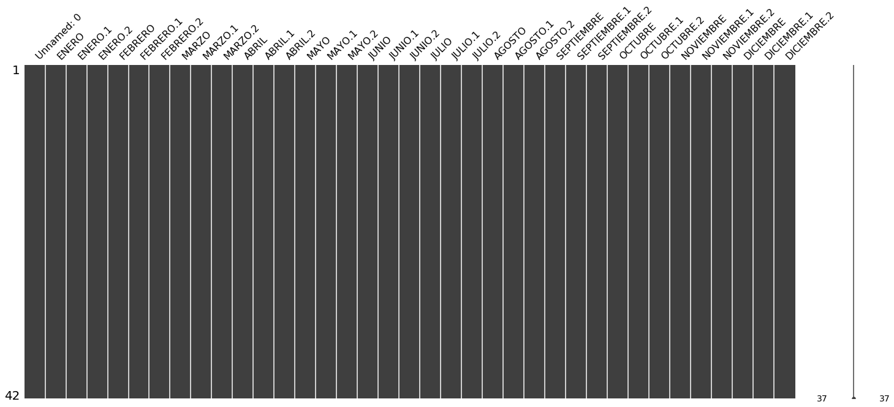
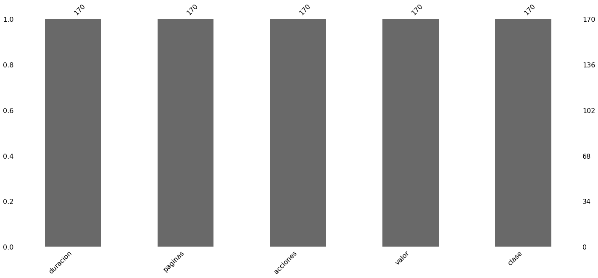
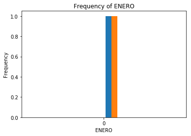

```python
import pandas as pd
import numpy as np
import missingno as msno
%matplotlib inline
```


```python
#https://datos.gob.mx/busca/dataset/pacientes-atendidos-en-consulta-externa-por-tipo-de-especialidad
path = 'ConsultaExterna.csv'
df = pd.read_csv(path, encoding='latin', error_bad_lines=False)
df.head()
```


<div>
<style scoped>
    .dataframe tbody tr th:only-of-type {
        vertical-align: middle;
    }

    .dataframe tbody tr th {
        vertical-align: top;
    }

    .dataframe thead th {
        text-align: right;
    }
</style>
<table border="1" class="dataframe">
  <thead>
    <tr style="text-align: right;">
      <th></th>
      <th>Unnamed: 0</th>
      <th>ENERO</th>
      <th>ENERO.1</th>
      <th>ENERO.2</th>
      <th>FEBRERO</th>
      <th>FEBRERO.1</th>
      <th>FEBRERO.2</th>
      <th>MARZO</th>
      <th>MARZO.1</th>
      <th>MARZO.2</th>
      <th>...</th>
      <th>SEPTIEMBRE.2</th>
      <th>OCTUBRE</th>
      <th>OCTUBRE.1</th>
      <th>OCTUBRE.2</th>
      <th>NOVIEMBRE</th>
      <th>NOVIEMBRE.1</th>
      <th>NOVIEMBRE.2</th>
      <th>DICIEMBRE</th>
      <th>DICIEMBRE.1</th>
      <th>DICIEMBRE.2</th>
    </tr>
  </thead>
  <tbody>
    <tr>
      <th>0</th>
      <td>ESPECIALIDAD</td>
      <td>PRECONSULTA</td>
      <td>CONSULTA DE PRIMERA VEZ</td>
      <td>CONSULTA SUBSECUENTE</td>
      <td>PRECONSULTA</td>
      <td>CONSULTA DE PRIMERA VEZ</td>
      <td>CONSULTA SUBSECUENTE</td>
      <td>PRECONSULTA</td>
      <td>CONSULTA DE PRIMERA VEZ</td>
      <td>CONSULTA SUBSECUENTE</td>
      <td>...</td>
      <td>CONSULTA SUBSECUENTE</td>
      <td>PRECONSULTA</td>
      <td>CONSULTA DE PRIMERA VEZ</td>
      <td>CONSULTA SUBSECUENTE</td>
      <td>PRECONSULTA</td>
      <td>CONSULTA DE PRIMERA VEZ</td>
      <td>CONSULTA SUBSECUENTE</td>
      <td>PRECONSULTA</td>
      <td>CONSULTA DE PRIMERA VEZ</td>
      <td>CONSULTA SUBSECUENTE</td>
    </tr>
    <tr>
      <th>1</th>
      <td>FONIATRIA</td>
      <td>0</td>
      <td>18</td>
      <td>0</td>
      <td>0</td>
      <td>0</td>
      <td>0</td>
      <td>0</td>
      <td>0</td>
      <td>0</td>
      <td>...</td>
      <td>0</td>
      <td>0</td>
      <td>0</td>
      <td>0</td>
      <td>0</td>
      <td>0</td>
      <td>0</td>
      <td>0</td>
      <td>7</td>
      <td>0</td>
    </tr>
    <tr>
      <th>2</th>
      <td>REHABILITACION</td>
      <td>0</td>
      <td>127</td>
      <td>49</td>
      <td>0</td>
      <td>144</td>
      <td>82</td>
      <td>0</td>
      <td>155</td>
      <td>68</td>
      <td>...</td>
      <td>89</td>
      <td>2</td>
      <td>198</td>
      <td>83</td>
      <td>2</td>
      <td>118</td>
      <td>76</td>
      <td>0</td>
      <td>115</td>
      <td>79</td>
    </tr>
    <tr>
      <th>3</th>
      <td>ESTOMATOLOGIA Y ORTODONCIA</td>
      <td>0</td>
      <td>190</td>
      <td>435</td>
      <td>0</td>
      <td>152</td>
      <td>341</td>
      <td>0</td>
      <td>245</td>
      <td>345</td>
      <td>...</td>
      <td>546</td>
      <td>0</td>
      <td>287</td>
      <td>737</td>
      <td>0</td>
      <td>108</td>
      <td>603</td>
      <td>0</td>
      <td>69</td>
      <td>378</td>
    </tr>
    <tr>
      <th>4</th>
      <td>COORDINACION DE CONSULTA EXTERNA</td>
      <td>680</td>
      <td>0</td>
      <td>0</td>
      <td>627</td>
      <td>0</td>
      <td>0</td>
      <td>824</td>
      <td>0</td>
      <td>0</td>
      <td>...</td>
      <td>0</td>
      <td>336</td>
      <td>0</td>
      <td>0</td>
      <td>278</td>
      <td>0</td>
      <td>0</td>
      <td>306</td>
      <td>0</td>
      <td>0</td>
    </tr>
  </tbody>
</table>
<p>5 rows × 37 columns</p>
</div>


```python
df.info()

```

    <class 'pandas.core.frame.DataFrame'>
    RangeIndex: 42 entries, 0 to 41
    Data columns (total 37 columns):
    Unnamed: 0      42 non-null object
    ENERO           42 non-null object
    ENERO.1         42 non-null object
    ENERO.2         42 non-null object
    FEBRERO         42 non-null object
    FEBRERO.1       42 non-null object
    FEBRERO.2       42 non-null object
    MARZO           42 non-null object
    MARZO.1         42 non-null object
    MARZO.2         42 non-null object
    ABRIL           42 non-null object
    ABRIL.1         42 non-null object
    ABRIL.2         42 non-null object
    MAYO            42 non-null object
    MAYO.1          42 non-null object
    MAYO.2          42 non-null object
    JUNIO           42 non-null object
    JUNIO.1         42 non-null object
    JUNIO.2         42 non-null object
    JULIO           42 non-null object
    JULIO.1         42 non-null object
    JULIO.2         42 non-null object
    AGOSTO          42 non-null object
    AGOSTO.1        42 non-null object
    AGOSTO.2        42 non-null object
    SEPTIEMBRE      42 non-null object
    SEPTIEMBRE.1    42 non-null object
    SEPTIEMBRE.2    42 non-null object
    OCTUBRE         42 non-null object
    OCTUBRE.1       42 non-null object
    OCTUBRE.2       42 non-null object
    NOVIEMBRE       42 non-null object
    NOVIEMBRE.1     42 non-null object
    NOVIEMBRE.2     42 non-null object
    DICIEMBRE       42 non-null object
    DICIEMBRE.1     42 non-null object
    DICIEMBRE.2     42 non-null object
    dtypes: object(37)
    memory usage: 12.2+ KB


```python
df.shape

```


    (42, 37)


```python
df.shape[0]

```


    42


```python
df.shape[1]

```


    37


```python
df.columns.values.tolist()

```


    ['Unnamed: 0',
     'ENERO',
     'ENERO.1',
     'ENERO.2',
     'FEBRERO',
     'FEBRERO.1',
     'FEBRERO.2',
     'MARZO',
     'MARZO.1',
     'MARZO.2',
     'ABRIL',
     'ABRIL.1',
     'ABRIL.2',
     'MAYO',
     'MAYO.1',
     'MAYO.2',
     'JUNIO',
     'JUNIO.1',
     'JUNIO.2',
     'JULIO',
     'JULIO.1',
     'JULIO.2',
     'AGOSTO',
     'AGOSTO.1',
     'AGOSTO.2',
     'SEPTIEMBRE',
     'SEPTIEMBRE.1',
     'SEPTIEMBRE.2',
     'OCTUBRE',
     'OCTUBRE.1',
     'OCTUBRE.2',
     'NOVIEMBRE',
     'NOVIEMBRE.1',
     'NOVIEMBRE.2',
     'DICIEMBRE',
     'DICIEMBRE.1',
     'DICIEMBRE.2']


```python
df.dtypes

```


    Unnamed: 0      object
    ENERO           object
    ENERO.1         object
    ENERO.2         object
    FEBRERO         object
    FEBRERO.1       object
    FEBRERO.2       object
    MARZO           object
    MARZO.1         object
    MARZO.2         object
    ABRIL           object
    ABRIL.1         object
    ABRIL.2         object
    MAYO            object
    MAYO.1          object
    MAYO.2          object
    JUNIO           object
    JUNIO.1         object
    JUNIO.2         object
    JULIO           object
    JULIO.1         object
    JULIO.2         object
    AGOSTO          object
    AGOSTO.1        object
    AGOSTO.2        object
    SEPTIEMBRE      object
    SEPTIEMBRE.1    object
    SEPTIEMBRE.2    object
    OCTUBRE         object
    OCTUBRE.1       object
    OCTUBRE.2       object
    NOVIEMBRE       object
    NOVIEMBRE.1     object
    NOVIEMBRE.2     object
    DICIEMBRE       object
    DICIEMBRE.1     object
    DICIEMBRE.2     object
    dtype: object


```python
df.isnull().any().any()

```


    False


```python
msno.matrix(df)

```


    <matplotlib.axes._subplots.AxesSubplot at 0x7f8405de7c88>





```python
df.replace({' ': np.nan}, inplace=True)

```


```python
df.isnull().any().any()

```


    False


```python
msno.matrix(df)

```


    <matplotlib.axes._subplots.AxesSubplot at 0x7f8405cf3ba8>


```python
msno.bar(df)

```


    <matplotlib.axes._subplots.AxesSubplot at 0x7f8405bd3240>





```python
df.columns[df.isnull().any()].tolist()

```


    []


```python
df.describe()

```


<div>
<style scoped>
    .dataframe tbody tr th:only-of-type {
        vertical-align: middle;
    }

    .dataframe tbody tr th {
        vertical-align: top;
    }

    .dataframe thead th {
        text-align: right;
    }
</style>
<table border="1" class="dataframe">
  <thead>
    <tr style="text-align: right;">
      <th></th>
      <th>Unnamed: 0</th>
      <th>ENERO</th>
      <th>ENERO.1</th>
      <th>ENERO.2</th>
      <th>FEBRERO</th>
      <th>FEBRERO.1</th>
      <th>FEBRERO.2</th>
      <th>MARZO</th>
      <th>MARZO.1</th>
      <th>MARZO.2</th>
      <th>...</th>
      <th>SEPTIEMBRE.2</th>
      <th>OCTUBRE</th>
      <th>OCTUBRE.1</th>
      <th>OCTUBRE.2</th>
      <th>NOVIEMBRE</th>
      <th>NOVIEMBRE.1</th>
      <th>NOVIEMBRE.2</th>
      <th>DICIEMBRE</th>
      <th>DICIEMBRE.1</th>
      <th>DICIEMBRE.2</th>
    </tr>
  </thead>
  <tbody>
    <tr>
      <th>count</th>
      <td>42</td>
      <td>42</td>
      <td>42</td>
      <td>42</td>
      <td>42</td>
      <td>42</td>
      <td>42</td>
      <td>42</td>
      <td>42</td>
      <td>42</td>
      <td>...</td>
      <td>42</td>
      <td>42</td>
      <td>42</td>
      <td>42</td>
      <td>42</td>
      <td>42</td>
      <td>42</td>
      <td>42</td>
      <td>42</td>
      <td>42</td>
    </tr>
    <tr>
      <th>unique</th>
      <td>42</td>
      <td>19</td>
      <td>32</td>
      <td>35</td>
      <td>17</td>
      <td>32</td>
      <td>36</td>
      <td>19</td>
      <td>33</td>
      <td>36</td>
      <td>...</td>
      <td>39</td>
      <td>20</td>
      <td>35</td>
      <td>39</td>
      <td>20</td>
      <td>32</td>
      <td>37</td>
      <td>16</td>
      <td>31</td>
      <td>39</td>
    </tr>
    <tr>
      <th>top</th>
      <td>CIRUGIA</td>
      <td>0</td>
      <td>0</td>
      <td>0</td>
      <td>0</td>
      <td>0</td>
      <td>0</td>
      <td>0</td>
      <td>0</td>
      <td>0</td>
      <td>...</td>
      <td>0</td>
      <td>0</td>
      <td>0</td>
      <td>0</td>
      <td>0</td>
      <td>0</td>
      <td>0</td>
      <td>0</td>
      <td>0</td>
      <td>0</td>
    </tr>
    <tr>
      <th>freq</th>
      <td>1</td>
      <td>22</td>
      <td>6</td>
      <td>5</td>
      <td>20</td>
      <td>5</td>
      <td>4</td>
      <td>18</td>
      <td>4</td>
      <td>4</td>
      <td>...</td>
      <td>3</td>
      <td>21</td>
      <td>4</td>
      <td>2</td>
      <td>20</td>
      <td>4</td>
      <td>3</td>
      <td>22</td>
      <td>4</td>
      <td>3</td>
    </tr>
  </tbody>
</table>
<p>4 rows × 37 columns</p>
</div>


```python
df.loc[[0]]

```


<div>
<style scoped>
    .dataframe tbody tr th:only-of-type {
        vertical-align: middle;
    }

    .dataframe tbody tr th {
        vertical-align: top;
    }

    .dataframe thead th {
        text-align: right;
    }
</style>
<table border="1" class="dataframe">
  <thead>
    <tr style="text-align: right;">
      <th></th>
      <th>Unnamed: 0</th>
      <th>ENERO</th>
      <th>ENERO.1</th>
      <th>ENERO.2</th>
      <th>FEBRERO</th>
      <th>FEBRERO.1</th>
      <th>FEBRERO.2</th>
      <th>MARZO</th>
      <th>MARZO.1</th>
      <th>MARZO.2</th>
      <th>...</th>
      <th>SEPTIEMBRE.2</th>
      <th>OCTUBRE</th>
      <th>OCTUBRE.1</th>
      <th>OCTUBRE.2</th>
      <th>NOVIEMBRE</th>
      <th>NOVIEMBRE.1</th>
      <th>NOVIEMBRE.2</th>
      <th>DICIEMBRE</th>
      <th>DICIEMBRE.1</th>
      <th>DICIEMBRE.2</th>
    </tr>
  </thead>
  <tbody>
    <tr>
      <th>0</th>
      <td>ESPECIALIDAD</td>
      <td>PRECONSULTA</td>
      <td>CONSULTA DE PRIMERA VEZ</td>
      <td>CONSULTA SUBSECUENTE</td>
      <td>PRECONSULTA</td>
      <td>CONSULTA DE PRIMERA VEZ</td>
      <td>CONSULTA SUBSECUENTE</td>
      <td>PRECONSULTA</td>
      <td>CONSULTA DE PRIMERA VEZ</td>
      <td>CONSULTA SUBSECUENTE</td>
      <td>...</td>
      <td>CONSULTA SUBSECUENTE</td>
      <td>PRECONSULTA</td>
      <td>CONSULTA DE PRIMERA VEZ</td>
      <td>CONSULTA SUBSECUENTE</td>
      <td>PRECONSULTA</td>
      <td>CONSULTA DE PRIMERA VEZ</td>
      <td>CONSULTA SUBSECUENTE</td>
      <td>PRECONSULTA</td>
      <td>CONSULTA DE PRIMERA VEZ</td>
      <td>CONSULTA SUBSECUENTE</td>
    </tr>
  </tbody>
</table>
<p>1 rows × 37 columns</p>
</div>


```python
df.loc[30:33]

```


<div>
<style scoped>
    .dataframe tbody tr th:only-of-type {
        vertical-align: middle;
    }

    .dataframe tbody tr th {
        vertical-align: top;
    }

    .dataframe thead th {
        text-align: right;
    }
</style>
<table border="1" class="dataframe">
  <thead>
    <tr style="text-align: right;">
      <th></th>
      <th>Unnamed: 0</th>
      <th>ENERO</th>
      <th>ENERO.1</th>
      <th>ENERO.2</th>
      <th>FEBRERO</th>
      <th>FEBRERO.1</th>
      <th>FEBRERO.2</th>
      <th>MARZO</th>
      <th>MARZO.1</th>
      <th>MARZO.2</th>
      <th>...</th>
      <th>SEPTIEMBRE.2</th>
      <th>OCTUBRE</th>
      <th>OCTUBRE.1</th>
      <th>OCTUBRE.2</th>
      <th>NOVIEMBRE</th>
      <th>NOVIEMBRE.1</th>
      <th>NOVIEMBRE.2</th>
      <th>DICIEMBRE</th>
      <th>DICIEMBRE.1</th>
      <th>DICIEMBRE.2</th>
    </tr>
  </thead>
  <tbody>
    <tr>
      <th>30</th>
      <td>NEUROLOGIA</td>
      <td>0</td>
      <td>12</td>
      <td>179</td>
      <td>0</td>
      <td>2</td>
      <td>152</td>
      <td>0</td>
      <td>1</td>
      <td>182</td>
      <td>...</td>
      <td>193</td>
      <td>0</td>
      <td>8</td>
      <td>205</td>
      <td>0</td>
      <td>1</td>
      <td>157</td>
      <td>0</td>
      <td>26</td>
      <td>174</td>
    </tr>
    <tr>
      <th>31</th>
      <td>DERMATOLOGIA</td>
      <td>0</td>
      <td>130</td>
      <td>925</td>
      <td>8</td>
      <td>84</td>
      <td>1,047</td>
      <td>16</td>
      <td>192</td>
      <td>1,337</td>
      <td>...</td>
      <td>1400</td>
      <td>1</td>
      <td>156</td>
      <td>1442</td>
      <td>0</td>
      <td>73</td>
      <td>1006</td>
      <td>0</td>
      <td>84</td>
      <td>1229</td>
    </tr>
    <tr>
      <th>32</th>
      <td>PSIQUIATRIA Y SALUD MENTAL</td>
      <td>0</td>
      <td>128</td>
      <td>329</td>
      <td>0</td>
      <td>126</td>
      <td>379</td>
      <td>0</td>
      <td>116</td>
      <td>421</td>
      <td>...</td>
      <td>395</td>
      <td>0</td>
      <td>277</td>
      <td>449</td>
      <td>0</td>
      <td>189</td>
      <td>410</td>
      <td>0</td>
      <td>186</td>
      <td>393</td>
    </tr>
    <tr>
      <th>33</th>
      <td>URGENCIAS Y MEDICINA</td>
      <td>5</td>
      <td>360</td>
      <td>2,291</td>
      <td>16</td>
      <td>371</td>
      <td>2,891</td>
      <td>22</td>
      <td>494</td>
      <td>3,346</td>
      <td>...</td>
      <td>3257</td>
      <td>9</td>
      <td>737</td>
      <td>3592</td>
      <td>10</td>
      <td>396</td>
      <td>2760</td>
      <td>3</td>
      <td>439</td>
      <td>2825</td>
    </tr>
  </tbody>
</table>
<p>4 rows × 37 columns</p>
</div>


```python
df.drop([0,4,32], axis=0).head()

```


<div>
<style scoped>
    .dataframe tbody tr th:only-of-type {
        vertical-align: middle;
    }

    .dataframe tbody tr th {
        vertical-align: top;
    }

    .dataframe thead th {
        text-align: right;
    }
</style>
<table border="1" class="dataframe">
  <thead>
    <tr style="text-align: right;">
      <th></th>
      <th>Unnamed: 0</th>
      <th>ENERO</th>
      <th>ENERO.1</th>
      <th>ENERO.2</th>
      <th>FEBRERO</th>
      <th>FEBRERO.1</th>
      <th>FEBRERO.2</th>
      <th>MARZO</th>
      <th>MARZO.1</th>
      <th>MARZO.2</th>
      <th>...</th>
      <th>SEPTIEMBRE.2</th>
      <th>OCTUBRE</th>
      <th>OCTUBRE.1</th>
      <th>OCTUBRE.2</th>
      <th>NOVIEMBRE</th>
      <th>NOVIEMBRE.1</th>
      <th>NOVIEMBRE.2</th>
      <th>DICIEMBRE</th>
      <th>DICIEMBRE.1</th>
      <th>DICIEMBRE.2</th>
    </tr>
  </thead>
  <tbody>
    <tr>
      <th>1</th>
      <td>FONIATRIA</td>
      <td>0</td>
      <td>18</td>
      <td>0</td>
      <td>0</td>
      <td>0</td>
      <td>0</td>
      <td>0</td>
      <td>0</td>
      <td>0</td>
      <td>...</td>
      <td>0</td>
      <td>0</td>
      <td>0</td>
      <td>0</td>
      <td>0</td>
      <td>0</td>
      <td>0</td>
      <td>0</td>
      <td>7</td>
      <td>0</td>
    </tr>
    <tr>
      <th>2</th>
      <td>REHABILITACION</td>
      <td>0</td>
      <td>127</td>
      <td>49</td>
      <td>0</td>
      <td>144</td>
      <td>82</td>
      <td>0</td>
      <td>155</td>
      <td>68</td>
      <td>...</td>
      <td>89</td>
      <td>2</td>
      <td>198</td>
      <td>83</td>
      <td>2</td>
      <td>118</td>
      <td>76</td>
      <td>0</td>
      <td>115</td>
      <td>79</td>
    </tr>
    <tr>
      <th>3</th>
      <td>ESTOMATOLOGIA Y ORTODONCIA</td>
      <td>0</td>
      <td>190</td>
      <td>435</td>
      <td>0</td>
      <td>152</td>
      <td>341</td>
      <td>0</td>
      <td>245</td>
      <td>345</td>
      <td>...</td>
      <td>546</td>
      <td>0</td>
      <td>287</td>
      <td>737</td>
      <td>0</td>
      <td>108</td>
      <td>603</td>
      <td>0</td>
      <td>69</td>
      <td>378</td>
    </tr>
    <tr>
      <th>5</th>
      <td>TANATOLOGIA CLINICA</td>
      <td>0</td>
      <td>0</td>
      <td>0</td>
      <td>0</td>
      <td>0</td>
      <td>0</td>
      <td>0</td>
      <td>0</td>
      <td>0</td>
      <td>...</td>
      <td>19</td>
      <td>0</td>
      <td>74</td>
      <td>13</td>
      <td>0</td>
      <td>53</td>
      <td>12</td>
      <td>1</td>
      <td>16</td>
      <td>13</td>
    </tr>
    <tr>
      <th>6</th>
      <td>GERIATRIA</td>
      <td>0</td>
      <td>8</td>
      <td>35</td>
      <td>0</td>
      <td>5</td>
      <td>77</td>
      <td>0</td>
      <td>2</td>
      <td>79</td>
      <td>...</td>
      <td>116</td>
      <td>0</td>
      <td>8</td>
      <td>84</td>
      <td>0</td>
      <td>12</td>
      <td>64</td>
      <td>0</td>
      <td>4</td>
      <td>75</td>
    </tr>
  </tbody>
</table>
<p>5 rows × 37 columns</p>
</div>


```python
df.drop(df.index[1:5], axis=0).head(10)

```


<div>
<style scoped>
    .dataframe tbody tr th:only-of-type {
        vertical-align: middle;
    }

    .dataframe tbody tr th {
        vertical-align: top;
    }

    .dataframe thead th {
        text-align: right;
    }
</style>
<table border="1" class="dataframe">
  <thead>
    <tr style="text-align: right;">
      <th></th>
      <th>Unnamed: 0</th>
      <th>ENERO</th>
      <th>ENERO.1</th>
      <th>ENERO.2</th>
      <th>FEBRERO</th>
      <th>FEBRERO.1</th>
      <th>FEBRERO.2</th>
      <th>MARZO</th>
      <th>MARZO.1</th>
      <th>MARZO.2</th>
      <th>...</th>
      <th>SEPTIEMBRE.2</th>
      <th>OCTUBRE</th>
      <th>OCTUBRE.1</th>
      <th>OCTUBRE.2</th>
      <th>NOVIEMBRE</th>
      <th>NOVIEMBRE.1</th>
      <th>NOVIEMBRE.2</th>
      <th>DICIEMBRE</th>
      <th>DICIEMBRE.1</th>
      <th>DICIEMBRE.2</th>
    </tr>
  </thead>
  <tbody>
    <tr>
      <th>0</th>
      <td>ESPECIALIDAD</td>
      <td>PRECONSULTA</td>
      <td>CONSULTA DE PRIMERA VEZ</td>
      <td>CONSULTA SUBSECUENTE</td>
      <td>PRECONSULTA</td>
      <td>CONSULTA DE PRIMERA VEZ</td>
      <td>CONSULTA SUBSECUENTE</td>
      <td>PRECONSULTA</td>
      <td>CONSULTA DE PRIMERA VEZ</td>
      <td>CONSULTA SUBSECUENTE</td>
      <td>...</td>
      <td>CONSULTA SUBSECUENTE</td>
      <td>PRECONSULTA</td>
      <td>CONSULTA DE PRIMERA VEZ</td>
      <td>CONSULTA SUBSECUENTE</td>
      <td>PRECONSULTA</td>
      <td>CONSULTA DE PRIMERA VEZ</td>
      <td>CONSULTA SUBSECUENTE</td>
      <td>PRECONSULTA</td>
      <td>CONSULTA DE PRIMERA VEZ</td>
      <td>CONSULTA SUBSECUENTE</td>
    </tr>
    <tr>
      <th>5</th>
      <td>TANATOLOGIA CLINICA</td>
      <td>0</td>
      <td>0</td>
      <td>0</td>
      <td>0</td>
      <td>0</td>
      <td>0</td>
      <td>0</td>
      <td>0</td>
      <td>0</td>
      <td>...</td>
      <td>19</td>
      <td>0</td>
      <td>74</td>
      <td>13</td>
      <td>0</td>
      <td>53</td>
      <td>12</td>
      <td>1</td>
      <td>16</td>
      <td>13</td>
    </tr>
    <tr>
      <th>6</th>
      <td>GERIATRIA</td>
      <td>0</td>
      <td>8</td>
      <td>35</td>
      <td>0</td>
      <td>5</td>
      <td>77</td>
      <td>0</td>
      <td>2</td>
      <td>79</td>
      <td>...</td>
      <td>116</td>
      <td>0</td>
      <td>8</td>
      <td>84</td>
      <td>0</td>
      <td>12</td>
      <td>64</td>
      <td>0</td>
      <td>4</td>
      <td>75</td>
    </tr>
    <tr>
      <th>7</th>
      <td>SERVICIOS AMBULATORIOS</td>
      <td>680</td>
      <td>343</td>
      <td>519</td>
      <td>627</td>
      <td>301</td>
      <td>500</td>
      <td>824</td>
      <td>402</td>
      <td>492</td>
      <td>...</td>
      <td>770</td>
      <td>338</td>
      <td>567</td>
      <td>917</td>
      <td>280</td>
      <td>291</td>
      <td>755</td>
      <td>307</td>
      <td>211</td>
      <td>545</td>
    </tr>
    <tr>
      <th>8</th>
      <td>CIRUGIA GENERAL</td>
      <td>15</td>
      <td>12</td>
      <td>150</td>
      <td>21</td>
      <td>33</td>
      <td>283</td>
      <td>17</td>
      <td>40</td>
      <td>394</td>
      <td>...</td>
      <td>300</td>
      <td>8</td>
      <td>59</td>
      <td>403</td>
      <td>15</td>
      <td>57</td>
      <td>382</td>
      <td>1</td>
      <td>14</td>
      <td>277</td>
    </tr>
    <tr>
      <th>9</th>
      <td>OFTALMOLOGIA</td>
      <td>17</td>
      <td>51</td>
      <td>856</td>
      <td>0</td>
      <td>15</td>
      <td>1,102</td>
      <td>5</td>
      <td>58</td>
      <td>969</td>
      <td>...</td>
      <td>841</td>
      <td>5</td>
      <td>7</td>
      <td>883</td>
      <td>0</td>
      <td>6</td>
      <td>623</td>
      <td>0</td>
      <td>6</td>
      <td>352</td>
    </tr>
    <tr>
      <th>10</th>
      <td>OTORRINOLARINGOLOGIA Y AUDIOLOGIA</td>
      <td>122</td>
      <td>260</td>
      <td>199</td>
      <td>97</td>
      <td>224</td>
      <td>189</td>
      <td>96</td>
      <td>211</td>
      <td>210</td>
      <td>...</td>
      <td>245</td>
      <td>67</td>
      <td>111</td>
      <td>188</td>
      <td>50</td>
      <td>212</td>
      <td>216</td>
      <td>28</td>
      <td>85</td>
      <td>117</td>
    </tr>
    <tr>
      <th>11</th>
      <td>CIRUGIA CARDIOVASCULAR</td>
      <td>2</td>
      <td>23</td>
      <td>35</td>
      <td>1</td>
      <td>23</td>
      <td>28</td>
      <td>0</td>
      <td>14</td>
      <td>23</td>
      <td>...</td>
      <td>0</td>
      <td>0</td>
      <td>4</td>
      <td>97</td>
      <td>0</td>
      <td>12</td>
      <td>21</td>
      <td>0</td>
      <td>29</td>
      <td>41</td>
    </tr>
    <tr>
      <th>12</th>
      <td>ORTOPEDIA</td>
      <td>3</td>
      <td>10</td>
      <td>661</td>
      <td>0</td>
      <td>5</td>
      <td>725</td>
      <td>1</td>
      <td>4</td>
      <td>743</td>
      <td>...</td>
      <td>1053</td>
      <td>0</td>
      <td>20</td>
      <td>943</td>
      <td>3</td>
      <td>3</td>
      <td>851</td>
      <td>0</td>
      <td>2</td>
      <td>760</td>
    </tr>
    <tr>
      <th>13</th>
      <td>UROLOGIA</td>
      <td>90</td>
      <td>34</td>
      <td>677</td>
      <td>101</td>
      <td>51</td>
      <td>716</td>
      <td>84</td>
      <td>40</td>
      <td>733</td>
      <td>...</td>
      <td>701</td>
      <td>116</td>
      <td>41</td>
      <td>800</td>
      <td>77</td>
      <td>27</td>
      <td>593</td>
      <td>58</td>
      <td>11</td>
      <td>456</td>
    </tr>
  </tbody>
</table>
<p>10 rows × 37 columns</p>
</div>


```python
df[10:].head() #df.tail(-100) )

```


<div>
<style scoped>
    .dataframe tbody tr th:only-of-type {
        vertical-align: middle;
    }

    .dataframe tbody tr th {
        vertical-align: top;
    }

    .dataframe thead th {
        text-align: right;
    }
</style>
<table border="1" class="dataframe">
  <thead>
    <tr style="text-align: right;">
      <th></th>
      <th>Unnamed: 0</th>
      <th>ENERO</th>
      <th>ENERO.1</th>
      <th>ENERO.2</th>
      <th>FEBRERO</th>
      <th>FEBRERO.1</th>
      <th>FEBRERO.2</th>
      <th>MARZO</th>
      <th>MARZO.1</th>
      <th>MARZO.2</th>
      <th>...</th>
      <th>SEPTIEMBRE.2</th>
      <th>OCTUBRE</th>
      <th>OCTUBRE.1</th>
      <th>OCTUBRE.2</th>
      <th>NOVIEMBRE</th>
      <th>NOVIEMBRE.1</th>
      <th>NOVIEMBRE.2</th>
      <th>DICIEMBRE</th>
      <th>DICIEMBRE.1</th>
      <th>DICIEMBRE.2</th>
    </tr>
  </thead>
  <tbody>
    <tr>
      <th>10</th>
      <td>OTORRINOLARINGOLOGIA Y AUDIOLOGIA</td>
      <td>122</td>
      <td>260</td>
      <td>199</td>
      <td>97</td>
      <td>224</td>
      <td>189</td>
      <td>96</td>
      <td>211</td>
      <td>210</td>
      <td>...</td>
      <td>245</td>
      <td>67</td>
      <td>111</td>
      <td>188</td>
      <td>50</td>
      <td>212</td>
      <td>216</td>
      <td>28</td>
      <td>85</td>
      <td>117</td>
    </tr>
    <tr>
      <th>11</th>
      <td>CIRUGIA CARDIOVASCULAR</td>
      <td>2</td>
      <td>23</td>
      <td>35</td>
      <td>1</td>
      <td>23</td>
      <td>28</td>
      <td>0</td>
      <td>14</td>
      <td>23</td>
      <td>...</td>
      <td>0</td>
      <td>0</td>
      <td>4</td>
      <td>97</td>
      <td>0</td>
      <td>12</td>
      <td>21</td>
      <td>0</td>
      <td>29</td>
      <td>41</td>
    </tr>
    <tr>
      <th>12</th>
      <td>ORTOPEDIA</td>
      <td>3</td>
      <td>10</td>
      <td>661</td>
      <td>0</td>
      <td>5</td>
      <td>725</td>
      <td>1</td>
      <td>4</td>
      <td>743</td>
      <td>...</td>
      <td>1053</td>
      <td>0</td>
      <td>20</td>
      <td>943</td>
      <td>3</td>
      <td>3</td>
      <td>851</td>
      <td>0</td>
      <td>2</td>
      <td>760</td>
    </tr>
    <tr>
      <th>13</th>
      <td>UROLOGIA</td>
      <td>90</td>
      <td>34</td>
      <td>677</td>
      <td>101</td>
      <td>51</td>
      <td>716</td>
      <td>84</td>
      <td>40</td>
      <td>733</td>
      <td>...</td>
      <td>701</td>
      <td>116</td>
      <td>41</td>
      <td>800</td>
      <td>77</td>
      <td>27</td>
      <td>593</td>
      <td>58</td>
      <td>11</td>
      <td>456</td>
    </tr>
    <tr>
      <th>14</th>
      <td>CIRUGIA PLASTICA Y RECONSTRUCTIVA</td>
      <td>91</td>
      <td>68</td>
      <td>650</td>
      <td>69</td>
      <td>82</td>
      <td>683</td>
      <td>107</td>
      <td>65</td>
      <td>780</td>
      <td>...</td>
      <td>882</td>
      <td>118</td>
      <td>93</td>
      <td>950</td>
      <td>81</td>
      <td>79</td>
      <td>698</td>
      <td>51</td>
      <td>28</td>
      <td>532</td>
    </tr>
  </tbody>
</table>
<p>5 rows × 37 columns</p>
</div>


```python
df.OCTUBRE.values

```


    array(['PRECONSULTA', '0', '2', '0', '336', '0', '0', '338', '8', '5',
           '67', '0', '0', '116', '118', '54', '9', '0', '0', '35', '0',
           '412', '0', '0', '0', '1', '0', '0', '7', '0', '0', '1', '0', '9',
           '0', '0', '29', '3', '0', '10', '42', '0'], dtype=object)


```python
df['OCTUBRE'].values

```


    array(['PRECONSULTA', '0', '2', '0', '336', '0', '0', '338', '8', '5',
           '67', '0', '0', '116', '118', '54', '9', '0', '0', '35', '0',
           '412', '0', '0', '0', '1', '0', '0', '7', '0', '0', '1', '0', '9',
           '0', '0', '29', '3', '0', '10', '42', '0'], dtype=object)


```python
df.OCTUBRE.unique()

```


    array(['PRECONSULTA', '0', '2', '336', '338', '8', '5', '67', '116',
           '118', '54', '9', '35', '412', '1', '7', '29', '3', '10', '42'],
          dtype=object)


```python
df.OCTUBRE.value_counts()

```


    0              21
    1               2
    9               2
    3               1
    67              1
    54              1
    10              1
    118             1
    412             1
    2               1
    35              1
    7               1
    29              1
    338             1
    PRECONSULTA     1
    42              1
    336             1
    5               1
    116             1
    8               1
    Name: OCTUBRE, dtype: int64


```python
df.agg(['count', 'size', 'nunique'])

```


<div>
<style scoped>
    .dataframe tbody tr th:only-of-type {
        vertical-align: middle;
    }

    .dataframe tbody tr th {
        vertical-align: top;
    }

    .dataframe thead th {
        text-align: right;
    }
</style>
<table border="1" class="dataframe">
  <thead>
    <tr style="text-align: right;">
      <th></th>
      <th>Unnamed: 0</th>
      <th>ENERO</th>
      <th>ENERO.1</th>
      <th>ENERO.2</th>
      <th>FEBRERO</th>
      <th>FEBRERO.1</th>
      <th>FEBRERO.2</th>
      <th>MARZO</th>
      <th>MARZO.1</th>
      <th>MARZO.2</th>
      <th>...</th>
      <th>SEPTIEMBRE.2</th>
      <th>OCTUBRE</th>
      <th>OCTUBRE.1</th>
      <th>OCTUBRE.2</th>
      <th>NOVIEMBRE</th>
      <th>NOVIEMBRE.1</th>
      <th>NOVIEMBRE.2</th>
      <th>DICIEMBRE</th>
      <th>DICIEMBRE.1</th>
      <th>DICIEMBRE.2</th>
    </tr>
  </thead>
  <tbody>
    <tr>
      <th>count</th>
      <td>42</td>
      <td>42</td>
      <td>42</td>
      <td>42</td>
      <td>42</td>
      <td>42</td>
      <td>42</td>
      <td>42</td>
      <td>42</td>
      <td>42</td>
      <td>...</td>
      <td>42</td>
      <td>42</td>
      <td>42</td>
      <td>42</td>
      <td>42</td>
      <td>42</td>
      <td>42</td>
      <td>42</td>
      <td>42</td>
      <td>42</td>
    </tr>
    <tr>
      <th>size</th>
      <td>42</td>
      <td>42</td>
      <td>42</td>
      <td>42</td>
      <td>42</td>
      <td>42</td>
      <td>42</td>
      <td>42</td>
      <td>42</td>
      <td>42</td>
      <td>...</td>
      <td>42</td>
      <td>42</td>
      <td>42</td>
      <td>42</td>
      <td>42</td>
      <td>42</td>
      <td>42</td>
      <td>42</td>
      <td>42</td>
      <td>42</td>
    </tr>
    <tr>
      <th>nunique</th>
      <td>42</td>
      <td>19</td>
      <td>32</td>
      <td>35</td>
      <td>17</td>
      <td>32</td>
      <td>36</td>
      <td>19</td>
      <td>33</td>
      <td>36</td>
      <td>...</td>
      <td>39</td>
      <td>20</td>
      <td>35</td>
      <td>39</td>
      <td>20</td>
      <td>32</td>
      <td>37</td>
      <td>16</td>
      <td>31</td>
      <td>39</td>
    </tr>
  </tbody>
</table>
<p>3 rows × 37 columns</p>
</div>


```python
df.groupby('OCTUBRE').agg(['count', 'size', 'nunique']).stack()

```


<div>
<style scoped>
    .dataframe tbody tr th:only-of-type {
        vertical-align: middle;
    }

    .dataframe tbody tr th {
        vertical-align: top;
    }

    .dataframe thead th {
        text-align: right;
    }
</style>
<table border="1" class="dataframe">
  <thead>
    <tr style="text-align: right;">
      <th></th>
      <th></th>
      <th>Unnamed: 0</th>
      <th>ENERO</th>
      <th>ENERO.1</th>
      <th>ENERO.2</th>
      <th>FEBRERO</th>
      <th>FEBRERO.1</th>
      <th>FEBRERO.2</th>
      <th>MARZO</th>
      <th>MARZO.1</th>
      <th>MARZO.2</th>
      <th>...</th>
      <th>SEPTIEMBRE.1</th>
      <th>SEPTIEMBRE.2</th>
      <th>OCTUBRE.1</th>
      <th>OCTUBRE.2</th>
      <th>NOVIEMBRE</th>
      <th>NOVIEMBRE.1</th>
      <th>NOVIEMBRE.2</th>
      <th>DICIEMBRE</th>
      <th>DICIEMBRE.1</th>
      <th>DICIEMBRE.2</th>
    </tr>
    <tr>
      <th>OCTUBRE</th>
      <th></th>
      <th></th>
      <th></th>
      <th></th>
      <th></th>
      <th></th>
      <th></th>
      <th></th>
      <th></th>
      <th></th>
      <th></th>
      <th></th>
      <th></th>
      <th></th>
      <th></th>
      <th></th>
      <th></th>
      <th></th>
      <th></th>
      <th></th>
      <th></th>
      <th></th>
    </tr>
  </thead>
  <tbody>
    <tr>
      <th rowspan="3" valign="top">0</th>
      <th>count</th>
      <td>21</td>
      <td>21</td>
      <td>21</td>
      <td>21</td>
      <td>21</td>
      <td>21</td>
      <td>21</td>
      <td>21</td>
      <td>21</td>
      <td>21</td>
      <td>...</td>
      <td>21</td>
      <td>21</td>
      <td>21</td>
      <td>21</td>
      <td>21</td>
      <td>21</td>
      <td>21</td>
      <td>21</td>
      <td>21</td>
      <td>21</td>
    </tr>
    <tr>
      <th>size</th>
      <td>21</td>
      <td>21</td>
      <td>21</td>
      <td>21</td>
      <td>21</td>
      <td>21</td>
      <td>21</td>
      <td>21</td>
      <td>21</td>
      <td>21</td>
      <td>...</td>
      <td>21</td>
      <td>21</td>
      <td>21</td>
      <td>21</td>
      <td>21</td>
      <td>21</td>
      <td>21</td>
      <td>21</td>
      <td>21</td>
      <td>21</td>
    </tr>
    <tr>
      <th>nunique</th>
      <td>21</td>
      <td>4</td>
      <td>15</td>
      <td>15</td>
      <td>3</td>
      <td>13</td>
      <td>16</td>
      <td>4</td>
      <td>16</td>
      <td>17</td>
      <td>...</td>
      <td>18</td>
      <td>19</td>
      <td>17</td>
      <td>20</td>
      <td>3</td>
      <td>16</td>
      <td>19</td>
      <td>2</td>
      <td>15</td>
      <td>19</td>
    </tr>
    <tr>
      <th rowspan="3" valign="top">1</th>
      <th>count</th>
      <td>2</td>
      <td>2</td>
      <td>2</td>
      <td>2</td>
      <td>2</td>
      <td>2</td>
      <td>2</td>
      <td>2</td>
      <td>2</td>
      <td>2</td>
      <td>...</td>
      <td>2</td>
      <td>2</td>
      <td>2</td>
      <td>2</td>
      <td>2</td>
      <td>2</td>
      <td>2</td>
      <td>2</td>
      <td>2</td>
      <td>2</td>
    </tr>
    <tr>
      <th>size</th>
      <td>2</td>
      <td>2</td>
      <td>2</td>
      <td>2</td>
      <td>2</td>
      <td>2</td>
      <td>2</td>
      <td>2</td>
      <td>2</td>
      <td>2</td>
      <td>...</td>
      <td>2</td>
      <td>2</td>
      <td>2</td>
      <td>2</td>
      <td>2</td>
      <td>2</td>
      <td>2</td>
      <td>2</td>
      <td>2</td>
      <td>2</td>
    </tr>
    <tr>
      <th>nunique</th>
      <td>2</td>
      <td>1</td>
      <td>2</td>
      <td>2</td>
      <td>2</td>
      <td>2</td>
      <td>2</td>
      <td>2</td>
      <td>2</td>
      <td>2</td>
      <td>...</td>
      <td>2</td>
      <td>2</td>
      <td>2</td>
      <td>2</td>
      <td>2</td>
      <td>2</td>
      <td>2</td>
      <td>1</td>
      <td>2</td>
      <td>2</td>
    </tr>
    <tr>
      <th rowspan="3" valign="top">10</th>
      <th>count</th>
      <td>1</td>
      <td>1</td>
      <td>1</td>
      <td>1</td>
      <td>1</td>
      <td>1</td>
      <td>1</td>
      <td>1</td>
      <td>1</td>
      <td>1</td>
      <td>...</td>
      <td>1</td>
      <td>1</td>
      <td>1</td>
      <td>1</td>
      <td>1</td>
      <td>1</td>
      <td>1</td>
      <td>1</td>
      <td>1</td>
      <td>1</td>
    </tr>
    <tr>
      <th>size</th>
      <td>1</td>
      <td>1</td>
      <td>1</td>
      <td>1</td>
      <td>1</td>
      <td>1</td>
      <td>1</td>
      <td>1</td>
      <td>1</td>
      <td>1</td>
      <td>...</td>
      <td>1</td>
      <td>1</td>
      <td>1</td>
      <td>1</td>
      <td>1</td>
      <td>1</td>
      <td>1</td>
      <td>1</td>
      <td>1</td>
      <td>1</td>
    </tr>
    <tr>
      <th>nunique</th>
      <td>1</td>
      <td>1</td>
      <td>1</td>
      <td>1</td>
      <td>1</td>
      <td>1</td>
      <td>1</td>
      <td>1</td>
      <td>1</td>
      <td>1</td>
      <td>...</td>
      <td>1</td>
      <td>1</td>
      <td>1</td>
      <td>1</td>
      <td>1</td>
      <td>1</td>
      <td>1</td>
      <td>1</td>
      <td>1</td>
      <td>1</td>
    </tr>
    <tr>
      <th rowspan="3" valign="top">116</th>
      <th>count</th>
      <td>1</td>
      <td>1</td>
      <td>1</td>
      <td>1</td>
      <td>1</td>
      <td>1</td>
      <td>1</td>
      <td>1</td>
      <td>1</td>
      <td>1</td>
      <td>...</td>
      <td>1</td>
      <td>1</td>
      <td>1</td>
      <td>1</td>
      <td>1</td>
      <td>1</td>
      <td>1</td>
      <td>1</td>
      <td>1</td>
      <td>1</td>
    </tr>
    <tr>
      <th>size</th>
      <td>1</td>
      <td>1</td>
      <td>1</td>
      <td>1</td>
      <td>1</td>
      <td>1</td>
      <td>1</td>
      <td>1</td>
      <td>1</td>
      <td>1</td>
      <td>...</td>
      <td>1</td>
      <td>1</td>
      <td>1</td>
      <td>1</td>
      <td>1</td>
      <td>1</td>
      <td>1</td>
      <td>1</td>
      <td>1</td>
      <td>1</td>
    </tr>
    <tr>
      <th>nunique</th>
      <td>1</td>
      <td>1</td>
      <td>1</td>
      <td>1</td>
      <td>1</td>
      <td>1</td>
      <td>1</td>
      <td>1</td>
      <td>1</td>
      <td>1</td>
      <td>...</td>
      <td>1</td>
      <td>1</td>
      <td>1</td>
      <td>1</td>
      <td>1</td>
      <td>1</td>
      <td>1</td>
      <td>1</td>
      <td>1</td>
      <td>1</td>
    </tr>
    <tr>
      <th rowspan="3" valign="top">118</th>
      <th>count</th>
      <td>1</td>
      <td>1</td>
      <td>1</td>
      <td>1</td>
      <td>1</td>
      <td>1</td>
      <td>1</td>
      <td>1</td>
      <td>1</td>
      <td>1</td>
      <td>...</td>
      <td>1</td>
      <td>1</td>
      <td>1</td>
      <td>1</td>
      <td>1</td>
      <td>1</td>
      <td>1</td>
      <td>1</td>
      <td>1</td>
      <td>1</td>
    </tr>
    <tr>
      <th>size</th>
      <td>1</td>
      <td>1</td>
      <td>1</td>
      <td>1</td>
      <td>1</td>
      <td>1</td>
      <td>1</td>
      <td>1</td>
      <td>1</td>
      <td>1</td>
      <td>...</td>
      <td>1</td>
      <td>1</td>
      <td>1</td>
      <td>1</td>
      <td>1</td>
      <td>1</td>
      <td>1</td>
      <td>1</td>
      <td>1</td>
      <td>1</td>
    </tr>
    <tr>
      <th>nunique</th>
      <td>1</td>
      <td>1</td>
      <td>1</td>
      <td>1</td>
      <td>1</td>
      <td>1</td>
      <td>1</td>
      <td>1</td>
      <td>1</td>
      <td>1</td>
      <td>...</td>
      <td>1</td>
      <td>1</td>
      <td>1</td>
      <td>1</td>
      <td>1</td>
      <td>1</td>
      <td>1</td>
      <td>1</td>
      <td>1</td>
      <td>1</td>
    </tr>
    <tr>
      <th rowspan="3" valign="top">2</th>
      <th>count</th>
      <td>1</td>
      <td>1</td>
      <td>1</td>
      <td>1</td>
      <td>1</td>
      <td>1</td>
      <td>1</td>
      <td>1</td>
      <td>1</td>
      <td>1</td>
      <td>...</td>
      <td>1</td>
      <td>1</td>
      <td>1</td>
      <td>1</td>
      <td>1</td>
      <td>1</td>
      <td>1</td>
      <td>1</td>
      <td>1</td>
      <td>1</td>
    </tr>
    <tr>
      <th>size</th>
      <td>1</td>
      <td>1</td>
      <td>1</td>
      <td>1</td>
      <td>1</td>
      <td>1</td>
      <td>1</td>
      <td>1</td>
      <td>1</td>
      <td>1</td>
      <td>...</td>
      <td>1</td>
      <td>1</td>
      <td>1</td>
      <td>1</td>
      <td>1</td>
      <td>1</td>
      <td>1</td>
      <td>1</td>
      <td>1</td>
      <td>1</td>
    </tr>
    <tr>
      <th>nunique</th>
      <td>1</td>
      <td>1</td>
      <td>1</td>
      <td>1</td>
      <td>1</td>
      <td>1</td>
      <td>1</td>
      <td>1</td>
      <td>1</td>
      <td>1</td>
      <td>...</td>
      <td>1</td>
      <td>1</td>
      <td>1</td>
      <td>1</td>
      <td>1</td>
      <td>1</td>
      <td>1</td>
      <td>1</td>
      <td>1</td>
      <td>1</td>
    </tr>
    <tr>
      <th rowspan="3" valign="top">29</th>
      <th>count</th>
      <td>1</td>
      <td>1</td>
      <td>1</td>
      <td>1</td>
      <td>1</td>
      <td>1</td>
      <td>1</td>
      <td>1</td>
      <td>1</td>
      <td>1</td>
      <td>...</td>
      <td>1</td>
      <td>1</td>
      <td>1</td>
      <td>1</td>
      <td>1</td>
      <td>1</td>
      <td>1</td>
      <td>1</td>
      <td>1</td>
      <td>1</td>
    </tr>
    <tr>
      <th>size</th>
      <td>1</td>
      <td>1</td>
      <td>1</td>
      <td>1</td>
      <td>1</td>
      <td>1</td>
      <td>1</td>
      <td>1</td>
      <td>1</td>
      <td>1</td>
      <td>...</td>
      <td>1</td>
      <td>1</td>
      <td>1</td>
      <td>1</td>
      <td>1</td>
      <td>1</td>
      <td>1</td>
      <td>1</td>
      <td>1</td>
      <td>1</td>
    </tr>
    <tr>
      <th>nunique</th>
      <td>1</td>
      <td>1</td>
      <td>1</td>
      <td>1</td>
      <td>1</td>
      <td>1</td>
      <td>1</td>
      <td>1</td>
      <td>1</td>
      <td>1</td>
      <td>...</td>
      <td>1</td>
      <td>1</td>
      <td>1</td>
      <td>1</td>
      <td>1</td>
      <td>1</td>
      <td>1</td>
      <td>1</td>
      <td>1</td>
      <td>1</td>
    </tr>
    <tr>
      <th rowspan="3" valign="top">3</th>
      <th>count</th>
      <td>1</td>
      <td>1</td>
      <td>1</td>
      <td>1</td>
      <td>1</td>
      <td>1</td>
      <td>1</td>
      <td>1</td>
      <td>1</td>
      <td>1</td>
      <td>...</td>
      <td>1</td>
      <td>1</td>
      <td>1</td>
      <td>1</td>
      <td>1</td>
      <td>1</td>
      <td>1</td>
      <td>1</td>
      <td>1</td>
      <td>1</td>
    </tr>
    <tr>
      <th>size</th>
      <td>1</td>
      <td>1</td>
      <td>1</td>
      <td>1</td>
      <td>1</td>
      <td>1</td>
      <td>1</td>
      <td>1</td>
      <td>1</td>
      <td>1</td>
      <td>...</td>
      <td>1</td>
      <td>1</td>
      <td>1</td>
      <td>1</td>
      <td>1</td>
      <td>1</td>
      <td>1</td>
      <td>1</td>
      <td>1</td>
      <td>1</td>
    </tr>
    <tr>
      <th>nunique</th>
      <td>1</td>
      <td>1</td>
      <td>1</td>
      <td>1</td>
      <td>1</td>
      <td>1</td>
      <td>1</td>
      <td>1</td>
      <td>1</td>
      <td>1</td>
      <td>...</td>
      <td>1</td>
      <td>1</td>
      <td>1</td>
      <td>1</td>
      <td>1</td>
      <td>1</td>
      <td>1</td>
      <td>1</td>
      <td>1</td>
      <td>1</td>
    </tr>
    <tr>
      <th rowspan="3" valign="top">336</th>
      <th>count</th>
      <td>1</td>
      <td>1</td>
      <td>1</td>
      <td>1</td>
      <td>1</td>
      <td>1</td>
      <td>1</td>
      <td>1</td>
      <td>1</td>
      <td>1</td>
      <td>...</td>
      <td>1</td>
      <td>1</td>
      <td>1</td>
      <td>1</td>
      <td>1</td>
      <td>1</td>
      <td>1</td>
      <td>1</td>
      <td>1</td>
      <td>1</td>
    </tr>
    <tr>
      <th>size</th>
      <td>1</td>
      <td>1</td>
      <td>1</td>
      <td>1</td>
      <td>1</td>
      <td>1</td>
      <td>1</td>
      <td>1</td>
      <td>1</td>
      <td>1</td>
      <td>...</td>
      <td>1</td>
      <td>1</td>
      <td>1</td>
      <td>1</td>
      <td>1</td>
      <td>1</td>
      <td>1</td>
      <td>1</td>
      <td>1</td>
      <td>1</td>
    </tr>
    <tr>
      <th>nunique</th>
      <td>1</td>
      <td>1</td>
      <td>1</td>
      <td>1</td>
      <td>1</td>
      <td>1</td>
      <td>1</td>
      <td>1</td>
      <td>1</td>
      <td>1</td>
      <td>...</td>
      <td>1</td>
      <td>1</td>
      <td>1</td>
      <td>1</td>
      <td>1</td>
      <td>1</td>
      <td>1</td>
      <td>1</td>
      <td>1</td>
      <td>1</td>
    </tr>
    <tr>
      <th rowspan="3" valign="top">338</th>
      <th>count</th>
      <td>1</td>
      <td>1</td>
      <td>1</td>
      <td>1</td>
      <td>1</td>
      <td>1</td>
      <td>1</td>
      <td>1</td>
      <td>1</td>
      <td>1</td>
      <td>...</td>
      <td>1</td>
      <td>1</td>
      <td>1</td>
      <td>1</td>
      <td>1</td>
      <td>1</td>
      <td>1</td>
      <td>1</td>
      <td>1</td>
      <td>1</td>
    </tr>
    <tr>
      <th>size</th>
      <td>1</td>
      <td>1</td>
      <td>1</td>
      <td>1</td>
      <td>1</td>
      <td>1</td>
      <td>1</td>
      <td>1</td>
      <td>1</td>
      <td>1</td>
      <td>...</td>
      <td>1</td>
      <td>1</td>
      <td>1</td>
      <td>1</td>
      <td>1</td>
      <td>1</td>
      <td>1</td>
      <td>1</td>
      <td>1</td>
      <td>1</td>
    </tr>
    <tr>
      <th>nunique</th>
      <td>1</td>
      <td>1</td>
      <td>1</td>
      <td>1</td>
      <td>1</td>
      <td>1</td>
      <td>1</td>
      <td>1</td>
      <td>1</td>
      <td>1</td>
      <td>...</td>
      <td>1</td>
      <td>1</td>
      <td>1</td>
      <td>1</td>
      <td>1</td>
      <td>1</td>
      <td>1</td>
      <td>1</td>
      <td>1</td>
      <td>1</td>
    </tr>
    <tr>
      <th rowspan="3" valign="top">35</th>
      <th>count</th>
      <td>1</td>
      <td>1</td>
      <td>1</td>
      <td>1</td>
      <td>1</td>
      <td>1</td>
      <td>1</td>
      <td>1</td>
      <td>1</td>
      <td>1</td>
      <td>...</td>
      <td>1</td>
      <td>1</td>
      <td>1</td>
      <td>1</td>
      <td>1</td>
      <td>1</td>
      <td>1</td>
      <td>1</td>
      <td>1</td>
      <td>1</td>
    </tr>
    <tr>
      <th>size</th>
      <td>1</td>
      <td>1</td>
      <td>1</td>
      <td>1</td>
      <td>1</td>
      <td>1</td>
      <td>1</td>
      <td>1</td>
      <td>1</td>
      <td>1</td>
      <td>...</td>
      <td>1</td>
      <td>1</td>
      <td>1</td>
      <td>1</td>
      <td>1</td>
      <td>1</td>
      <td>1</td>
      <td>1</td>
      <td>1</td>
      <td>1</td>
    </tr>
    <tr>
      <th>nunique</th>
      <td>1</td>
      <td>1</td>
      <td>1</td>
      <td>1</td>
      <td>1</td>
      <td>1</td>
      <td>1</td>
      <td>1</td>
      <td>1</td>
      <td>1</td>
      <td>...</td>
      <td>1</td>
      <td>1</td>
      <td>1</td>
      <td>1</td>
      <td>1</td>
      <td>1</td>
      <td>1</td>
      <td>1</td>
      <td>1</td>
      <td>1</td>
    </tr>
    <tr>
      <th rowspan="3" valign="top">412</th>
      <th>count</th>
      <td>1</td>
      <td>1</td>
      <td>1</td>
      <td>1</td>
      <td>1</td>
      <td>1</td>
      <td>1</td>
      <td>1</td>
      <td>1</td>
      <td>1</td>
      <td>...</td>
      <td>1</td>
      <td>1</td>
      <td>1</td>
      <td>1</td>
      <td>1</td>
      <td>1</td>
      <td>1</td>
      <td>1</td>
      <td>1</td>
      <td>1</td>
    </tr>
    <tr>
      <th>size</th>
      <td>1</td>
      <td>1</td>
      <td>1</td>
      <td>1</td>
      <td>1</td>
      <td>1</td>
      <td>1</td>
      <td>1</td>
      <td>1</td>
      <td>1</td>
      <td>...</td>
      <td>1</td>
      <td>1</td>
      <td>1</td>
      <td>1</td>
      <td>1</td>
      <td>1</td>
      <td>1</td>
      <td>1</td>
      <td>1</td>
      <td>1</td>
    </tr>
    <tr>
      <th>nunique</th>
      <td>1</td>
      <td>1</td>
      <td>1</td>
      <td>1</td>
      <td>1</td>
      <td>1</td>
      <td>1</td>
      <td>1</td>
      <td>1</td>
      <td>1</td>
      <td>...</td>
      <td>1</td>
      <td>1</td>
      <td>1</td>
      <td>1</td>
      <td>1</td>
      <td>1</td>
      <td>1</td>
      <td>1</td>
      <td>1</td>
      <td>1</td>
    </tr>
    <tr>
      <th rowspan="3" valign="top">42</th>
      <th>count</th>
      <td>1</td>
      <td>1</td>
      <td>1</td>
      <td>1</td>
      <td>1</td>
      <td>1</td>
      <td>1</td>
      <td>1</td>
      <td>1</td>
      <td>1</td>
      <td>...</td>
      <td>1</td>
      <td>1</td>
      <td>1</td>
      <td>1</td>
      <td>1</td>
      <td>1</td>
      <td>1</td>
      <td>1</td>
      <td>1</td>
      <td>1</td>
    </tr>
    <tr>
      <th>size</th>
      <td>1</td>
      <td>1</td>
      <td>1</td>
      <td>1</td>
      <td>1</td>
      <td>1</td>
      <td>1</td>
      <td>1</td>
      <td>1</td>
      <td>1</td>
      <td>...</td>
      <td>1</td>
      <td>1</td>
      <td>1</td>
      <td>1</td>
      <td>1</td>
      <td>1</td>
      <td>1</td>
      <td>1</td>
      <td>1</td>
      <td>1</td>
    </tr>
    <tr>
      <th>nunique</th>
      <td>1</td>
      <td>1</td>
      <td>1</td>
      <td>1</td>
      <td>1</td>
      <td>1</td>
      <td>1</td>
      <td>1</td>
      <td>1</td>
      <td>1</td>
      <td>...</td>
      <td>1</td>
      <td>1</td>
      <td>1</td>
      <td>1</td>
      <td>1</td>
      <td>1</td>
      <td>1</td>
      <td>1</td>
      <td>1</td>
      <td>1</td>
    </tr>
    <tr>
      <th rowspan="3" valign="top">5</th>
      <th>count</th>
      <td>1</td>
      <td>1</td>
      <td>1</td>
      <td>1</td>
      <td>1</td>
      <td>1</td>
      <td>1</td>
      <td>1</td>
      <td>1</td>
      <td>1</td>
      <td>...</td>
      <td>1</td>
      <td>1</td>
      <td>1</td>
      <td>1</td>
      <td>1</td>
      <td>1</td>
      <td>1</td>
      <td>1</td>
      <td>1</td>
      <td>1</td>
    </tr>
    <tr>
      <th>size</th>
      <td>1</td>
      <td>1</td>
      <td>1</td>
      <td>1</td>
      <td>1</td>
      <td>1</td>
      <td>1</td>
      <td>1</td>
      <td>1</td>
      <td>1</td>
      <td>...</td>
      <td>1</td>
      <td>1</td>
      <td>1</td>
      <td>1</td>
      <td>1</td>
      <td>1</td>
      <td>1</td>
      <td>1</td>
      <td>1</td>
      <td>1</td>
    </tr>
    <tr>
      <th>nunique</th>
      <td>1</td>
      <td>1</td>
      <td>1</td>
      <td>1</td>
      <td>1</td>
      <td>1</td>
      <td>1</td>
      <td>1</td>
      <td>1</td>
      <td>1</td>
      <td>...</td>
      <td>1</td>
      <td>1</td>
      <td>1</td>
      <td>1</td>
      <td>1</td>
      <td>1</td>
      <td>1</td>
      <td>1</td>
      <td>1</td>
      <td>1</td>
    </tr>
    <tr>
      <th rowspan="3" valign="top">54</th>
      <th>count</th>
      <td>1</td>
      <td>1</td>
      <td>1</td>
      <td>1</td>
      <td>1</td>
      <td>1</td>
      <td>1</td>
      <td>1</td>
      <td>1</td>
      <td>1</td>
      <td>...</td>
      <td>1</td>
      <td>1</td>
      <td>1</td>
      <td>1</td>
      <td>1</td>
      <td>1</td>
      <td>1</td>
      <td>1</td>
      <td>1</td>
      <td>1</td>
    </tr>
    <tr>
      <th>size</th>
      <td>1</td>
      <td>1</td>
      <td>1</td>
      <td>1</td>
      <td>1</td>
      <td>1</td>
      <td>1</td>
      <td>1</td>
      <td>1</td>
      <td>1</td>
      <td>...</td>
      <td>1</td>
      <td>1</td>
      <td>1</td>
      <td>1</td>
      <td>1</td>
      <td>1</td>
      <td>1</td>
      <td>1</td>
      <td>1</td>
      <td>1</td>
    </tr>
    <tr>
      <th>nunique</th>
      <td>1</td>
      <td>1</td>
      <td>1</td>
      <td>1</td>
      <td>1</td>
      <td>1</td>
      <td>1</td>
      <td>1</td>
      <td>1</td>
      <td>1</td>
      <td>...</td>
      <td>1</td>
      <td>1</td>
      <td>1</td>
      <td>1</td>
      <td>1</td>
      <td>1</td>
      <td>1</td>
      <td>1</td>
      <td>1</td>
      <td>1</td>
    </tr>
    <tr>
      <th rowspan="3" valign="top">67</th>
      <th>count</th>
      <td>1</td>
      <td>1</td>
      <td>1</td>
      <td>1</td>
      <td>1</td>
      <td>1</td>
      <td>1</td>
      <td>1</td>
      <td>1</td>
      <td>1</td>
      <td>...</td>
      <td>1</td>
      <td>1</td>
      <td>1</td>
      <td>1</td>
      <td>1</td>
      <td>1</td>
      <td>1</td>
      <td>1</td>
      <td>1</td>
      <td>1</td>
    </tr>
    <tr>
      <th>size</th>
      <td>1</td>
      <td>1</td>
      <td>1</td>
      <td>1</td>
      <td>1</td>
      <td>1</td>
      <td>1</td>
      <td>1</td>
      <td>1</td>
      <td>1</td>
      <td>...</td>
      <td>1</td>
      <td>1</td>
      <td>1</td>
      <td>1</td>
      <td>1</td>
      <td>1</td>
      <td>1</td>
      <td>1</td>
      <td>1</td>
      <td>1</td>
    </tr>
    <tr>
      <th>nunique</th>
      <td>1</td>
      <td>1</td>
      <td>1</td>
      <td>1</td>
      <td>1</td>
      <td>1</td>
      <td>1</td>
      <td>1</td>
      <td>1</td>
      <td>1</td>
      <td>...</td>
      <td>1</td>
      <td>1</td>
      <td>1</td>
      <td>1</td>
      <td>1</td>
      <td>1</td>
      <td>1</td>
      <td>1</td>
      <td>1</td>
      <td>1</td>
    </tr>
    <tr>
      <th rowspan="3" valign="top">7</th>
      <th>count</th>
      <td>1</td>
      <td>1</td>
      <td>1</td>
      <td>1</td>
      <td>1</td>
      <td>1</td>
      <td>1</td>
      <td>1</td>
      <td>1</td>
      <td>1</td>
      <td>...</td>
      <td>1</td>
      <td>1</td>
      <td>1</td>
      <td>1</td>
      <td>1</td>
      <td>1</td>
      <td>1</td>
      <td>1</td>
      <td>1</td>
      <td>1</td>
    </tr>
    <tr>
      <th>size</th>
      <td>1</td>
      <td>1</td>
      <td>1</td>
      <td>1</td>
      <td>1</td>
      <td>1</td>
      <td>1</td>
      <td>1</td>
      <td>1</td>
      <td>1</td>
      <td>...</td>
      <td>1</td>
      <td>1</td>
      <td>1</td>
      <td>1</td>
      <td>1</td>
      <td>1</td>
      <td>1</td>
      <td>1</td>
      <td>1</td>
      <td>1</td>
    </tr>
    <tr>
      <th>nunique</th>
      <td>1</td>
      <td>1</td>
      <td>1</td>
      <td>1</td>
      <td>1</td>
      <td>1</td>
      <td>1</td>
      <td>1</td>
      <td>1</td>
      <td>1</td>
      <td>...</td>
      <td>1</td>
      <td>1</td>
      <td>1</td>
      <td>1</td>
      <td>1</td>
      <td>1</td>
      <td>1</td>
      <td>1</td>
      <td>1</td>
      <td>1</td>
    </tr>
    <tr>
      <th rowspan="3" valign="top">8</th>
      <th>count</th>
      <td>1</td>
      <td>1</td>
      <td>1</td>
      <td>1</td>
      <td>1</td>
      <td>1</td>
      <td>1</td>
      <td>1</td>
      <td>1</td>
      <td>1</td>
      <td>...</td>
      <td>1</td>
      <td>1</td>
      <td>1</td>
      <td>1</td>
      <td>1</td>
      <td>1</td>
      <td>1</td>
      <td>1</td>
      <td>1</td>
      <td>1</td>
    </tr>
    <tr>
      <th>size</th>
      <td>1</td>
      <td>1</td>
      <td>1</td>
      <td>1</td>
      <td>1</td>
      <td>1</td>
      <td>1</td>
      <td>1</td>
      <td>1</td>
      <td>1</td>
      <td>...</td>
      <td>1</td>
      <td>1</td>
      <td>1</td>
      <td>1</td>
      <td>1</td>
      <td>1</td>
      <td>1</td>
      <td>1</td>
      <td>1</td>
      <td>1</td>
    </tr>
    <tr>
      <th>nunique</th>
      <td>1</td>
      <td>1</td>
      <td>1</td>
      <td>1</td>
      <td>1</td>
      <td>1</td>
      <td>1</td>
      <td>1</td>
      <td>1</td>
      <td>1</td>
      <td>...</td>
      <td>1</td>
      <td>1</td>
      <td>1</td>
      <td>1</td>
      <td>1</td>
      <td>1</td>
      <td>1</td>
      <td>1</td>
      <td>1</td>
      <td>1</td>
    </tr>
    <tr>
      <th rowspan="3" valign="top">9</th>
      <th>count</th>
      <td>2</td>
      <td>2</td>
      <td>2</td>
      <td>2</td>
      <td>2</td>
      <td>2</td>
      <td>2</td>
      <td>2</td>
      <td>2</td>
      <td>2</td>
      <td>...</td>
      <td>2</td>
      <td>2</td>
      <td>2</td>
      <td>2</td>
      <td>2</td>
      <td>2</td>
      <td>2</td>
      <td>2</td>
      <td>2</td>
      <td>2</td>
    </tr>
    <tr>
      <th>size</th>
      <td>2</td>
      <td>2</td>
      <td>2</td>
      <td>2</td>
      <td>2</td>
      <td>2</td>
      <td>2</td>
      <td>2</td>
      <td>2</td>
      <td>2</td>
      <td>...</td>
      <td>2</td>
      <td>2</td>
      <td>2</td>
      <td>2</td>
      <td>2</td>
      <td>2</td>
      <td>2</td>
      <td>2</td>
      <td>2</td>
      <td>2</td>
    </tr>
    <tr>
      <th>nunique</th>
      <td>2</td>
      <td>2</td>
      <td>2</td>
      <td>2</td>
      <td>2</td>
      <td>2</td>
      <td>2</td>
      <td>2</td>
      <td>2</td>
      <td>2</td>
      <td>...</td>
      <td>2</td>
      <td>2</td>
      <td>2</td>
      <td>2</td>
      <td>2</td>
      <td>2</td>
      <td>2</td>
      <td>2</td>
      <td>2</td>
      <td>2</td>
    </tr>
    <tr>
      <th rowspan="3" valign="top">PRECONSULTA</th>
      <th>count</th>
      <td>1</td>
      <td>1</td>
      <td>1</td>
      <td>1</td>
      <td>1</td>
      <td>1</td>
      <td>1</td>
      <td>1</td>
      <td>1</td>
      <td>1</td>
      <td>...</td>
      <td>1</td>
      <td>1</td>
      <td>1</td>
      <td>1</td>
      <td>1</td>
      <td>1</td>
      <td>1</td>
      <td>1</td>
      <td>1</td>
      <td>1</td>
    </tr>
    <tr>
      <th>size</th>
      <td>1</td>
      <td>1</td>
      <td>1</td>
      <td>1</td>
      <td>1</td>
      <td>1</td>
      <td>1</td>
      <td>1</td>
      <td>1</td>
      <td>1</td>
      <td>...</td>
      <td>1</td>
      <td>1</td>
      <td>1</td>
      <td>1</td>
      <td>1</td>
      <td>1</td>
      <td>1</td>
      <td>1</td>
      <td>1</td>
      <td>1</td>
    </tr>
    <tr>
      <th>nunique</th>
      <td>1</td>
      <td>1</td>
      <td>1</td>
      <td>1</td>
      <td>1</td>
      <td>1</td>
      <td>1</td>
      <td>1</td>
      <td>1</td>
      <td>1</td>
      <td>...</td>
      <td>1</td>
      <td>1</td>
      <td>1</td>
      <td>1</td>
      <td>1</td>
      <td>1</td>
      <td>1</td>
      <td>1</td>
      <td>1</td>
      <td>1</td>
    </tr>
  </tbody>
</table>
<p>60 rows × 36 columns</p>
</div>


```python
df.groupby('OCTUBRE').agg(['count', 'size', 'nunique'])

```


<div>
<style scoped>
    .dataframe tbody tr th:only-of-type {
        vertical-align: middle;
    }

    .dataframe tbody tr th {
        vertical-align: top;
    }

    .dataframe thead tr th {
        text-align: left;
    }

    .dataframe thead tr:last-of-type th {
        text-align: right;
    }
</style>
<table border="1" class="dataframe">
  <thead>
    <tr>
      <th></th>
      <th colspan="3" halign="left">Unnamed: 0</th>
      <th colspan="3" halign="left">ENERO</th>
      <th colspan="3" halign="left">ENERO.1</th>
      <th>ENERO.2</th>
      <th>...</th>
      <th>NOVIEMBRE.2</th>
      <th colspan="3" halign="left">DICIEMBRE</th>
      <th colspan="3" halign="left">DICIEMBRE.1</th>
      <th colspan="3" halign="left">DICIEMBRE.2</th>
    </tr>
    <tr>
      <th></th>
      <th>count</th>
      <th>size</th>
      <th>nunique</th>
      <th>count</th>
      <th>size</th>
      <th>nunique</th>
      <th>count</th>
      <th>size</th>
      <th>nunique</th>
      <th>count</th>
      <th>...</th>
      <th>nunique</th>
      <th>count</th>
      <th>size</th>
      <th>nunique</th>
      <th>count</th>
      <th>size</th>
      <th>nunique</th>
      <th>count</th>
      <th>size</th>
      <th>nunique</th>
    </tr>
    <tr>
      <th>OCTUBRE</th>
      <th></th>
      <th></th>
      <th></th>
      <th></th>
      <th></th>
      <th></th>
      <th></th>
      <th></th>
      <th></th>
      <th></th>
      <th></th>
      <th></th>
      <th></th>
      <th></th>
      <th></th>
      <th></th>
      <th></th>
      <th></th>
      <th></th>
      <th></th>
      <th></th>
    </tr>
  </thead>
  <tbody>
    <tr>
      <th>0</th>
      <td>21</td>
      <td>21</td>
      <td>21</td>
      <td>21</td>
      <td>21</td>
      <td>4</td>
      <td>21</td>
      <td>21</td>
      <td>15</td>
      <td>21</td>
      <td>...</td>
      <td>19</td>
      <td>21</td>
      <td>21</td>
      <td>2</td>
      <td>21</td>
      <td>21</td>
      <td>15</td>
      <td>21</td>
      <td>21</td>
      <td>19</td>
    </tr>
    <tr>
      <th>1</th>
      <td>2</td>
      <td>2</td>
      <td>2</td>
      <td>2</td>
      <td>2</td>
      <td>1</td>
      <td>2</td>
      <td>2</td>
      <td>2</td>
      <td>2</td>
      <td>...</td>
      <td>2</td>
      <td>2</td>
      <td>2</td>
      <td>1</td>
      <td>2</td>
      <td>2</td>
      <td>2</td>
      <td>2</td>
      <td>2</td>
      <td>2</td>
    </tr>
    <tr>
      <th>10</th>
      <td>1</td>
      <td>1</td>
      <td>1</td>
      <td>1</td>
      <td>1</td>
      <td>1</td>
      <td>1</td>
      <td>1</td>
      <td>1</td>
      <td>1</td>
      <td>...</td>
      <td>1</td>
      <td>1</td>
      <td>1</td>
      <td>1</td>
      <td>1</td>
      <td>1</td>
      <td>1</td>
      <td>1</td>
      <td>1</td>
      <td>1</td>
    </tr>
    <tr>
      <th>116</th>
      <td>1</td>
      <td>1</td>
      <td>1</td>
      <td>1</td>
      <td>1</td>
      <td>1</td>
      <td>1</td>
      <td>1</td>
      <td>1</td>
      <td>1</td>
      <td>...</td>
      <td>1</td>
      <td>1</td>
      <td>1</td>
      <td>1</td>
      <td>1</td>
      <td>1</td>
      <td>1</td>
      <td>1</td>
      <td>1</td>
      <td>1</td>
    </tr>
    <tr>
      <th>118</th>
      <td>1</td>
      <td>1</td>
      <td>1</td>
      <td>1</td>
      <td>1</td>
      <td>1</td>
      <td>1</td>
      <td>1</td>
      <td>1</td>
      <td>1</td>
      <td>...</td>
      <td>1</td>
      <td>1</td>
      <td>1</td>
      <td>1</td>
      <td>1</td>
      <td>1</td>
      <td>1</td>
      <td>1</td>
      <td>1</td>
      <td>1</td>
    </tr>
    <tr>
      <th>2</th>
      <td>1</td>
      <td>1</td>
      <td>1</td>
      <td>1</td>
      <td>1</td>
      <td>1</td>
      <td>1</td>
      <td>1</td>
      <td>1</td>
      <td>1</td>
      <td>...</td>
      <td>1</td>
      <td>1</td>
      <td>1</td>
      <td>1</td>
      <td>1</td>
      <td>1</td>
      <td>1</td>
      <td>1</td>
      <td>1</td>
      <td>1</td>
    </tr>
    <tr>
      <th>29</th>
      <td>1</td>
      <td>1</td>
      <td>1</td>
      <td>1</td>
      <td>1</td>
      <td>1</td>
      <td>1</td>
      <td>1</td>
      <td>1</td>
      <td>1</td>
      <td>...</td>
      <td>1</td>
      <td>1</td>
      <td>1</td>
      <td>1</td>
      <td>1</td>
      <td>1</td>
      <td>1</td>
      <td>1</td>
      <td>1</td>
      <td>1</td>
    </tr>
    <tr>
      <th>3</th>
      <td>1</td>
      <td>1</td>
      <td>1</td>
      <td>1</td>
      <td>1</td>
      <td>1</td>
      <td>1</td>
      <td>1</td>
      <td>1</td>
      <td>1</td>
      <td>...</td>
      <td>1</td>
      <td>1</td>
      <td>1</td>
      <td>1</td>
      <td>1</td>
      <td>1</td>
      <td>1</td>
      <td>1</td>
      <td>1</td>
      <td>1</td>
    </tr>
    <tr>
      <th>336</th>
      <td>1</td>
      <td>1</td>
      <td>1</td>
      <td>1</td>
      <td>1</td>
      <td>1</td>
      <td>1</td>
      <td>1</td>
      <td>1</td>
      <td>1</td>
      <td>...</td>
      <td>1</td>
      <td>1</td>
      <td>1</td>
      <td>1</td>
      <td>1</td>
      <td>1</td>
      <td>1</td>
      <td>1</td>
      <td>1</td>
      <td>1</td>
    </tr>
    <tr>
      <th>338</th>
      <td>1</td>
      <td>1</td>
      <td>1</td>
      <td>1</td>
      <td>1</td>
      <td>1</td>
      <td>1</td>
      <td>1</td>
      <td>1</td>
      <td>1</td>
      <td>...</td>
      <td>1</td>
      <td>1</td>
      <td>1</td>
      <td>1</td>
      <td>1</td>
      <td>1</td>
      <td>1</td>
      <td>1</td>
      <td>1</td>
      <td>1</td>
    </tr>
    <tr>
      <th>35</th>
      <td>1</td>
      <td>1</td>
      <td>1</td>
      <td>1</td>
      <td>1</td>
      <td>1</td>
      <td>1</td>
      <td>1</td>
      <td>1</td>
      <td>1</td>
      <td>...</td>
      <td>1</td>
      <td>1</td>
      <td>1</td>
      <td>1</td>
      <td>1</td>
      <td>1</td>
      <td>1</td>
      <td>1</td>
      <td>1</td>
      <td>1</td>
    </tr>
    <tr>
      <th>412</th>
      <td>1</td>
      <td>1</td>
      <td>1</td>
      <td>1</td>
      <td>1</td>
      <td>1</td>
      <td>1</td>
      <td>1</td>
      <td>1</td>
      <td>1</td>
      <td>...</td>
      <td>1</td>
      <td>1</td>
      <td>1</td>
      <td>1</td>
      <td>1</td>
      <td>1</td>
      <td>1</td>
      <td>1</td>
      <td>1</td>
      <td>1</td>
    </tr>
    <tr>
      <th>42</th>
      <td>1</td>
      <td>1</td>
      <td>1</td>
      <td>1</td>
      <td>1</td>
      <td>1</td>
      <td>1</td>
      <td>1</td>
      <td>1</td>
      <td>1</td>
      <td>...</td>
      <td>1</td>
      <td>1</td>
      <td>1</td>
      <td>1</td>
      <td>1</td>
      <td>1</td>
      <td>1</td>
      <td>1</td>
      <td>1</td>
      <td>1</td>
    </tr>
    <tr>
      <th>5</th>
      <td>1</td>
      <td>1</td>
      <td>1</td>
      <td>1</td>
      <td>1</td>
      <td>1</td>
      <td>1</td>
      <td>1</td>
      <td>1</td>
      <td>1</td>
      <td>...</td>
      <td>1</td>
      <td>1</td>
      <td>1</td>
      <td>1</td>
      <td>1</td>
      <td>1</td>
      <td>1</td>
      <td>1</td>
      <td>1</td>
      <td>1</td>
    </tr>
    <tr>
      <th>54</th>
      <td>1</td>
      <td>1</td>
      <td>1</td>
      <td>1</td>
      <td>1</td>
      <td>1</td>
      <td>1</td>
      <td>1</td>
      <td>1</td>
      <td>1</td>
      <td>...</td>
      <td>1</td>
      <td>1</td>
      <td>1</td>
      <td>1</td>
      <td>1</td>
      <td>1</td>
      <td>1</td>
      <td>1</td>
      <td>1</td>
      <td>1</td>
    </tr>
    <tr>
      <th>67</th>
      <td>1</td>
      <td>1</td>
      <td>1</td>
      <td>1</td>
      <td>1</td>
      <td>1</td>
      <td>1</td>
      <td>1</td>
      <td>1</td>
      <td>1</td>
      <td>...</td>
      <td>1</td>
      <td>1</td>
      <td>1</td>
      <td>1</td>
      <td>1</td>
      <td>1</td>
      <td>1</td>
      <td>1</td>
      <td>1</td>
      <td>1</td>
    </tr>
    <tr>
      <th>7</th>
      <td>1</td>
      <td>1</td>
      <td>1</td>
      <td>1</td>
      <td>1</td>
      <td>1</td>
      <td>1</td>
      <td>1</td>
      <td>1</td>
      <td>1</td>
      <td>...</td>
      <td>1</td>
      <td>1</td>
      <td>1</td>
      <td>1</td>
      <td>1</td>
      <td>1</td>
      <td>1</td>
      <td>1</td>
      <td>1</td>
      <td>1</td>
    </tr>
    <tr>
      <th>8</th>
      <td>1</td>
      <td>1</td>
      <td>1</td>
      <td>1</td>
      <td>1</td>
      <td>1</td>
      <td>1</td>
      <td>1</td>
      <td>1</td>
      <td>1</td>
      <td>...</td>
      <td>1</td>
      <td>1</td>
      <td>1</td>
      <td>1</td>
      <td>1</td>
      <td>1</td>
      <td>1</td>
      <td>1</td>
      <td>1</td>
      <td>1</td>
    </tr>
    <tr>
      <th>9</th>
      <td>2</td>
      <td>2</td>
      <td>2</td>
      <td>2</td>
      <td>2</td>
      <td>2</td>
      <td>2</td>
      <td>2</td>
      <td>2</td>
      <td>2</td>
      <td>...</td>
      <td>2</td>
      <td>2</td>
      <td>2</td>
      <td>2</td>
      <td>2</td>
      <td>2</td>
      <td>2</td>
      <td>2</td>
      <td>2</td>
      <td>2</td>
    </tr>
    <tr>
      <th>PRECONSULTA</th>
      <td>1</td>
      <td>1</td>
      <td>1</td>
      <td>1</td>
      <td>1</td>
      <td>1</td>
      <td>1</td>
      <td>1</td>
      <td>1</td>
      <td>1</td>
      <td>...</td>
      <td>1</td>
      <td>1</td>
      <td>1</td>
      <td>1</td>
      <td>1</td>
      <td>1</td>
      <td>1</td>
      <td>1</td>
      <td>1</td>
      <td>1</td>
    </tr>
  </tbody>
</table>
<p>20 rows × 108 columns</p>
</div>


```python
df_sample = df.sample(frac=0.05, random_state=1)
df_sample.head()
```


<div>
<style scoped>
    .dataframe tbody tr th:only-of-type {
        vertical-align: middle;
    }

    .dataframe tbody tr th {
        vertical-align: top;
    }

    .dataframe thead th {
        text-align: right;
    }
</style>
<table border="1" class="dataframe">
  <thead>
    <tr style="text-align: right;">
      <th></th>
      <th>Unnamed: 0</th>
      <th>ENERO</th>
      <th>ENERO.1</th>
      <th>ENERO.2</th>
      <th>FEBRERO</th>
      <th>FEBRERO.1</th>
      <th>FEBRERO.2</th>
      <th>MARZO</th>
      <th>MARZO.1</th>
      <th>MARZO.2</th>
      <th>...</th>
      <th>SEPTIEMBRE.2</th>
      <th>OCTUBRE</th>
      <th>OCTUBRE.1</th>
      <th>OCTUBRE.2</th>
      <th>NOVIEMBRE</th>
      <th>NOVIEMBRE.1</th>
      <th>NOVIEMBRE.2</th>
      <th>DICIEMBRE</th>
      <th>DICIEMBRE.1</th>
      <th>DICIEMBRE.2</th>
    </tr>
  </thead>
  <tbody>
    <tr>
      <th>3</th>
      <td>ESTOMATOLOGIA Y ORTODONCIA</td>
      <td>0</td>
      <td>190</td>
      <td>435</td>
      <td>0</td>
      <td>152</td>
      <td>341</td>
      <td>0</td>
      <td>245</td>
      <td>345</td>
      <td>...</td>
      <td>546</td>
      <td>0</td>
      <td>287</td>
      <td>737</td>
      <td>0</td>
      <td>108</td>
      <td>603</td>
      <td>0</td>
      <td>69</td>
      <td>378</td>
    </tr>
    <tr>
      <th>2</th>
      <td>REHABILITACION</td>
      <td>0</td>
      <td>127</td>
      <td>49</td>
      <td>0</td>
      <td>144</td>
      <td>82</td>
      <td>0</td>
      <td>155</td>
      <td>68</td>
      <td>...</td>
      <td>89</td>
      <td>2</td>
      <td>198</td>
      <td>83</td>
      <td>2</td>
      <td>118</td>
      <td>76</td>
      <td>0</td>
      <td>115</td>
      <td>79</td>
    </tr>
  </tbody>
</table>
<p>2 rows × 37 columns</p>
</div>


```python
df.shape

```


    (42, 37)


```python
df_sample.shape

```


    (2, 37)


```python
df_dropped = df.dropna(subset=['OCTUBRE.1'])
df_dropped.head()

```


<div>
<style scoped>
    .dataframe tbody tr th:only-of-type {
        vertical-align: middle;
    }

    .dataframe tbody tr th {
        vertical-align: top;
    }

    .dataframe thead th {
        text-align: right;
    }
</style>
<table border="1" class="dataframe">
  <thead>
    <tr style="text-align: right;">
      <th></th>
      <th>Unnamed: 0</th>
      <th>ENERO</th>
      <th>ENERO.1</th>
      <th>ENERO.2</th>
      <th>FEBRERO</th>
      <th>FEBRERO.1</th>
      <th>FEBRERO.2</th>
      <th>MARZO</th>
      <th>MARZO.1</th>
      <th>MARZO.2</th>
      <th>...</th>
      <th>SEPTIEMBRE.2</th>
      <th>OCTUBRE</th>
      <th>OCTUBRE.1</th>
      <th>OCTUBRE.2</th>
      <th>NOVIEMBRE</th>
      <th>NOVIEMBRE.1</th>
      <th>NOVIEMBRE.2</th>
      <th>DICIEMBRE</th>
      <th>DICIEMBRE.1</th>
      <th>DICIEMBRE.2</th>
    </tr>
  </thead>
  <tbody>
    <tr>
      <th>0</th>
      <td>ESPECIALIDAD</td>
      <td>PRECONSULTA</td>
      <td>CONSULTA DE PRIMERA VEZ</td>
      <td>CONSULTA SUBSECUENTE</td>
      <td>PRECONSULTA</td>
      <td>CONSULTA DE PRIMERA VEZ</td>
      <td>CONSULTA SUBSECUENTE</td>
      <td>PRECONSULTA</td>
      <td>CONSULTA DE PRIMERA VEZ</td>
      <td>CONSULTA SUBSECUENTE</td>
      <td>...</td>
      <td>CONSULTA SUBSECUENTE</td>
      <td>PRECONSULTA</td>
      <td>CONSULTA DE PRIMERA VEZ</td>
      <td>CONSULTA SUBSECUENTE</td>
      <td>PRECONSULTA</td>
      <td>CONSULTA DE PRIMERA VEZ</td>
      <td>CONSULTA SUBSECUENTE</td>
      <td>PRECONSULTA</td>
      <td>CONSULTA DE PRIMERA VEZ</td>
      <td>CONSULTA SUBSECUENTE</td>
    </tr>
    <tr>
      <th>1</th>
      <td>FONIATRIA</td>
      <td>0</td>
      <td>18</td>
      <td>0</td>
      <td>0</td>
      <td>0</td>
      <td>0</td>
      <td>0</td>
      <td>0</td>
      <td>0</td>
      <td>...</td>
      <td>0</td>
      <td>0</td>
      <td>0</td>
      <td>0</td>
      <td>0</td>
      <td>0</td>
      <td>0</td>
      <td>0</td>
      <td>7</td>
      <td>0</td>
    </tr>
    <tr>
      <th>2</th>
      <td>REHABILITACION</td>
      <td>0</td>
      <td>127</td>
      <td>49</td>
      <td>0</td>
      <td>144</td>
      <td>82</td>
      <td>0</td>
      <td>155</td>
      <td>68</td>
      <td>...</td>
      <td>89</td>
      <td>2</td>
      <td>198</td>
      <td>83</td>
      <td>2</td>
      <td>118</td>
      <td>76</td>
      <td>0</td>
      <td>115</td>
      <td>79</td>
    </tr>
    <tr>
      <th>3</th>
      <td>ESTOMATOLOGIA Y ORTODONCIA</td>
      <td>0</td>
      <td>190</td>
      <td>435</td>
      <td>0</td>
      <td>152</td>
      <td>341</td>
      <td>0</td>
      <td>245</td>
      <td>345</td>
      <td>...</td>
      <td>546</td>
      <td>0</td>
      <td>287</td>
      <td>737</td>
      <td>0</td>
      <td>108</td>
      <td>603</td>
      <td>0</td>
      <td>69</td>
      <td>378</td>
    </tr>
    <tr>
      <th>4</th>
      <td>COORDINACION DE CONSULTA EXTERNA</td>
      <td>680</td>
      <td>0</td>
      <td>0</td>
      <td>627</td>
      <td>0</td>
      <td>0</td>
      <td>824</td>
      <td>0</td>
      <td>0</td>
      <td>...</td>
      <td>0</td>
      <td>336</td>
      <td>0</td>
      <td>0</td>
      <td>278</td>
      <td>0</td>
      <td>0</td>
      <td>306</td>
      <td>0</td>
      <td>0</td>
    </tr>
  </tbody>
</table>
<p>5 rows × 37 columns</p>
</div>


```python
df_dropped.shape

```


    (42, 37)


```python
df_copy = df.copy()
df_copy.head()
```


<div>
<style scoped>
    .dataframe tbody tr th:only-of-type {
        vertical-align: middle;
    }

    .dataframe tbody tr th {
        vertical-align: top;
    }

    .dataframe thead th {
        text-align: right;
    }
</style>
<table border="1" class="dataframe">
  <thead>
    <tr style="text-align: right;">
      <th></th>
      <th>Unnamed: 0</th>
      <th>ENERO</th>
      <th>ENERO.1</th>
      <th>ENERO.2</th>
      <th>FEBRERO</th>
      <th>FEBRERO.1</th>
      <th>FEBRERO.2</th>
      <th>MARZO</th>
      <th>MARZO.1</th>
      <th>MARZO.2</th>
      <th>...</th>
      <th>SEPTIEMBRE.2</th>
      <th>OCTUBRE</th>
      <th>OCTUBRE.1</th>
      <th>OCTUBRE.2</th>
      <th>NOVIEMBRE</th>
      <th>NOVIEMBRE.1</th>
      <th>NOVIEMBRE.2</th>
      <th>DICIEMBRE</th>
      <th>DICIEMBRE.1</th>
      <th>DICIEMBRE.2</th>
    </tr>
  </thead>
  <tbody>
    <tr>
      <th>0</th>
      <td>ESPECIALIDAD</td>
      <td>PRECONSULTA</td>
      <td>CONSULTA DE PRIMERA VEZ</td>
      <td>CONSULTA SUBSECUENTE</td>
      <td>PRECONSULTA</td>
      <td>CONSULTA DE PRIMERA VEZ</td>
      <td>CONSULTA SUBSECUENTE</td>
      <td>PRECONSULTA</td>
      <td>CONSULTA DE PRIMERA VEZ</td>
      <td>CONSULTA SUBSECUENTE</td>
      <td>...</td>
      <td>CONSULTA SUBSECUENTE</td>
      <td>PRECONSULTA</td>
      <td>CONSULTA DE PRIMERA VEZ</td>
      <td>CONSULTA SUBSECUENTE</td>
      <td>PRECONSULTA</td>
      <td>CONSULTA DE PRIMERA VEZ</td>
      <td>CONSULTA SUBSECUENTE</td>
      <td>PRECONSULTA</td>
      <td>CONSULTA DE PRIMERA VEZ</td>
      <td>CONSULTA SUBSECUENTE</td>
    </tr>
    <tr>
      <th>1</th>
      <td>FONIATRIA</td>
      <td>0</td>
      <td>18</td>
      <td>0</td>
      <td>0</td>
      <td>0</td>
      <td>0</td>
      <td>0</td>
      <td>0</td>
      <td>0</td>
      <td>...</td>
      <td>0</td>
      <td>0</td>
      <td>0</td>
      <td>0</td>
      <td>0</td>
      <td>0</td>
      <td>0</td>
      <td>0</td>
      <td>7</td>
      <td>0</td>
    </tr>
    <tr>
      <th>2</th>
      <td>REHABILITACION</td>
      <td>0</td>
      <td>127</td>
      <td>49</td>
      <td>0</td>
      <td>144</td>
      <td>82</td>
      <td>0</td>
      <td>155</td>
      <td>68</td>
      <td>...</td>
      <td>89</td>
      <td>2</td>
      <td>198</td>
      <td>83</td>
      <td>2</td>
      <td>118</td>
      <td>76</td>
      <td>0</td>
      <td>115</td>
      <td>79</td>
    </tr>
    <tr>
      <th>3</th>
      <td>ESTOMATOLOGIA Y ORTODONCIA</td>
      <td>0</td>
      <td>190</td>
      <td>435</td>
      <td>0</td>
      <td>152</td>
      <td>341</td>
      <td>0</td>
      <td>245</td>
      <td>345</td>
      <td>...</td>
      <td>546</td>
      <td>0</td>
      <td>287</td>
      <td>737</td>
      <td>0</td>
      <td>108</td>
      <td>603</td>
      <td>0</td>
      <td>69</td>
      <td>378</td>
    </tr>
    <tr>
      <th>4</th>
      <td>COORDINACION DE CONSULTA EXTERNA</td>
      <td>680</td>
      <td>0</td>
      <td>0</td>
      <td>627</td>
      <td>0</td>
      <td>0</td>
      <td>824</td>
      <td>0</td>
      <td>0</td>
      <td>...</td>
      <td>0</td>
      <td>336</td>
      <td>0</td>
      <td>0</td>
      <td>278</td>
      <td>0</td>
      <td>0</td>
      <td>306</td>
      <td>0</td>
      <td>0</td>
    </tr>
  </tbody>
</table>
<p>5 rows × 37 columns</p>
</div>


```python
df_copy.shape

```


    (42, 37)


```python
df_copy.agg(['count', 'size', 'nunique'])

```


<div>
<style scoped>
    .dataframe tbody tr th:only-of-type {
        vertical-align: middle;
    }

    .dataframe tbody tr th {
        vertical-align: top;
    }

    .dataframe thead th {
        text-align: right;
    }
</style>
<table border="1" class="dataframe">
  <thead>
    <tr style="text-align: right;">
      <th></th>
      <th>Unnamed: 0</th>
      <th>ENERO</th>
      <th>ENERO.1</th>
      <th>ENERO.2</th>
      <th>FEBRERO</th>
      <th>FEBRERO.1</th>
      <th>FEBRERO.2</th>
      <th>MARZO</th>
      <th>MARZO.1</th>
      <th>MARZO.2</th>
      <th>...</th>
      <th>SEPTIEMBRE.2</th>
      <th>OCTUBRE</th>
      <th>OCTUBRE.1</th>
      <th>OCTUBRE.2</th>
      <th>NOVIEMBRE</th>
      <th>NOVIEMBRE.1</th>
      <th>NOVIEMBRE.2</th>
      <th>DICIEMBRE</th>
      <th>DICIEMBRE.1</th>
      <th>DICIEMBRE.2</th>
    </tr>
  </thead>
  <tbody>
    <tr>
      <th>count</th>
      <td>42</td>
      <td>42</td>
      <td>42</td>
      <td>42</td>
      <td>42</td>
      <td>42</td>
      <td>42</td>
      <td>42</td>
      <td>42</td>
      <td>42</td>
      <td>...</td>
      <td>42</td>
      <td>42</td>
      <td>42</td>
      <td>42</td>
      <td>42</td>
      <td>42</td>
      <td>42</td>
      <td>42</td>
      <td>42</td>
      <td>42</td>
    </tr>
    <tr>
      <th>size</th>
      <td>42</td>
      <td>42</td>
      <td>42</td>
      <td>42</td>
      <td>42</td>
      <td>42</td>
      <td>42</td>
      <td>42</td>
      <td>42</td>
      <td>42</td>
      <td>...</td>
      <td>42</td>
      <td>42</td>
      <td>42</td>
      <td>42</td>
      <td>42</td>
      <td>42</td>
      <td>42</td>
      <td>42</td>
      <td>42</td>
      <td>42</td>
    </tr>
    <tr>
      <th>nunique</th>
      <td>42</td>
      <td>19</td>
      <td>32</td>
      <td>35</td>
      <td>17</td>
      <td>32</td>
      <td>36</td>
      <td>19</td>
      <td>33</td>
      <td>36</td>
      <td>...</td>
      <td>39</td>
      <td>20</td>
      <td>35</td>
      <td>39</td>
      <td>20</td>
      <td>32</td>
      <td>37</td>
      <td>16</td>
      <td>31</td>
      <td>39</td>
    </tr>
  </tbody>
</table>
<p>3 rows × 37 columns</p>
</div>


```python
list(df['FEBRERO'].unique())

```


    ['PRECONSULTA',
     '0',
     '627',
     '21',
     '97',
     '1',
     '101',
     '69',
     '48',
     '8',
     '5',
     '350',
     '7',
     '16',
     '25',
     '9',
     '35']


```python
keys = list(df['FEBRERO'].unique())
vals = range(1,8)
act = dict(zip(keys, vals))
act
```


    {'PRECONSULTA': 1, '0': 2, '627': 3, '21': 4, '97': 5, '1': 6, '101': 7}


```python
df_copy['FEBRERO.1'] = df['FEBRERO'].map(act)
df_copy.head()
```


<div>
<style scoped>
    .dataframe tbody tr th:only-of-type {
        vertical-align: middle;
    }

    .dataframe tbody tr th {
        vertical-align: top;
    }

    .dataframe thead th {
        text-align: right;
    }
</style>
<table border="1" class="dataframe">
  <thead>
    <tr style="text-align: right;">
      <th></th>
      <th>Unnamed: 0</th>
      <th>ENERO</th>
      <th>ENERO.1</th>
      <th>ENERO.2</th>
      <th>FEBRERO</th>
      <th>FEBRERO.1</th>
      <th>FEBRERO.2</th>
      <th>MARZO</th>
      <th>MARZO.1</th>
      <th>MARZO.2</th>
      <th>...</th>
      <th>SEPTIEMBRE.2</th>
      <th>OCTUBRE</th>
      <th>OCTUBRE.1</th>
      <th>OCTUBRE.2</th>
      <th>NOVIEMBRE</th>
      <th>NOVIEMBRE.1</th>
      <th>NOVIEMBRE.2</th>
      <th>DICIEMBRE</th>
      <th>DICIEMBRE.1</th>
      <th>DICIEMBRE.2</th>
    </tr>
  </thead>
  <tbody>
    <tr>
      <th>0</th>
      <td>ESPECIALIDAD</td>
      <td>PRECONSULTA</td>
      <td>CONSULTA DE PRIMERA VEZ</td>
      <td>CONSULTA SUBSECUENTE</td>
      <td>PRECONSULTA</td>
      <td>1.0</td>
      <td>CONSULTA SUBSECUENTE</td>
      <td>PRECONSULTA</td>
      <td>CONSULTA DE PRIMERA VEZ</td>
      <td>CONSULTA SUBSECUENTE</td>
      <td>...</td>
      <td>CONSULTA SUBSECUENTE</td>
      <td>PRECONSULTA</td>
      <td>CONSULTA DE PRIMERA VEZ</td>
      <td>CONSULTA SUBSECUENTE</td>
      <td>PRECONSULTA</td>
      <td>CONSULTA DE PRIMERA VEZ</td>
      <td>CONSULTA SUBSECUENTE</td>
      <td>PRECONSULTA</td>
      <td>CONSULTA DE PRIMERA VEZ</td>
      <td>CONSULTA SUBSECUENTE</td>
    </tr>
    <tr>
      <th>1</th>
      <td>FONIATRIA</td>
      <td>0</td>
      <td>18</td>
      <td>0</td>
      <td>0</td>
      <td>2.0</td>
      <td>0</td>
      <td>0</td>
      <td>0</td>
      <td>0</td>
      <td>...</td>
      <td>0</td>
      <td>0</td>
      <td>0</td>
      <td>0</td>
      <td>0</td>
      <td>0</td>
      <td>0</td>
      <td>0</td>
      <td>7</td>
      <td>0</td>
    </tr>
    <tr>
      <th>2</th>
      <td>REHABILITACION</td>
      <td>0</td>
      <td>127</td>
      <td>49</td>
      <td>0</td>
      <td>2.0</td>
      <td>82</td>
      <td>0</td>
      <td>155</td>
      <td>68</td>
      <td>...</td>
      <td>89</td>
      <td>2</td>
      <td>198</td>
      <td>83</td>
      <td>2</td>
      <td>118</td>
      <td>76</td>
      <td>0</td>
      <td>115</td>
      <td>79</td>
    </tr>
    <tr>
      <th>3</th>
      <td>ESTOMATOLOGIA Y ORTODONCIA</td>
      <td>0</td>
      <td>190</td>
      <td>435</td>
      <td>0</td>
      <td>2.0</td>
      <td>341</td>
      <td>0</td>
      <td>245</td>
      <td>345</td>
      <td>...</td>
      <td>546</td>
      <td>0</td>
      <td>287</td>
      <td>737</td>
      <td>0</td>
      <td>108</td>
      <td>603</td>
      <td>0</td>
      <td>69</td>
      <td>378</td>
    </tr>
    <tr>
      <th>4</th>
      <td>COORDINACION DE CONSULTA EXTERNA</td>
      <td>680</td>
      <td>0</td>
      <td>0</td>
      <td>627</td>
      <td>3.0</td>
      <td>0</td>
      <td>824</td>
      <td>0</td>
      <td>0</td>
      <td>...</td>
      <td>0</td>
      <td>336</td>
      <td>0</td>
      <td>0</td>
      <td>278</td>
      <td>0</td>
      <td>0</td>
      <td>306</td>
      <td>0</td>
      <td>0</td>
    </tr>
  </tbody>
</table>
<p>5 rows × 37 columns</p>
</div>


```python
list(df_copy['FEBRERO.1'].unique())

```


    [1.0, 2.0, 3.0, 4.0, 5.0, 6.0, 7.0, nan]


```python
df_copy['ENERO'][df_copy['FEBRERO'] == 2]

```


    Series([], Name: ENERO, dtype: object)


```python
df_copy['ENERO'][df_copy['FEBRERO.1'] == 2].mean()

```


    86505000000000.0


```python
%matplotlib inline
import matplotlib.pyplot as plt
```


```python
plt.hist(df_sample['ENERO'])
plt.xlabel('ENERO')
plt.ylabel('Frequency')
plt.title('Frequency of ENERO')
```


    Text(0.5, 1.0, 'Frequency of ENERO')





```python

```
