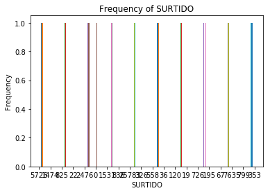

```python
import pandas as pd
import numpy as np
import missingno as msno
%matplotlib inline
```


```python
#https://datos.gob.mx/busca/dataset/medicamentos-y-productos-farmaceuticos-adquiridos-por-el-hospital-de-hggea
path = 'MEDICAMENTOS.csv'
df = pd.read_csv(path, encoding='latin', error_bad_lines=False)
df.head()
```


<div>
<style scoped>
    .dataframe tbody tr th:only-of-type {
        vertical-align: middle;
    }

    .dataframe tbody tr th {
        vertical-align: top;
    }

    .dataframe thead th {
        text-align: right;
    }
</style>
<table border="1" class="dataframe">
  <thead>
    <tr style="text-align: right;">
      <th></th>
      <th>PROVEEDOR</th>
      <th>NUMERODELICITACION</th>
      <th>TIPODECOMPRA</th>
      <th>NUMERO DE CONTRATO</th>
      <th>CODIGOSSA</th>
      <th>CLAVEARTICULO</th>
      <th>NOMBREMEDICAMENTO</th>
      <th>UNIDADDEMEDIDA</th>
      <th>MARCA</th>
      <th>LABORATORIO</th>
      <th>PRECIOUNITARIOCONDESCUENTO</th>
      <th>SURTIDO</th>
    </tr>
  </thead>
  <tbody>
    <tr>
      <th>0</th>
      <td>MAYPO, S.A. DE C.V.</td>
      <td>LA-050GIR047-E71-2018</td>
      <td>CONSOLIDADA</td>
      <td>DA-SRM-LPN008/2019</td>
      <td>010.000.5107.00</td>
      <td>02-01-0787</td>
      <td>ALTEPLASA, 50 MG 10,000 UI</td>
      <td>JERINGA PRELLENADA</td>
      <td>ACTILYSE</td>
      <td>BOEHRINGER INGELHEIM MEXICO, S.A. DE C.V.</td>
      <td>$4,239.24</td>
      <td>4</td>
    </tr>
    <tr>
      <th>1</th>
      <td>NaN</td>
      <td>NaN</td>
      <td>CONSOLIDADA</td>
      <td>NaN</td>
      <td>040.000.2098.00</td>
      <td>02-02-0098</td>
      <td>BUPRENORFINA TRANSDERMICA, 20 MG</td>
      <td>PARCHE</td>
      <td>NaN</td>
      <td>NaN</td>
      <td>NaN</td>
      <td>28</td>
    </tr>
    <tr>
      <th>2</th>
      <td>NaN</td>
      <td>NaN</td>
      <td>CONSOLIDADA</td>
      <td>NaN</td>
      <td>040.000.2097.00</td>
      <td>02-02-0097</td>
      <td>BUPRENORFINA TRANSDERMICA, 30 MG</td>
      <td>PARCHE</td>
      <td>NaN</td>
      <td>NaN</td>
      <td>NaN</td>
      <td>28</td>
    </tr>
    <tr>
      <th>3</th>
      <td>COMERCIALIZADORA DE PRODUCTOS INSTITUCIONALES,...</td>
      <td>LA-050GIR047-E44-2018</td>
      <td>CONSOLIDADA</td>
      <td>DA-SRM-LPN001/2019</td>
      <td>010.000.1541.00\n010.000.1541.01\n010.000.1541.02</td>
      <td>02-01-0694</td>
      <td>CARBETOCINA, 100 MCG/ML</td>
      <td>ÁMPULA</td>
      <td>NaN</td>
      <td>NaN</td>
      <td>$331.01</td>
      <td>148</td>
    </tr>
    <tr>
      <th>4</th>
      <td>DISTRIBUIDORA INTERNACIONAL DE MEDICAMENTOS Y ...</td>
      <td>LA-050GIR047-E44-2018</td>
      <td>CONSOLIDADA</td>
      <td>DA-SRM-LPN003/2019</td>
      <td>010.000.0247.00\n010.000.0247.01\n010.000.0247.02</td>
      <td>02-01-0607</td>
      <td>DEXMEDETOMIDINA, 200 MCG/2 ML</td>
      <td>FRASCO ÁMPULA</td>
      <td>NaN</td>
      <td>NaN</td>
      <td>$48.97</td>
      <td>2476</td>
    </tr>
  </tbody>
</table>
</div>


```python
df.info()

```

    <class 'pandas.core.frame.DataFrame'>
    RangeIndex: 420 entries, 0 to 419
    Data columns (total 12 columns):
    PROVEEDOR                     417 non-null object
    NUMERODELICITACION            417 non-null object
    TIPODECOMPRA                  420 non-null object
    NUMERO DE CONTRATO            417 non-null object
    CODIGOSSA                     418 non-null object
    CLAVEARTICULO                 415 non-null object
    NOMBREMEDICAMENTO             420 non-null object
    UNIDADDEMEDIDA                420 non-null object
    MARCA                         48 non-null object
    LABORATORIO                   405 non-null object
    PRECIOUNITARIOCONDESCUENTO    411 non-null object
    SURTIDO                       419 non-null object
    dtypes: object(12)
    memory usage: 39.5+ KB


```python
df.shape

```


    (420, 12)


```python
df.shape[0]

```


    420


```python
df.shape[1]

```


    12


```python
df.columns.values.tolist()

```


    ['PROVEEDOR',
     'NUMERODELICITACION',
     'TIPODECOMPRA',
     'NUMERO DE CONTRATO',
     'CODIGOSSA',
     'CLAVEARTICULO',
     'NOMBREMEDICAMENTO',
     'UNIDADDEMEDIDA',
     'MARCA',
     'LABORATORIO',
     'PRECIOUNITARIOCONDESCUENTO',
     'SURTIDO']


```python
df.dtypes

```


    PROVEEDOR                     object
    NUMERODELICITACION            object
    TIPODECOMPRA                  object
    NUMERO DE CONTRATO            object
    CODIGOSSA                     object
    CLAVEARTICULO                 object
    NOMBREMEDICAMENTO             object
    UNIDADDEMEDIDA                object
    MARCA                         object
    LABORATORIO                   object
    PRECIOUNITARIOCONDESCUENTO    object
    SURTIDO                       object
    dtype: object


```python
df.isnull().any().any()

```


    True


```python
msno.matrix(df)

```


    <matplotlib.axes._subplots.AxesSubplot at 0x7f495bd132b0>


```python
df.replace({' ': np.nan}, inplace=True)

```


```python
df.isnull().any().any()

```


    True


```python
msno.matrix(df)

```


    <matplotlib.axes._subplots.AxesSubplot at 0x7f495b3f0f28>


```python
msno.bar(df)

```


    <matplotlib.axes._subplots.AxesSubplot at 0x7f495b3a11d0>


```python
df.columns[df.isnull().any()].tolist()

```


    ['PROVEEDOR',
     'NUMERODELICITACION',
     'NUMERO DE CONTRATO',
     'CODIGOSSA',
     'CLAVEARTICULO',
     'MARCA',
     'LABORATORIO',
     'PRECIOUNITARIOCONDESCUENTO',
     'SURTIDO']


```python
df.describe()

```


<div>
<style scoped>
    .dataframe tbody tr th:only-of-type {
        vertical-align: middle;
    }

    .dataframe tbody tr th {
        vertical-align: top;
    }

    .dataframe thead th {
        text-align: right;
    }
</style>
<table border="1" class="dataframe">
  <thead>
    <tr style="text-align: right;">
      <th></th>
      <th>PROVEEDOR</th>
      <th>NUMERODELICITACION</th>
      <th>TIPODECOMPRA</th>
      <th>NUMERO DE CONTRATO</th>
      <th>CODIGOSSA</th>
      <th>CLAVEARTICULO</th>
      <th>NOMBREMEDICAMENTO</th>
      <th>UNIDADDEMEDIDA</th>
      <th>MARCA</th>
      <th>LABORATORIO</th>
      <th>PRECIOUNITARIOCONDESCUENTO</th>
      <th>SURTIDO</th>
    </tr>
  </thead>
  <tbody>
    <tr>
      <th>count</th>
      <td>417</td>
      <td>417</td>
      <td>420</td>
      <td>417</td>
      <td>418</td>
      <td>415</td>
      <td>420</td>
      <td>420</td>
      <td>48</td>
      <td>405</td>
      <td>411</td>
      <td>419</td>
    </tr>
    <tr>
      <th>unique</th>
      <td>5</td>
      <td>406</td>
      <td>2</td>
      <td>411</td>
      <td>335</td>
      <td>405</td>
      <td>420</td>
      <td>40</td>
      <td>30</td>
      <td>191</td>
      <td>391</td>
      <td>248</td>
    </tr>
    <tr>
      <th>top</th>
      <td>DISTRIBUIDORA INTERNACIONAL DE MEDICAMENTOS Y ...</td>
      <td>LA-050GIR047-E71-2018</td>
      <td>SUBROGADA</td>
      <td>DA-SRM-LPN008/2019</td>
      <td>FCB</td>
      <td>02-01-0843</td>
      <td>METAMIZOL, 1 G/2 ML</td>
      <td>ÁMPULA</td>
      <td>ÁMPULA</td>
      <td>LABORATORIOS PISA, S.A. DE C.V.</td>
      <td>$0.44</td>
      <td>0</td>
    </tr>
    <tr>
      <th>freq</th>
      <td>407</td>
      <td>5</td>
      <td>401</td>
      <td>3</td>
      <td>76</td>
      <td>2</td>
      <td>1</td>
      <td>93</td>
      <td>10</td>
      <td>172</td>
      <td>6</td>
      <td>78</td>
    </tr>
  </tbody>
</table>
</div>


```python
df.loc[[0]]

```


<div>
<style scoped>
    .dataframe tbody tr th:only-of-type {
        vertical-align: middle;
    }

    .dataframe tbody tr th {
        vertical-align: top;
    }

    .dataframe thead th {
        text-align: right;
    }
</style>
<table border="1" class="dataframe">
  <thead>
    <tr style="text-align: right;">
      <th></th>
      <th>PROVEEDOR</th>
      <th>NUMERODELICITACION</th>
      <th>TIPODECOMPRA</th>
      <th>NUMERO DE CONTRATO</th>
      <th>CODIGOSSA</th>
      <th>CLAVEARTICULO</th>
      <th>NOMBREMEDICAMENTO</th>
      <th>UNIDADDEMEDIDA</th>
      <th>MARCA</th>
      <th>LABORATORIO</th>
      <th>PRECIOUNITARIOCONDESCUENTO</th>
      <th>SURTIDO</th>
    </tr>
  </thead>
  <tbody>
    <tr>
      <th>0</th>
      <td>MAYPO, S.A. DE C.V.</td>
      <td>LA-050GIR047-E71-2018</td>
      <td>CONSOLIDADA</td>
      <td>DA-SRM-LPN008/2019</td>
      <td>010.000.5107.00</td>
      <td>02-01-0787</td>
      <td>ALTEPLASA, 50 MG 10,000 UI</td>
      <td>JERINGA PRELLENADA</td>
      <td>ACTILYSE</td>
      <td>BOEHRINGER INGELHEIM MEXICO, S.A. DE C.V.</td>
      <td>$4,239.24</td>
      <td>4</td>
    </tr>
  </tbody>
</table>
</div>


```python
df.loc[30:33]

```


<div>
<style scoped>
    .dataframe tbody tr th:only-of-type {
        vertical-align: middle;
    }

    .dataframe tbody tr th {
        vertical-align: top;
    }

    .dataframe thead th {
        text-align: right;
    }
</style>
<table border="1" class="dataframe">
  <thead>
    <tr style="text-align: right;">
      <th></th>
      <th>PROVEEDOR</th>
      <th>NUMERODELICITACION</th>
      <th>TIPODECOMPRA</th>
      <th>NUMERO DE CONTRATO</th>
      <th>CODIGOSSA</th>
      <th>CLAVEARTICULO</th>
      <th>NOMBREMEDICAMENTO</th>
      <th>UNIDADDEMEDIDA</th>
      <th>MARCA</th>
      <th>LABORATORIO</th>
      <th>PRECIOUNITARIOCONDESCUENTO</th>
      <th>SURTIDO</th>
    </tr>
  </thead>
  <tbody>
    <tr>
      <th>30</th>
      <td>DISTRIBUIDORA INTERNACIONAL DE MEDICAMENTOS Y ...</td>
      <td>LA-012NBB001-E8-2030</td>
      <td>SUBROGADA</td>
      <td>HGMGG-LPN-01-2030</td>
      <td>010.000.4185.00/010.000.4185.01 (50 Y 60)</td>
      <td>02-01-0796</td>
      <td>ÁCIDO URSODEOXICÓLICO, 250 MG</td>
      <td>CÁPSULA</td>
      <td>CAJA CON BLISTERS DE 50 O 60 CÁPSULAS</td>
      <td>LABORATORIOS PISA, S.A. DE C.V.</td>
      <td>$6.04</td>
      <td>193</td>
    </tr>
    <tr>
      <th>31</th>
      <td>DISTRIBUIDORA INTERNACIONAL DE MEDICAMENTOS Y ...</td>
      <td>LA-012NBB001-E8-2031</td>
      <td>SUBROGADA</td>
      <td>HGMGG-LPN-01-2031</td>
      <td>FCB</td>
      <td>02-01-0776</td>
      <td>ACIDO VALPROICO,  500  MG/ 5 ML</td>
      <td>SOLUCIÓN</td>
      <td>CAJA CON 1 FRASCO ÁMPULA</td>
      <td>DEPAKENE</td>
      <td>$542.91</td>
      <td>422</td>
    </tr>
    <tr>
      <th>32</th>
      <td>DISTRIBUIDORA INTERNACIONAL DE MEDICAMENTOS Y ...</td>
      <td>LA-012NBB001-E8-2032</td>
      <td>SUBROGADA</td>
      <td>HGMGG-LPN-01-2032</td>
      <td>010.000.2620.00 (60)</td>
      <td>02-01-0355</td>
      <td>ACIDO VALPROICO, 250 MG</td>
      <td>CÁPSULA</td>
      <td>ENVASE CON 60 CÁPSULAS</td>
      <td>DEPAKENE</td>
      <td>$5.93</td>
      <td>263</td>
    </tr>
    <tr>
      <th>33</th>
      <td>DISTRIBUIDORA INTERNACIONAL DE MEDICAMENTOS Y ...</td>
      <td>LA-012NBB001-E8-2033</td>
      <td>SUBROGADA</td>
      <td>HGMGG-LPN-01-2033</td>
      <td>010.000.2620.00 (60)</td>
      <td>02-01-0568</td>
      <td>ACIDO VALPROICO, 250 MG/5 ML, SUSPENSION</td>
      <td>FRASCO</td>
      <td>FRASCO CON 40 ML</td>
      <td>LABORATORIOS PISA, S.A. DE C.V.</td>
      <td>$344.87</td>
      <td>14</td>
    </tr>
  </tbody>
</table>
</div>


```python
df.drop([0,4,32], axis=0).head()

```


<div>
<style scoped>
    .dataframe tbody tr th:only-of-type {
        vertical-align: middle;
    }

    .dataframe tbody tr th {
        vertical-align: top;
    }

    .dataframe thead th {
        text-align: right;
    }
</style>
<table border="1" class="dataframe">
  <thead>
    <tr style="text-align: right;">
      <th></th>
      <th>PROVEEDOR</th>
      <th>NUMERODELICITACION</th>
      <th>TIPODECOMPRA</th>
      <th>NUMERO DE CONTRATO</th>
      <th>CODIGOSSA</th>
      <th>CLAVEARTICULO</th>
      <th>NOMBREMEDICAMENTO</th>
      <th>UNIDADDEMEDIDA</th>
      <th>MARCA</th>
      <th>LABORATORIO</th>
      <th>PRECIOUNITARIOCONDESCUENTO</th>
      <th>SURTIDO</th>
    </tr>
  </thead>
  <tbody>
    <tr>
      <th>1</th>
      <td>NaN</td>
      <td>NaN</td>
      <td>CONSOLIDADA</td>
      <td>NaN</td>
      <td>040.000.2098.00</td>
      <td>02-02-0098</td>
      <td>BUPRENORFINA TRANSDERMICA, 20 MG</td>
      <td>PARCHE</td>
      <td>NaN</td>
      <td>NaN</td>
      <td>NaN</td>
      <td>28</td>
    </tr>
    <tr>
      <th>2</th>
      <td>NaN</td>
      <td>NaN</td>
      <td>CONSOLIDADA</td>
      <td>NaN</td>
      <td>040.000.2097.00</td>
      <td>02-02-0097</td>
      <td>BUPRENORFINA TRANSDERMICA, 30 MG</td>
      <td>PARCHE</td>
      <td>NaN</td>
      <td>NaN</td>
      <td>NaN</td>
      <td>28</td>
    </tr>
    <tr>
      <th>3</th>
      <td>COMERCIALIZADORA DE PRODUCTOS INSTITUCIONALES,...</td>
      <td>LA-050GIR047-E44-2018</td>
      <td>CONSOLIDADA</td>
      <td>DA-SRM-LPN001/2019</td>
      <td>010.000.1541.00\n010.000.1541.01\n010.000.1541.02</td>
      <td>02-01-0694</td>
      <td>CARBETOCINA, 100 MCG/ML</td>
      <td>ÁMPULA</td>
      <td>NaN</td>
      <td>NaN</td>
      <td>$331.01</td>
      <td>148</td>
    </tr>
    <tr>
      <th>5</th>
      <td>DISTRIBUIDORA INTERNACIONAL DE MEDICAMENTOS Y ...</td>
      <td>LA-050GIR047-E44-2018</td>
      <td>CONSOLIDADA</td>
      <td>DA-SRM-LPN003/2019</td>
      <td>010.000.4242.00\n010.000.4242.01</td>
      <td>02-01-0414</td>
      <td>ENOXAPARINA, 20 MG/2 ML</td>
      <td>JERINGA PRELLENADA</td>
      <td>NaN</td>
      <td>NaN</td>
      <td>$40.60</td>
      <td>326</td>
    </tr>
    <tr>
      <th>6</th>
      <td>GRUPO FÁRMACOS ESPECIALIZADOS, S..A DE CV</td>
      <td>LA-050GIR047-E45-2018</td>
      <td>CONSOLIDADA</td>
      <td>DA-SRM-LPN005/2019</td>
      <td>010.000.2154.00\n010.000.2154.01</td>
      <td>02-01-0511</td>
      <td>ENOXAPARINA, 40 MG/2 ML</td>
      <td>JERINGA PRELLENADA</td>
      <td>CLEXANE</td>
      <td>SANOFI AVENTIS WINTHROP, S.A. DE C.V.</td>
      <td>$42.10</td>
      <td>3284</td>
    </tr>
  </tbody>
</table>
</div>


```python
df.drop(df.index[1:5], axis=0).head(10)

```


<div>
<style scoped>
    .dataframe tbody tr th:only-of-type {
        vertical-align: middle;
    }

    .dataframe tbody tr th {
        vertical-align: top;
    }

    .dataframe thead th {
        text-align: right;
    }
</style>
<table border="1" class="dataframe">
  <thead>
    <tr style="text-align: right;">
      <th></th>
      <th>PROVEEDOR</th>
      <th>NUMERODELICITACION</th>
      <th>TIPODECOMPRA</th>
      <th>NUMERO DE CONTRATO</th>
      <th>CODIGOSSA</th>
      <th>CLAVEARTICULO</th>
      <th>NOMBREMEDICAMENTO</th>
      <th>UNIDADDEMEDIDA</th>
      <th>MARCA</th>
      <th>LABORATORIO</th>
      <th>PRECIOUNITARIOCONDESCUENTO</th>
      <th>SURTIDO</th>
    </tr>
  </thead>
  <tbody>
    <tr>
      <th>0</th>
      <td>MAYPO, S.A. DE C.V.</td>
      <td>LA-050GIR047-E71-2018</td>
      <td>CONSOLIDADA</td>
      <td>DA-SRM-LPN008/2019</td>
      <td>010.000.5107.00</td>
      <td>02-01-0787</td>
      <td>ALTEPLASA, 50 MG 10,000 UI</td>
      <td>JERINGA PRELLENADA</td>
      <td>ACTILYSE</td>
      <td>BOEHRINGER INGELHEIM MEXICO, S.A. DE C.V.</td>
      <td>$4,239.24</td>
      <td>4</td>
    </tr>
    <tr>
      <th>5</th>
      <td>DISTRIBUIDORA INTERNACIONAL DE MEDICAMENTOS Y ...</td>
      <td>LA-050GIR047-E44-2018</td>
      <td>CONSOLIDADA</td>
      <td>DA-SRM-LPN003/2019</td>
      <td>010.000.4242.00\n010.000.4242.01</td>
      <td>02-01-0414</td>
      <td>ENOXAPARINA, 20 MG/2 ML</td>
      <td>JERINGA PRELLENADA</td>
      <td>NaN</td>
      <td>NaN</td>
      <td>$40.60</td>
      <td>326</td>
    </tr>
    <tr>
      <th>6</th>
      <td>GRUPO FÁRMACOS ESPECIALIZADOS, S..A DE CV</td>
      <td>LA-050GIR047-E45-2018</td>
      <td>CONSOLIDADA</td>
      <td>DA-SRM-LPN005/2019</td>
      <td>010.000.2154.00\n010.000.2154.01</td>
      <td>02-01-0511</td>
      <td>ENOXAPARINA, 40 MG/2 ML</td>
      <td>JERINGA PRELLENADA</td>
      <td>CLEXANE</td>
      <td>SANOFI AVENTIS WINTHROP, S.A. DE C.V.</td>
      <td>$42.10</td>
      <td>3284</td>
    </tr>
    <tr>
      <th>7</th>
      <td>GRUPO FÁRMACOS ESPECIALIZADOS, S..A DE CV</td>
      <td>LA-050GIR047-E45-2018</td>
      <td>CONSOLIDADA</td>
      <td>DA-SRM-LPN005/2019</td>
      <td>010.000.4224.00\n010.000.4224.01</td>
      <td>02-01-0605</td>
      <td>ENOXAPARINA, 60 MG/2 ML</td>
      <td>JERINGA PRELLENADA</td>
      <td>BOLENTAX,DENEPAR</td>
      <td>PISA,</td>
      <td>$56.15</td>
      <td>1932</td>
    </tr>
    <tr>
      <th>8</th>
      <td>DISTRIBUIDORA INTERNACIONAL DE MEDICAMENTOS Y ...</td>
      <td>LA-050GIR047-E64-2018</td>
      <td>CONSOLIDADA</td>
      <td>DA-SRM-LPN011/2019</td>
      <td>010.000.5332.00</td>
      <td>02-01-0750</td>
      <td>ERITROPOYETINA HUMANA RECOMBINANTE 2000 UI  1 ML</td>
      <td>FRASCO ÁMPULA</td>
      <td>NaN</td>
      <td>NaN</td>
      <td>$260.00</td>
      <td>5</td>
    </tr>
    <tr>
      <th>9</th>
      <td>MAYPO, S.A. DE C.V.</td>
      <td>LA-050GIR047-E71-2018</td>
      <td>CONSOLIDADA</td>
      <td>DA-SRM-LPN008/2019</td>
      <td>010.000.4148.00\n010.000.4148.01</td>
      <td>02-01-0712</td>
      <td>INSULINA LISPRO RECOMBINANTE, PROTAMINA 25/75</td>
      <td>FRASCO ÁMPULA</td>
      <td>HUMALOG MIX</td>
      <td>LILLY</td>
      <td>$280.23</td>
      <td>1</td>
    </tr>
    <tr>
      <th>10</th>
      <td>DISTRIBUIDORA INTERNACIONAL DE MEDICAMENTOS Y ...</td>
      <td>LA-050GIR047-E45-2018</td>
      <td>CONSOLIDADA</td>
      <td>DA-SRM-LPN004/2019</td>
      <td>010.000.5097.00\n010.000.5097.01</td>
      <td>02-01-0675</td>
      <td>LEVOSIMENDAN, 2.5 MG/ML</td>
      <td>FRASCO ÁMPULA</td>
      <td>NaN</td>
      <td>NaN</td>
      <td>NaN</td>
      <td>14</td>
    </tr>
    <tr>
      <th>11</th>
      <td>DISTRIBUIDORA INTERNACIONAL DE MEDICAMENTOS Y ...</td>
      <td>LA-050GIR047-E44-2018</td>
      <td>CONSOLIDADA</td>
      <td>DA-SRM-LPN003/2019</td>
      <td>010.000.5100.01</td>
      <td>02-01-0609</td>
      <td>MILRINONA, 10 MG/10 ML</td>
      <td>FRASCO ÁMPULA</td>
      <td>NaN</td>
      <td>NaN</td>
      <td>$2,838.79</td>
      <td>35</td>
    </tr>
    <tr>
      <th>12</th>
      <td>VITASANITAS, S.A. DE C.V.</td>
      <td>LA-050GIR047-E71-2018</td>
      <td>CONSOLIDADA</td>
      <td>DA-SRM-LPN009/2019</td>
      <td>010.000.4248.00</td>
      <td>01-07-0300</td>
      <td>SELLADORES DE FIBRINA, 3 ML (CONCENTRADO DE PR...</td>
      <td>KIT</td>
      <td>BERIPLAST</td>
      <td>CS BHERING</td>
      <td>$5,356.58</td>
      <td>0</td>
    </tr>
    <tr>
      <th>13</th>
      <td>DISTRIBUIDORA INTERNACIONAL DE MEDICAMENTOS Y ...</td>
      <td>LA-050GIR047-E63-2018</td>
      <td>CONSOLIDADA</td>
      <td>DA-SRM-LPN010/2019</td>
      <td>010.000.0233.00</td>
      <td>02-01-0569</td>
      <td>SEVOFLURANO, 250 ML</td>
      <td>FRASCO</td>
      <td>FLOVES</td>
      <td>PISA,</td>
      <td>$1,496.00</td>
      <td>240</td>
    </tr>
  </tbody>
</table>
</div>


```python
df[10:].head() 
```


<div>
<style scoped>
    .dataframe tbody tr th:only-of-type {
        vertical-align: middle;
    }

    .dataframe tbody tr th {
        vertical-align: top;
    }

    .dataframe thead th {
        text-align: right;
    }
</style>
<table border="1" class="dataframe">
  <thead>
    <tr style="text-align: right;">
      <th></th>
      <th>PROVEEDOR</th>
      <th>NUMERODELICITACION</th>
      <th>TIPODECOMPRA</th>
      <th>NUMERO DE CONTRATO</th>
      <th>CODIGOSSA</th>
      <th>CLAVEARTICULO</th>
      <th>NOMBREMEDICAMENTO</th>
      <th>UNIDADDEMEDIDA</th>
      <th>MARCA</th>
      <th>LABORATORIO</th>
      <th>PRECIOUNITARIOCONDESCUENTO</th>
      <th>SURTIDO</th>
    </tr>
  </thead>
  <tbody>
    <tr>
      <th>10</th>
      <td>DISTRIBUIDORA INTERNACIONAL DE MEDICAMENTOS Y ...</td>
      <td>LA-050GIR047-E45-2018</td>
      <td>CONSOLIDADA</td>
      <td>DA-SRM-LPN004/2019</td>
      <td>010.000.5097.00\n010.000.5097.01</td>
      <td>02-01-0675</td>
      <td>LEVOSIMENDAN, 2.5 MG/ML</td>
      <td>FRASCO ÁMPULA</td>
      <td>NaN</td>
      <td>NaN</td>
      <td>NaN</td>
      <td>14</td>
    </tr>
    <tr>
      <th>11</th>
      <td>DISTRIBUIDORA INTERNACIONAL DE MEDICAMENTOS Y ...</td>
      <td>LA-050GIR047-E44-2018</td>
      <td>CONSOLIDADA</td>
      <td>DA-SRM-LPN003/2019</td>
      <td>010.000.5100.01</td>
      <td>02-01-0609</td>
      <td>MILRINONA, 10 MG/10 ML</td>
      <td>FRASCO ÁMPULA</td>
      <td>NaN</td>
      <td>NaN</td>
      <td>$2,838.79</td>
      <td>35</td>
    </tr>
    <tr>
      <th>12</th>
      <td>VITASANITAS, S.A. DE C.V.</td>
      <td>LA-050GIR047-E71-2018</td>
      <td>CONSOLIDADA</td>
      <td>DA-SRM-LPN009/2019</td>
      <td>010.000.4248.00</td>
      <td>01-07-0300</td>
      <td>SELLADORES DE FIBRINA, 3 ML (CONCENTRADO DE PR...</td>
      <td>KIT</td>
      <td>BERIPLAST</td>
      <td>CS BHERING</td>
      <td>$5,356.58</td>
      <td>0</td>
    </tr>
    <tr>
      <th>13</th>
      <td>DISTRIBUIDORA INTERNACIONAL DE MEDICAMENTOS Y ...</td>
      <td>LA-050GIR047-E63-2018</td>
      <td>CONSOLIDADA</td>
      <td>DA-SRM-LPN010/2019</td>
      <td>010.000.0233.00</td>
      <td>02-01-0569</td>
      <td>SEVOFLURANO, 250 ML</td>
      <td>FRASCO</td>
      <td>FLOVES</td>
      <td>PISA,</td>
      <td>$1,496.00</td>
      <td>240</td>
    </tr>
    <tr>
      <th>14</th>
      <td>NaN</td>
      <td>NaN</td>
      <td>CONSOLIDADA</td>
      <td>NaN</td>
      <td>010.000.5363.00</td>
      <td>02-01-0763</td>
      <td>TOPIRAMATO, 100 MG</td>
      <td>TABLETA</td>
      <td>NaN</td>
      <td>NaN</td>
      <td>NaN</td>
      <td>13</td>
    </tr>
  </tbody>
</table>
</div>


```python
df.MARCA.values

```


    array(['ACTILYSE', nan, nan, nan, nan, nan, 'CLEXANE', 'BOLENTAX,DENEPAR',
           nan, 'HUMALOG MIX', nan, nan, 'BERIPLAST', 'FLOVES', nan,
           'NITRODERM TTS,MINITRAL', 'CUROSURF',
           'BIOMINA, OCTALBIN, GRIFOLS, PROBIALBUMIN, BHERING, ALBUNATE,KEDRIAL, ',
           'METALYSE', 'FRASCO ÁMPULA ',
           'CAJA CON BLISTER DE 20 O 30 TABLETAS',
           'CAJA CON BLISTER DE 20 TABLETAS', 'ÁMPULA', 'ÁMPULA',
           'FRASCO ÁMPULA ', nan, 'CAJA CON BLISTER DE 20 TABLETAS',
           'ÁMPULA ', 'CAJA CON 6 ÁMPULAS',
           'CAJA O FRASCO CON 20 O 92 TABLETAS',
           'CAJA CON BLISTERS DE 50 O 60 CÁPSULAS',
           'CAJA CON 1 FRASCO ÁMPULA', 'ENVASE CON 60 CÁPSULAS',
           'FRASCO CON 40 ML ', 'FRASCO ÁMPULA ',
           'CAJA CON BLISTERS CONTENIENDO 30 TABLETAS',
           'CAJA CON BLISTERS CONTENIENDO 20 O 50 TABLETAS',
           'CAJA CON BLISTERS CONTENIENDO 20 TABLETAS',
           'CAJA CON BLISTERS CONTENIENDO 30 TABLETAS', 'ÁMPULA',
           'FRASCO CON XXX ML', 'FRASCO ÁMPULA ', 'ÁMPULA', 'ÁMPULA',
           'ÁMPULA', 'ÁMPULA', 'CAJA CON BISTER CONTENIENDO 20 TABLETAS',
           'FRASCO ÁMPULA', 'FRASCO CON XXX ML', 'FRASCO O BLISTER',
           'FRASCO ÁMPULA', 'FRASCO ÁMPULA', 'CAJA CON BISTER', 'ÁMPULA',
           'ÁMPULA', nan, 'ÁMPULA', nan, nan, nan, nan, nan, nan, nan, nan,
           nan, nan, nan, nan, nan, nan, nan, nan, nan, nan, nan, nan, nan,
           nan, nan, nan, nan, nan, nan, nan, nan, nan, nan, nan, nan, nan,
           nan, nan, nan, nan, nan, nan, nan, nan, nan, nan, nan, nan, nan,
           nan, nan, nan, nan, nan, nan, nan, nan, nan, nan, nan, nan, nan,
           nan, nan, nan, nan, nan, nan, nan, nan, nan, nan, nan, nan, nan,
           nan, nan, nan, nan, nan, nan, nan, nan, nan, nan, nan, nan, nan,
           nan, nan, nan, nan, nan, nan, nan, nan, nan, nan, nan, nan, nan,
           nan, nan, nan, nan, nan, nan, nan, nan, nan, nan, nan, nan, nan,
           nan, nan, nan, nan, nan, nan, nan, nan, nan, nan, nan, nan, nan,
           nan, nan, nan, nan, nan, nan, nan, nan, nan, nan, nan, nan, nan,
           nan, nan, nan, nan, nan, nan, nan, nan, nan, nan, nan, nan, nan,
           nan, nan, nan, nan, nan, nan, nan, nan, nan, nan, nan, nan, nan,
           nan, nan, nan, nan, nan, nan, nan, nan, nan, nan, nan, nan, nan,
           nan, nan, nan, nan, nan, nan, nan, nan, nan, nan, nan, nan, nan,
           nan, nan, nan, nan, nan, nan, nan, nan, nan, nan, nan, nan, nan,
           nan, nan, nan, nan, nan, nan, nan, nan, nan, nan, nan, nan, nan,
           nan, nan, nan, nan, nan, nan, nan, nan, nan, nan, nan, nan, nan,
           nan, nan, nan, nan, nan, nan, nan, nan, nan, nan, nan, nan, nan,
           nan, nan, nan, nan, nan, nan, nan, nan, nan, nan, nan, nan, nan,
           nan, nan, nan, nan, nan, nan, nan, nan, nan, nan, nan, nan, nan,
           nan, nan, nan, nan, nan, nan, nan, nan, nan, nan, nan, nan, nan,
           nan, nan, nan, nan, nan, nan, nan, nan, nan, nan, nan, nan, nan,
           nan, nan, nan, nan, nan, nan, nan, nan, nan, nan, nan, nan, nan,
           nan, nan, nan, nan, nan, nan, nan, nan, nan, nan, nan, nan, nan,
           nan, nan, nan, nan, nan, nan, nan, nan, nan, nan, nan, nan, nan,
           nan, nan, nan, nan, 'FRASCO ÁMPULA', 'FRASCO GOTERO', nan, nan,
           nan, nan, nan, nan, nan, nan, nan, nan, nan, nan, nan, nan, nan,
           nan, nan, nan, nan, nan, nan, nan, nan, nan], dtype=object)


```python
df['MARCA'].values

```


    array(['ACTILYSE', nan, nan, nan, nan, nan, 'CLEXANE', 'BOLENTAX,DENEPAR',
           nan, 'HUMALOG MIX', nan, nan, 'BERIPLAST', 'FLOVES', nan,
           'NITRODERM TTS,MINITRAL', 'CUROSURF',
           'BIOMINA, OCTALBIN, GRIFOLS, PROBIALBUMIN, BHERING, ALBUNATE,KEDRIAL, ',
           'METALYSE', 'FRASCO ÁMPULA ',
           'CAJA CON BLISTER DE 20 O 30 TABLETAS',
           'CAJA CON BLISTER DE 20 TABLETAS', 'ÁMPULA', 'ÁMPULA',
           'FRASCO ÁMPULA ', nan, 'CAJA CON BLISTER DE 20 TABLETAS',
           'ÁMPULA ', 'CAJA CON 6 ÁMPULAS',
           'CAJA O FRASCO CON 20 O 92 TABLETAS',
           'CAJA CON BLISTERS DE 50 O 60 CÁPSULAS',
           'CAJA CON 1 FRASCO ÁMPULA', 'ENVASE CON 60 CÁPSULAS',
           'FRASCO CON 40 ML ', 'FRASCO ÁMPULA ',
           'CAJA CON BLISTERS CONTENIENDO 30 TABLETAS',
           'CAJA CON BLISTERS CONTENIENDO 20 O 50 TABLETAS',
           'CAJA CON BLISTERS CONTENIENDO 20 TABLETAS',
           'CAJA CON BLISTERS CONTENIENDO 30 TABLETAS', 'ÁMPULA',
           'FRASCO CON XXX ML', 'FRASCO ÁMPULA ', 'ÁMPULA', 'ÁMPULA',
           'ÁMPULA', 'ÁMPULA', 'CAJA CON BISTER CONTENIENDO 20 TABLETAS',
           'FRASCO ÁMPULA', 'FRASCO CON XXX ML', 'FRASCO O BLISTER',
           'FRASCO ÁMPULA', 'FRASCO ÁMPULA', 'CAJA CON BISTER', 'ÁMPULA',
           'ÁMPULA', nan, 'ÁMPULA', nan, nan, nan, nan, nan, nan, nan, nan,
           nan, nan, nan, nan, nan, nan, nan, nan, nan, nan, nan, nan, nan,
           nan, nan, nan, nan, nan, nan, nan, nan, nan, nan, nan, nan, nan,
           nan, nan, nan, nan, nan, nan, nan, nan, nan, nan, nan, nan, nan,
           nan, nan, nan, nan, nan, nan, nan, nan, nan, nan, nan, nan, nan,
           nan, nan, nan, nan, nan, nan, nan, nan, nan, nan, nan, nan, nan,
           nan, nan, nan, nan, nan, nan, nan, nan, nan, nan, nan, nan, nan,
           nan, nan, nan, nan, nan, nan, nan, nan, nan, nan, nan, nan, nan,
           nan, nan, nan, nan, nan, nan, nan, nan, nan, nan, nan, nan, nan,
           nan, nan, nan, nan, nan, nan, nan, nan, nan, nan, nan, nan, nan,
           nan, nan, nan, nan, nan, nan, nan, nan, nan, nan, nan, nan, nan,
           nan, nan, nan, nan, nan, nan, nan, nan, nan, nan, nan, nan, nan,
           nan, nan, nan, nan, nan, nan, nan, nan, nan, nan, nan, nan, nan,
           nan, nan, nan, nan, nan, nan, nan, nan, nan, nan, nan, nan, nan,
           nan, nan, nan, nan, nan, nan, nan, nan, nan, nan, nan, nan, nan,
           nan, nan, nan, nan, nan, nan, nan, nan, nan, nan, nan, nan, nan,
           nan, nan, nan, nan, nan, nan, nan, nan, nan, nan, nan, nan, nan,
           nan, nan, nan, nan, nan, nan, nan, nan, nan, nan, nan, nan, nan,
           nan, nan, nan, nan, nan, nan, nan, nan, nan, nan, nan, nan, nan,
           nan, nan, nan, nan, nan, nan, nan, nan, nan, nan, nan, nan, nan,
           nan, nan, nan, nan, nan, nan, nan, nan, nan, nan, nan, nan, nan,
           nan, nan, nan, nan, nan, nan, nan, nan, nan, nan, nan, nan, nan,
           nan, nan, nan, nan, nan, nan, nan, nan, nan, nan, nan, nan, nan,
           nan, nan, nan, nan, nan, nan, nan, nan, nan, nan, nan, nan, nan,
           nan, nan, nan, nan, nan, nan, nan, nan, nan, nan, nan, nan, nan,
           nan, nan, nan, nan, nan, nan, nan, nan, nan, nan, nan, nan, nan,
           nan, nan, nan, nan, 'FRASCO ÁMPULA', 'FRASCO GOTERO', nan, nan,
           nan, nan, nan, nan, nan, nan, nan, nan, nan, nan, nan, nan, nan,
           nan, nan, nan, nan, nan, nan, nan, nan, nan], dtype=object)


```python
df.MARCA.unique()

```


    array(['ACTILYSE', nan, 'CLEXANE', 'BOLENTAX,DENEPAR', 'HUMALOG MIX',
           'BERIPLAST', 'FLOVES', 'NITRODERM TTS,MINITRAL', 'CUROSURF',
           'BIOMINA, OCTALBIN, GRIFOLS, PROBIALBUMIN, BHERING, ALBUNATE,KEDRIAL, ',
           'METALYSE', 'FRASCO ÁMPULA ',
           'CAJA CON BLISTER DE 20 O 30 TABLETAS',
           'CAJA CON BLISTER DE 20 TABLETAS', 'ÁMPULA', 'ÁMPULA ',
           'CAJA CON 6 ÁMPULAS', 'CAJA O FRASCO CON 20 O 92 TABLETAS',
           'CAJA CON BLISTERS DE 50 O 60 CÁPSULAS',
           'CAJA CON 1 FRASCO ÁMPULA', 'ENVASE CON 60 CÁPSULAS',
           'FRASCO CON 40 ML ', 'CAJA CON BLISTERS CONTENIENDO 30 TABLETAS',
           'CAJA CON BLISTERS CONTENIENDO 20 O 50 TABLETAS',
           'CAJA CON BLISTERS CONTENIENDO 20 TABLETAS', 'FRASCO CON XXX ML',
           'CAJA CON BISTER CONTENIENDO 20 TABLETAS', 'FRASCO ÁMPULA',
           'FRASCO O BLISTER', 'CAJA CON BISTER', 'FRASCO GOTERO'],
          dtype=object)


```python
df.MARCA.value_counts()

```


    ÁMPULA                                                                   10
    FRASCO ÁMPULA                                                             4
    FRASCO ÁMPULA                                                             4
    CAJA CON BLISTER DE 20 TABLETAS                                           2
    CAJA CON BLISTERS CONTENIENDO 30 TABLETAS                                 2
    FRASCO CON XXX ML                                                         2
    ACTILYSE                                                                  1
    CAJA CON 6 ÁMPULAS                                                        1
    BIOMINA, OCTALBIN, GRIFOLS, PROBIALBUMIN, BHERING, ALBUNATE,KEDRIAL,      1
    CAJA CON BLISTERS DE 50 O 60 CÁPSULAS                                     1
    NITRODERM TTS,MINITRAL                                                    1
    CAJA CON BLISTER DE 20 O 30 TABLETAS                                      1
    BERIPLAST                                                                 1
    FRASCO GOTERO                                                             1
    CAJA CON 1 FRASCO ÁMPULA                                                  1
    FRASCO CON 40 ML                                                          1
    FLOVES                                                                    1
    METALYSE                                                                  1
    CAJA CON BISTER CONTENIENDO 20 TABLETAS                                   1
    CAJA CON BLISTERS CONTENIENDO 20 O 50 TABLETAS                            1
    CAJA CON BLISTERS CONTENIENDO 20 TABLETAS                                 1
    CAJA O FRASCO CON 20 O 92 TABLETAS                                        1
    HUMALOG MIX                                                               1
    ENVASE CON 60 CÁPSULAS                                                    1
    CUROSURF                                                                  1
    CAJA CON BISTER                                                           1
    FRASCO O BLISTER                                                          1
    ÁMPULA                                                                    1
    CLEXANE                                                                   1
    BOLENTAX,DENEPAR                                                          1
    Name: MARCA, dtype: int64


```python
df.agg(['count', 'size', 'nunique'])

```


<div>
<style scoped>
    .dataframe tbody tr th:only-of-type {
        vertical-align: middle;
    }

    .dataframe tbody tr th {
        vertical-align: top;
    }

    .dataframe thead th {
        text-align: right;
    }
</style>
<table border="1" class="dataframe">
  <thead>
    <tr style="text-align: right;">
      <th></th>
      <th>PROVEEDOR</th>
      <th>NUMERODELICITACION</th>
      <th>TIPODECOMPRA</th>
      <th>NUMERO DE CONTRATO</th>
      <th>CODIGOSSA</th>
      <th>CLAVEARTICULO</th>
      <th>NOMBREMEDICAMENTO</th>
      <th>UNIDADDEMEDIDA</th>
      <th>MARCA</th>
      <th>LABORATORIO</th>
      <th>PRECIOUNITARIOCONDESCUENTO</th>
      <th>SURTIDO</th>
    </tr>
  </thead>
  <tbody>
    <tr>
      <th>count</th>
      <td>417</td>
      <td>417</td>
      <td>420</td>
      <td>417</td>
      <td>418</td>
      <td>415</td>
      <td>420</td>
      <td>420</td>
      <td>48</td>
      <td>405</td>
      <td>411</td>
      <td>419</td>
    </tr>
    <tr>
      <th>size</th>
      <td>420</td>
      <td>420</td>
      <td>420</td>
      <td>420</td>
      <td>420</td>
      <td>420</td>
      <td>420</td>
      <td>420</td>
      <td>420</td>
      <td>420</td>
      <td>420</td>
      <td>420</td>
    </tr>
    <tr>
      <th>nunique</th>
      <td>5</td>
      <td>406</td>
      <td>2</td>
      <td>411</td>
      <td>335</td>
      <td>405</td>
      <td>420</td>
      <td>40</td>
      <td>30</td>
      <td>191</td>
      <td>391</td>
      <td>248</td>
    </tr>
  </tbody>
</table>
</div>


```python
df.groupby('MARCA').agg(['count', 'size', 'nunique']).stack()

```


<div>
<style scoped>
    .dataframe tbody tr th:only-of-type {
        vertical-align: middle;
    }

    .dataframe tbody tr th {
        vertical-align: top;
    }

    .dataframe thead th {
        text-align: right;
    }
</style>
<table border="1" class="dataframe">
  <thead>
    <tr style="text-align: right;">
      <th></th>
      <th></th>
      <th>PROVEEDOR</th>
      <th>NUMERODELICITACION</th>
      <th>TIPODECOMPRA</th>
      <th>NUMERO DE CONTRATO</th>
      <th>CODIGOSSA</th>
      <th>CLAVEARTICULO</th>
      <th>NOMBREMEDICAMENTO</th>
      <th>UNIDADDEMEDIDA</th>
      <th>LABORATORIO</th>
      <th>PRECIOUNITARIOCONDESCUENTO</th>
      <th>SURTIDO</th>
    </tr>
    <tr>
      <th>MARCA</th>
      <th></th>
      <th></th>
      <th></th>
      <th></th>
      <th></th>
      <th></th>
      <th></th>
      <th></th>
      <th></th>
      <th></th>
      <th></th>
      <th></th>
    </tr>
  </thead>
  <tbody>
    <tr>
      <th rowspan="3" valign="top">ACTILYSE</th>
      <th>count</th>
      <td>1</td>
      <td>1</td>
      <td>1</td>
      <td>1</td>
      <td>1</td>
      <td>1</td>
      <td>1</td>
      <td>1</td>
      <td>1</td>
      <td>1</td>
      <td>1</td>
    </tr>
    <tr>
      <th>size</th>
      <td>1</td>
      <td>1</td>
      <td>1</td>
      <td>1</td>
      <td>1</td>
      <td>1</td>
      <td>1</td>
      <td>1</td>
      <td>1</td>
      <td>1</td>
      <td>1</td>
    </tr>
    <tr>
      <th>nunique</th>
      <td>1</td>
      <td>1</td>
      <td>1</td>
      <td>1</td>
      <td>1</td>
      <td>1</td>
      <td>1</td>
      <td>1</td>
      <td>1</td>
      <td>1</td>
      <td>1</td>
    </tr>
    <tr>
      <th rowspan="3" valign="top">BERIPLAST</th>
      <th>count</th>
      <td>1</td>
      <td>1</td>
      <td>1</td>
      <td>1</td>
      <td>1</td>
      <td>1</td>
      <td>1</td>
      <td>1</td>
      <td>1</td>
      <td>1</td>
      <td>1</td>
    </tr>
    <tr>
      <th>size</th>
      <td>1</td>
      <td>1</td>
      <td>1</td>
      <td>1</td>
      <td>1</td>
      <td>1</td>
      <td>1</td>
      <td>1</td>
      <td>1</td>
      <td>1</td>
      <td>1</td>
    </tr>
    <tr>
      <th>nunique</th>
      <td>1</td>
      <td>1</td>
      <td>1</td>
      <td>1</td>
      <td>1</td>
      <td>1</td>
      <td>1</td>
      <td>1</td>
      <td>1</td>
      <td>1</td>
      <td>1</td>
    </tr>
    <tr>
      <th rowspan="3" valign="top">BIOMINA, OCTALBIN, GRIFOLS, PROBIALBUMIN, BHERING, ALBUNATE,KEDRIAL,</th>
      <th>count</th>
      <td>1</td>
      <td>1</td>
      <td>1</td>
      <td>1</td>
      <td>1</td>
      <td>1</td>
      <td>1</td>
      <td>1</td>
      <td>0</td>
      <td>1</td>
      <td>1</td>
    </tr>
    <tr>
      <th>size</th>
      <td>1</td>
      <td>1</td>
      <td>1</td>
      <td>1</td>
      <td>1</td>
      <td>1</td>
      <td>1</td>
      <td>1</td>
      <td>1</td>
      <td>1</td>
      <td>1</td>
    </tr>
    <tr>
      <th>nunique</th>
      <td>1</td>
      <td>1</td>
      <td>1</td>
      <td>1</td>
      <td>1</td>
      <td>1</td>
      <td>1</td>
      <td>1</td>
      <td>0</td>
      <td>1</td>
      <td>1</td>
    </tr>
    <tr>
      <th rowspan="3" valign="top">BOLENTAX,DENEPAR</th>
      <th>count</th>
      <td>1</td>
      <td>1</td>
      <td>1</td>
      <td>1</td>
      <td>1</td>
      <td>1</td>
      <td>1</td>
      <td>1</td>
      <td>1</td>
      <td>1</td>
      <td>1</td>
    </tr>
    <tr>
      <th>size</th>
      <td>1</td>
      <td>1</td>
      <td>1</td>
      <td>1</td>
      <td>1</td>
      <td>1</td>
      <td>1</td>
      <td>1</td>
      <td>1</td>
      <td>1</td>
      <td>1</td>
    </tr>
    <tr>
      <th>nunique</th>
      <td>1</td>
      <td>1</td>
      <td>1</td>
      <td>1</td>
      <td>1</td>
      <td>1</td>
      <td>1</td>
      <td>1</td>
      <td>1</td>
      <td>1</td>
      <td>1</td>
    </tr>
    <tr>
      <th rowspan="3" valign="top">CAJA CON 1 FRASCO ÁMPULA</th>
      <th>count</th>
      <td>1</td>
      <td>1</td>
      <td>1</td>
      <td>1</td>
      <td>1</td>
      <td>1</td>
      <td>1</td>
      <td>1</td>
      <td>1</td>
      <td>1</td>
      <td>1</td>
    </tr>
    <tr>
      <th>size</th>
      <td>1</td>
      <td>1</td>
      <td>1</td>
      <td>1</td>
      <td>1</td>
      <td>1</td>
      <td>1</td>
      <td>1</td>
      <td>1</td>
      <td>1</td>
      <td>1</td>
    </tr>
    <tr>
      <th>nunique</th>
      <td>1</td>
      <td>1</td>
      <td>1</td>
      <td>1</td>
      <td>1</td>
      <td>1</td>
      <td>1</td>
      <td>1</td>
      <td>1</td>
      <td>1</td>
      <td>1</td>
    </tr>
    <tr>
      <th rowspan="3" valign="top">CAJA CON 6 ÁMPULAS</th>
      <th>count</th>
      <td>1</td>
      <td>1</td>
      <td>1</td>
      <td>1</td>
      <td>1</td>
      <td>1</td>
      <td>1</td>
      <td>1</td>
      <td>1</td>
      <td>1</td>
      <td>1</td>
    </tr>
    <tr>
      <th>size</th>
      <td>1</td>
      <td>1</td>
      <td>1</td>
      <td>1</td>
      <td>1</td>
      <td>1</td>
      <td>1</td>
      <td>1</td>
      <td>1</td>
      <td>1</td>
      <td>1</td>
    </tr>
    <tr>
      <th>nunique</th>
      <td>1</td>
      <td>1</td>
      <td>1</td>
      <td>1</td>
      <td>1</td>
      <td>1</td>
      <td>1</td>
      <td>1</td>
      <td>1</td>
      <td>1</td>
      <td>1</td>
    </tr>
    <tr>
      <th rowspan="3" valign="top">CAJA CON BISTER</th>
      <th>count</th>
      <td>1</td>
      <td>1</td>
      <td>1</td>
      <td>1</td>
      <td>1</td>
      <td>1</td>
      <td>1</td>
      <td>1</td>
      <td>1</td>
      <td>1</td>
      <td>1</td>
    </tr>
    <tr>
      <th>size</th>
      <td>1</td>
      <td>1</td>
      <td>1</td>
      <td>1</td>
      <td>1</td>
      <td>1</td>
      <td>1</td>
      <td>1</td>
      <td>1</td>
      <td>1</td>
      <td>1</td>
    </tr>
    <tr>
      <th>nunique</th>
      <td>1</td>
      <td>1</td>
      <td>1</td>
      <td>1</td>
      <td>1</td>
      <td>1</td>
      <td>1</td>
      <td>1</td>
      <td>1</td>
      <td>1</td>
      <td>1</td>
    </tr>
    <tr>
      <th rowspan="3" valign="top">CAJA CON BISTER CONTENIENDO 20 TABLETAS</th>
      <th>count</th>
      <td>1</td>
      <td>1</td>
      <td>1</td>
      <td>1</td>
      <td>1</td>
      <td>1</td>
      <td>1</td>
      <td>1</td>
      <td>1</td>
      <td>1</td>
      <td>1</td>
    </tr>
    <tr>
      <th>size</th>
      <td>1</td>
      <td>1</td>
      <td>1</td>
      <td>1</td>
      <td>1</td>
      <td>1</td>
      <td>1</td>
      <td>1</td>
      <td>1</td>
      <td>1</td>
      <td>1</td>
    </tr>
    <tr>
      <th>nunique</th>
      <td>1</td>
      <td>1</td>
      <td>1</td>
      <td>1</td>
      <td>1</td>
      <td>1</td>
      <td>1</td>
      <td>1</td>
      <td>1</td>
      <td>1</td>
      <td>1</td>
    </tr>
    <tr>
      <th rowspan="3" valign="top">CAJA CON BLISTER DE 20 O 30 TABLETAS</th>
      <th>count</th>
      <td>1</td>
      <td>1</td>
      <td>1</td>
      <td>1</td>
      <td>1</td>
      <td>1</td>
      <td>1</td>
      <td>1</td>
      <td>1</td>
      <td>1</td>
      <td>1</td>
    </tr>
    <tr>
      <th>size</th>
      <td>1</td>
      <td>1</td>
      <td>1</td>
      <td>1</td>
      <td>1</td>
      <td>1</td>
      <td>1</td>
      <td>1</td>
      <td>1</td>
      <td>1</td>
      <td>1</td>
    </tr>
    <tr>
      <th>nunique</th>
      <td>1</td>
      <td>1</td>
      <td>1</td>
      <td>1</td>
      <td>1</td>
      <td>1</td>
      <td>1</td>
      <td>1</td>
      <td>1</td>
      <td>1</td>
      <td>1</td>
    </tr>
    <tr>
      <th rowspan="3" valign="top">CAJA CON BLISTER DE 20 TABLETAS</th>
      <th>count</th>
      <td>2</td>
      <td>2</td>
      <td>2</td>
      <td>2</td>
      <td>2</td>
      <td>2</td>
      <td>2</td>
      <td>2</td>
      <td>2</td>
      <td>2</td>
      <td>2</td>
    </tr>
    <tr>
      <th>size</th>
      <td>2</td>
      <td>2</td>
      <td>2</td>
      <td>2</td>
      <td>2</td>
      <td>2</td>
      <td>2</td>
      <td>2</td>
      <td>2</td>
      <td>2</td>
      <td>2</td>
    </tr>
    <tr>
      <th>nunique</th>
      <td>1</td>
      <td>2</td>
      <td>1</td>
      <td>2</td>
      <td>2</td>
      <td>2</td>
      <td>2</td>
      <td>1</td>
      <td>2</td>
      <td>2</td>
      <td>2</td>
    </tr>
    <tr>
      <th>...</th>
      <th>...</th>
      <td>...</td>
      <td>...</td>
      <td>...</td>
      <td>...</td>
      <td>...</td>
      <td>...</td>
      <td>...</td>
      <td>...</td>
      <td>...</td>
      <td>...</td>
      <td>...</td>
    </tr>
    <tr>
      <th rowspan="3" valign="top">FRASCO CON XXX ML</th>
      <th>count</th>
      <td>2</td>
      <td>2</td>
      <td>2</td>
      <td>2</td>
      <td>2</td>
      <td>2</td>
      <td>2</td>
      <td>2</td>
      <td>2</td>
      <td>2</td>
      <td>2</td>
    </tr>
    <tr>
      <th>size</th>
      <td>2</td>
      <td>2</td>
      <td>2</td>
      <td>2</td>
      <td>2</td>
      <td>2</td>
      <td>2</td>
      <td>2</td>
      <td>2</td>
      <td>2</td>
      <td>2</td>
    </tr>
    <tr>
      <th>nunique</th>
      <td>1</td>
      <td>2</td>
      <td>1</td>
      <td>2</td>
      <td>2</td>
      <td>2</td>
      <td>2</td>
      <td>1</td>
      <td>2</td>
      <td>2</td>
      <td>2</td>
    </tr>
    <tr>
      <th rowspan="3" valign="top">FRASCO GOTERO</th>
      <th>count</th>
      <td>1</td>
      <td>1</td>
      <td>1</td>
      <td>1</td>
      <td>1</td>
      <td>1</td>
      <td>1</td>
      <td>1</td>
      <td>1</td>
      <td>1</td>
      <td>1</td>
    </tr>
    <tr>
      <th>size</th>
      <td>1</td>
      <td>1</td>
      <td>1</td>
      <td>1</td>
      <td>1</td>
      <td>1</td>
      <td>1</td>
      <td>1</td>
      <td>1</td>
      <td>1</td>
      <td>1</td>
    </tr>
    <tr>
      <th>nunique</th>
      <td>1</td>
      <td>1</td>
      <td>1</td>
      <td>1</td>
      <td>1</td>
      <td>1</td>
      <td>1</td>
      <td>1</td>
      <td>1</td>
      <td>1</td>
      <td>1</td>
    </tr>
    <tr>
      <th rowspan="3" valign="top">FRASCO O BLISTER</th>
      <th>count</th>
      <td>1</td>
      <td>1</td>
      <td>1</td>
      <td>1</td>
      <td>1</td>
      <td>1</td>
      <td>1</td>
      <td>1</td>
      <td>1</td>
      <td>1</td>
      <td>1</td>
    </tr>
    <tr>
      <th>size</th>
      <td>1</td>
      <td>1</td>
      <td>1</td>
      <td>1</td>
      <td>1</td>
      <td>1</td>
      <td>1</td>
      <td>1</td>
      <td>1</td>
      <td>1</td>
      <td>1</td>
    </tr>
    <tr>
      <th>nunique</th>
      <td>1</td>
      <td>1</td>
      <td>1</td>
      <td>1</td>
      <td>1</td>
      <td>1</td>
      <td>1</td>
      <td>1</td>
      <td>1</td>
      <td>1</td>
      <td>1</td>
    </tr>
    <tr>
      <th rowspan="3" valign="top">FRASCO ÁMPULA</th>
      <th>count</th>
      <td>4</td>
      <td>4</td>
      <td>4</td>
      <td>4</td>
      <td>4</td>
      <td>4</td>
      <td>4</td>
      <td>4</td>
      <td>4</td>
      <td>4</td>
      <td>4</td>
    </tr>
    <tr>
      <th>size</th>
      <td>4</td>
      <td>4</td>
      <td>4</td>
      <td>4</td>
      <td>4</td>
      <td>4</td>
      <td>4</td>
      <td>4</td>
      <td>4</td>
      <td>4</td>
      <td>4</td>
    </tr>
    <tr>
      <th>nunique</th>
      <td>1</td>
      <td>4</td>
      <td>1</td>
      <td>4</td>
      <td>4</td>
      <td>4</td>
      <td>4</td>
      <td>1</td>
      <td>2</td>
      <td>4</td>
      <td>4</td>
    </tr>
    <tr>
      <th rowspan="3" valign="top">FRASCO ÁMPULA</th>
      <th>count</th>
      <td>4</td>
      <td>4</td>
      <td>4</td>
      <td>4</td>
      <td>4</td>
      <td>4</td>
      <td>4</td>
      <td>4</td>
      <td>4</td>
      <td>4</td>
      <td>4</td>
    </tr>
    <tr>
      <th>size</th>
      <td>4</td>
      <td>4</td>
      <td>4</td>
      <td>4</td>
      <td>4</td>
      <td>4</td>
      <td>4</td>
      <td>4</td>
      <td>4</td>
      <td>4</td>
      <td>4</td>
    </tr>
    <tr>
      <th>nunique</th>
      <td>1</td>
      <td>4</td>
      <td>1</td>
      <td>4</td>
      <td>4</td>
      <td>4</td>
      <td>4</td>
      <td>3</td>
      <td>2</td>
      <td>4</td>
      <td>4</td>
    </tr>
    <tr>
      <th rowspan="3" valign="top">HUMALOG MIX</th>
      <th>count</th>
      <td>1</td>
      <td>1</td>
      <td>1</td>
      <td>1</td>
      <td>1</td>
      <td>1</td>
      <td>1</td>
      <td>1</td>
      <td>1</td>
      <td>1</td>
      <td>1</td>
    </tr>
    <tr>
      <th>size</th>
      <td>1</td>
      <td>1</td>
      <td>1</td>
      <td>1</td>
      <td>1</td>
      <td>1</td>
      <td>1</td>
      <td>1</td>
      <td>1</td>
      <td>1</td>
      <td>1</td>
    </tr>
    <tr>
      <th>nunique</th>
      <td>1</td>
      <td>1</td>
      <td>1</td>
      <td>1</td>
      <td>1</td>
      <td>1</td>
      <td>1</td>
      <td>1</td>
      <td>1</td>
      <td>1</td>
      <td>1</td>
    </tr>
    <tr>
      <th rowspan="3" valign="top">METALYSE</th>
      <th>count</th>
      <td>1</td>
      <td>1</td>
      <td>1</td>
      <td>1</td>
      <td>1</td>
      <td>1</td>
      <td>1</td>
      <td>1</td>
      <td>1</td>
      <td>1</td>
      <td>1</td>
    </tr>
    <tr>
      <th>size</th>
      <td>1</td>
      <td>1</td>
      <td>1</td>
      <td>1</td>
      <td>1</td>
      <td>1</td>
      <td>1</td>
      <td>1</td>
      <td>1</td>
      <td>1</td>
      <td>1</td>
    </tr>
    <tr>
      <th>nunique</th>
      <td>1</td>
      <td>1</td>
      <td>1</td>
      <td>1</td>
      <td>1</td>
      <td>1</td>
      <td>1</td>
      <td>1</td>
      <td>1</td>
      <td>1</td>
      <td>1</td>
    </tr>
    <tr>
      <th rowspan="3" valign="top">NITRODERM TTS,MINITRAL</th>
      <th>count</th>
      <td>1</td>
      <td>1</td>
      <td>1</td>
      <td>1</td>
      <td>1</td>
      <td>1</td>
      <td>1</td>
      <td>1</td>
      <td>1</td>
      <td>1</td>
      <td>1</td>
    </tr>
    <tr>
      <th>size</th>
      <td>1</td>
      <td>1</td>
      <td>1</td>
      <td>1</td>
      <td>1</td>
      <td>1</td>
      <td>1</td>
      <td>1</td>
      <td>1</td>
      <td>1</td>
      <td>1</td>
    </tr>
    <tr>
      <th>nunique</th>
      <td>1</td>
      <td>1</td>
      <td>1</td>
      <td>1</td>
      <td>1</td>
      <td>1</td>
      <td>1</td>
      <td>1</td>
      <td>1</td>
      <td>1</td>
      <td>1</td>
    </tr>
    <tr>
      <th rowspan="3" valign="top">ÁMPULA</th>
      <th>count</th>
      <td>10</td>
      <td>10</td>
      <td>10</td>
      <td>10</td>
      <td>10</td>
      <td>10</td>
      <td>10</td>
      <td>10</td>
      <td>10</td>
      <td>10</td>
      <td>10</td>
    </tr>
    <tr>
      <th>size</th>
      <td>10</td>
      <td>10</td>
      <td>10</td>
      <td>10</td>
      <td>10</td>
      <td>10</td>
      <td>10</td>
      <td>10</td>
      <td>10</td>
      <td>10</td>
      <td>10</td>
    </tr>
    <tr>
      <th>nunique</th>
      <td>1</td>
      <td>10</td>
      <td>1</td>
      <td>10</td>
      <td>10</td>
      <td>10</td>
      <td>10</td>
      <td>2</td>
      <td>5</td>
      <td>10</td>
      <td>10</td>
    </tr>
    <tr>
      <th rowspan="3" valign="top">ÁMPULA</th>
      <th>count</th>
      <td>1</td>
      <td>1</td>
      <td>1</td>
      <td>1</td>
      <td>1</td>
      <td>1</td>
      <td>1</td>
      <td>1</td>
      <td>1</td>
      <td>1</td>
      <td>1</td>
    </tr>
    <tr>
      <th>size</th>
      <td>1</td>
      <td>1</td>
      <td>1</td>
      <td>1</td>
      <td>1</td>
      <td>1</td>
      <td>1</td>
      <td>1</td>
      <td>1</td>
      <td>1</td>
      <td>1</td>
    </tr>
    <tr>
      <th>nunique</th>
      <td>1</td>
      <td>1</td>
      <td>1</td>
      <td>1</td>
      <td>1</td>
      <td>1</td>
      <td>1</td>
      <td>1</td>
      <td>1</td>
      <td>1</td>
      <td>1</td>
    </tr>
  </tbody>
</table>
<p>90 rows × 11 columns</p>
</div>


```python
df.groupby('MARCA').agg(['count', 'size', 'nunique'])

```


<div>
<style scoped>
    .dataframe tbody tr th:only-of-type {
        vertical-align: middle;
    }

    .dataframe tbody tr th {
        vertical-align: top;
    }

    .dataframe thead tr th {
        text-align: left;
    }

    .dataframe thead tr:last-of-type th {
        text-align: right;
    }
</style>
<table border="1" class="dataframe">
  <thead>
    <tr>
      <th></th>
      <th colspan="3" halign="left">PROVEEDOR</th>
      <th colspan="3" halign="left">NUMERODELICITACION</th>
      <th colspan="3" halign="left">TIPODECOMPRA</th>
      <th>NUMERO DE CONTRATO</th>
      <th>...</th>
      <th>UNIDADDEMEDIDA</th>
      <th colspan="3" halign="left">LABORATORIO</th>
      <th colspan="3" halign="left">PRECIOUNITARIOCONDESCUENTO</th>
      <th colspan="3" halign="left">SURTIDO</th>
    </tr>
    <tr>
      <th></th>
      <th>count</th>
      <th>size</th>
      <th>nunique</th>
      <th>count</th>
      <th>size</th>
      <th>nunique</th>
      <th>count</th>
      <th>size</th>
      <th>nunique</th>
      <th>count</th>
      <th>...</th>
      <th>nunique</th>
      <th>count</th>
      <th>size</th>
      <th>nunique</th>
      <th>count</th>
      <th>size</th>
      <th>nunique</th>
      <th>count</th>
      <th>size</th>
      <th>nunique</th>
    </tr>
    <tr>
      <th>MARCA</th>
      <th></th>
      <th></th>
      <th></th>
      <th></th>
      <th></th>
      <th></th>
      <th></th>
      <th></th>
      <th></th>
      <th></th>
      <th></th>
      <th></th>
      <th></th>
      <th></th>
      <th></th>
      <th></th>
      <th></th>
      <th></th>
      <th></th>
      <th></th>
      <th></th>
    </tr>
  </thead>
  <tbody>
    <tr>
      <th>ACTILYSE</th>
      <td>1</td>
      <td>1</td>
      <td>1</td>
      <td>1</td>
      <td>1</td>
      <td>1</td>
      <td>1</td>
      <td>1</td>
      <td>1</td>
      <td>1</td>
      <td>...</td>
      <td>1</td>
      <td>1</td>
      <td>1</td>
      <td>1</td>
      <td>1</td>
      <td>1</td>
      <td>1</td>
      <td>1</td>
      <td>1</td>
      <td>1</td>
    </tr>
    <tr>
      <th>BERIPLAST</th>
      <td>1</td>
      <td>1</td>
      <td>1</td>
      <td>1</td>
      <td>1</td>
      <td>1</td>
      <td>1</td>
      <td>1</td>
      <td>1</td>
      <td>1</td>
      <td>...</td>
      <td>1</td>
      <td>1</td>
      <td>1</td>
      <td>1</td>
      <td>1</td>
      <td>1</td>
      <td>1</td>
      <td>1</td>
      <td>1</td>
      <td>1</td>
    </tr>
    <tr>
      <th>BIOMINA, OCTALBIN, GRIFOLS, PROBIALBUMIN, BHERING, ALBUNATE,KEDRIAL,</th>
      <td>1</td>
      <td>1</td>
      <td>1</td>
      <td>1</td>
      <td>1</td>
      <td>1</td>
      <td>1</td>
      <td>1</td>
      <td>1</td>
      <td>1</td>
      <td>...</td>
      <td>1</td>
      <td>0</td>
      <td>1</td>
      <td>0</td>
      <td>1</td>
      <td>1</td>
      <td>1</td>
      <td>1</td>
      <td>1</td>
      <td>1</td>
    </tr>
    <tr>
      <th>BOLENTAX,DENEPAR</th>
      <td>1</td>
      <td>1</td>
      <td>1</td>
      <td>1</td>
      <td>1</td>
      <td>1</td>
      <td>1</td>
      <td>1</td>
      <td>1</td>
      <td>1</td>
      <td>...</td>
      <td>1</td>
      <td>1</td>
      <td>1</td>
      <td>1</td>
      <td>1</td>
      <td>1</td>
      <td>1</td>
      <td>1</td>
      <td>1</td>
      <td>1</td>
    </tr>
    <tr>
      <th>CAJA CON 1 FRASCO ÁMPULA</th>
      <td>1</td>
      <td>1</td>
      <td>1</td>
      <td>1</td>
      <td>1</td>
      <td>1</td>
      <td>1</td>
      <td>1</td>
      <td>1</td>
      <td>1</td>
      <td>...</td>
      <td>1</td>
      <td>1</td>
      <td>1</td>
      <td>1</td>
      <td>1</td>
      <td>1</td>
      <td>1</td>
      <td>1</td>
      <td>1</td>
      <td>1</td>
    </tr>
    <tr>
      <th>CAJA CON 6 ÁMPULAS</th>
      <td>1</td>
      <td>1</td>
      <td>1</td>
      <td>1</td>
      <td>1</td>
      <td>1</td>
      <td>1</td>
      <td>1</td>
      <td>1</td>
      <td>1</td>
      <td>...</td>
      <td>1</td>
      <td>1</td>
      <td>1</td>
      <td>1</td>
      <td>1</td>
      <td>1</td>
      <td>1</td>
      <td>1</td>
      <td>1</td>
      <td>1</td>
    </tr>
    <tr>
      <th>CAJA CON BISTER</th>
      <td>1</td>
      <td>1</td>
      <td>1</td>
      <td>1</td>
      <td>1</td>
      <td>1</td>
      <td>1</td>
      <td>1</td>
      <td>1</td>
      <td>1</td>
      <td>...</td>
      <td>1</td>
      <td>1</td>
      <td>1</td>
      <td>1</td>
      <td>1</td>
      <td>1</td>
      <td>1</td>
      <td>1</td>
      <td>1</td>
      <td>1</td>
    </tr>
    <tr>
      <th>CAJA CON BISTER CONTENIENDO 20 TABLETAS</th>
      <td>1</td>
      <td>1</td>
      <td>1</td>
      <td>1</td>
      <td>1</td>
      <td>1</td>
      <td>1</td>
      <td>1</td>
      <td>1</td>
      <td>1</td>
      <td>...</td>
      <td>1</td>
      <td>1</td>
      <td>1</td>
      <td>1</td>
      <td>1</td>
      <td>1</td>
      <td>1</td>
      <td>1</td>
      <td>1</td>
      <td>1</td>
    </tr>
    <tr>
      <th>CAJA CON BLISTER DE 20 O 30 TABLETAS</th>
      <td>1</td>
      <td>1</td>
      <td>1</td>
      <td>1</td>
      <td>1</td>
      <td>1</td>
      <td>1</td>
      <td>1</td>
      <td>1</td>
      <td>1</td>
      <td>...</td>
      <td>1</td>
      <td>1</td>
      <td>1</td>
      <td>1</td>
      <td>1</td>
      <td>1</td>
      <td>1</td>
      <td>1</td>
      <td>1</td>
      <td>1</td>
    </tr>
    <tr>
      <th>CAJA CON BLISTER DE 20 TABLETAS</th>
      <td>2</td>
      <td>2</td>
      <td>1</td>
      <td>2</td>
      <td>2</td>
      <td>2</td>
      <td>2</td>
      <td>2</td>
      <td>1</td>
      <td>2</td>
      <td>...</td>
      <td>1</td>
      <td>2</td>
      <td>2</td>
      <td>2</td>
      <td>2</td>
      <td>2</td>
      <td>2</td>
      <td>2</td>
      <td>2</td>
      <td>2</td>
    </tr>
    <tr>
      <th>CAJA CON BLISTERS CONTENIENDO 20 O 50 TABLETAS</th>
      <td>1</td>
      <td>1</td>
      <td>1</td>
      <td>1</td>
      <td>1</td>
      <td>1</td>
      <td>1</td>
      <td>1</td>
      <td>1</td>
      <td>1</td>
      <td>...</td>
      <td>1</td>
      <td>1</td>
      <td>1</td>
      <td>1</td>
      <td>1</td>
      <td>1</td>
      <td>1</td>
      <td>1</td>
      <td>1</td>
      <td>1</td>
    </tr>
    <tr>
      <th>CAJA CON BLISTERS CONTENIENDO 20 TABLETAS</th>
      <td>1</td>
      <td>1</td>
      <td>1</td>
      <td>1</td>
      <td>1</td>
      <td>1</td>
      <td>1</td>
      <td>1</td>
      <td>1</td>
      <td>1</td>
      <td>...</td>
      <td>1</td>
      <td>1</td>
      <td>1</td>
      <td>1</td>
      <td>1</td>
      <td>1</td>
      <td>1</td>
      <td>1</td>
      <td>1</td>
      <td>1</td>
    </tr>
    <tr>
      <th>CAJA CON BLISTERS CONTENIENDO 30 TABLETAS</th>
      <td>2</td>
      <td>2</td>
      <td>1</td>
      <td>2</td>
      <td>2</td>
      <td>2</td>
      <td>2</td>
      <td>2</td>
      <td>1</td>
      <td>2</td>
      <td>...</td>
      <td>1</td>
      <td>2</td>
      <td>2</td>
      <td>2</td>
      <td>2</td>
      <td>2</td>
      <td>2</td>
      <td>2</td>
      <td>2</td>
      <td>2</td>
    </tr>
    <tr>
      <th>CAJA CON BLISTERS DE 50 O 60 CÁPSULAS</th>
      <td>1</td>
      <td>1</td>
      <td>1</td>
      <td>1</td>
      <td>1</td>
      <td>1</td>
      <td>1</td>
      <td>1</td>
      <td>1</td>
      <td>1</td>
      <td>...</td>
      <td>1</td>
      <td>1</td>
      <td>1</td>
      <td>1</td>
      <td>1</td>
      <td>1</td>
      <td>1</td>
      <td>1</td>
      <td>1</td>
      <td>1</td>
    </tr>
    <tr>
      <th>CAJA O FRASCO CON 20 O 92 TABLETAS</th>
      <td>1</td>
      <td>1</td>
      <td>1</td>
      <td>1</td>
      <td>1</td>
      <td>1</td>
      <td>1</td>
      <td>1</td>
      <td>1</td>
      <td>1</td>
      <td>...</td>
      <td>1</td>
      <td>1</td>
      <td>1</td>
      <td>1</td>
      <td>1</td>
      <td>1</td>
      <td>1</td>
      <td>1</td>
      <td>1</td>
      <td>1</td>
    </tr>
    <tr>
      <th>CLEXANE</th>
      <td>1</td>
      <td>1</td>
      <td>1</td>
      <td>1</td>
      <td>1</td>
      <td>1</td>
      <td>1</td>
      <td>1</td>
      <td>1</td>
      <td>1</td>
      <td>...</td>
      <td>1</td>
      <td>1</td>
      <td>1</td>
      <td>1</td>
      <td>1</td>
      <td>1</td>
      <td>1</td>
      <td>1</td>
      <td>1</td>
      <td>1</td>
    </tr>
    <tr>
      <th>CUROSURF</th>
      <td>1</td>
      <td>1</td>
      <td>1</td>
      <td>1</td>
      <td>1</td>
      <td>1</td>
      <td>1</td>
      <td>1</td>
      <td>1</td>
      <td>1</td>
      <td>...</td>
      <td>1</td>
      <td>1</td>
      <td>1</td>
      <td>1</td>
      <td>1</td>
      <td>1</td>
      <td>1</td>
      <td>1</td>
      <td>1</td>
      <td>1</td>
    </tr>
    <tr>
      <th>ENVASE CON 60 CÁPSULAS</th>
      <td>1</td>
      <td>1</td>
      <td>1</td>
      <td>1</td>
      <td>1</td>
      <td>1</td>
      <td>1</td>
      <td>1</td>
      <td>1</td>
      <td>1</td>
      <td>...</td>
      <td>1</td>
      <td>1</td>
      <td>1</td>
      <td>1</td>
      <td>1</td>
      <td>1</td>
      <td>1</td>
      <td>1</td>
      <td>1</td>
      <td>1</td>
    </tr>
    <tr>
      <th>FLOVES</th>
      <td>1</td>
      <td>1</td>
      <td>1</td>
      <td>1</td>
      <td>1</td>
      <td>1</td>
      <td>1</td>
      <td>1</td>
      <td>1</td>
      <td>1</td>
      <td>...</td>
      <td>1</td>
      <td>1</td>
      <td>1</td>
      <td>1</td>
      <td>1</td>
      <td>1</td>
      <td>1</td>
      <td>1</td>
      <td>1</td>
      <td>1</td>
    </tr>
    <tr>
      <th>FRASCO CON 40 ML</th>
      <td>1</td>
      <td>1</td>
      <td>1</td>
      <td>1</td>
      <td>1</td>
      <td>1</td>
      <td>1</td>
      <td>1</td>
      <td>1</td>
      <td>1</td>
      <td>...</td>
      <td>1</td>
      <td>1</td>
      <td>1</td>
      <td>1</td>
      <td>1</td>
      <td>1</td>
      <td>1</td>
      <td>1</td>
      <td>1</td>
      <td>1</td>
    </tr>
    <tr>
      <th>FRASCO CON XXX ML</th>
      <td>2</td>
      <td>2</td>
      <td>1</td>
      <td>2</td>
      <td>2</td>
      <td>2</td>
      <td>2</td>
      <td>2</td>
      <td>1</td>
      <td>2</td>
      <td>...</td>
      <td>1</td>
      <td>2</td>
      <td>2</td>
      <td>2</td>
      <td>2</td>
      <td>2</td>
      <td>2</td>
      <td>2</td>
      <td>2</td>
      <td>2</td>
    </tr>
    <tr>
      <th>FRASCO GOTERO</th>
      <td>1</td>
      <td>1</td>
      <td>1</td>
      <td>1</td>
      <td>1</td>
      <td>1</td>
      <td>1</td>
      <td>1</td>
      <td>1</td>
      <td>1</td>
      <td>...</td>
      <td>1</td>
      <td>1</td>
      <td>1</td>
      <td>1</td>
      <td>1</td>
      <td>1</td>
      <td>1</td>
      <td>1</td>
      <td>1</td>
      <td>1</td>
    </tr>
    <tr>
      <th>FRASCO O BLISTER</th>
      <td>1</td>
      <td>1</td>
      <td>1</td>
      <td>1</td>
      <td>1</td>
      <td>1</td>
      <td>1</td>
      <td>1</td>
      <td>1</td>
      <td>1</td>
      <td>...</td>
      <td>1</td>
      <td>1</td>
      <td>1</td>
      <td>1</td>
      <td>1</td>
      <td>1</td>
      <td>1</td>
      <td>1</td>
      <td>1</td>
      <td>1</td>
    </tr>
    <tr>
      <th>FRASCO ÁMPULA</th>
      <td>4</td>
      <td>4</td>
      <td>1</td>
      <td>4</td>
      <td>4</td>
      <td>4</td>
      <td>4</td>
      <td>4</td>
      <td>1</td>
      <td>4</td>
      <td>...</td>
      <td>1</td>
      <td>4</td>
      <td>4</td>
      <td>2</td>
      <td>4</td>
      <td>4</td>
      <td>4</td>
      <td>4</td>
      <td>4</td>
      <td>4</td>
    </tr>
    <tr>
      <th>FRASCO ÁMPULA</th>
      <td>4</td>
      <td>4</td>
      <td>1</td>
      <td>4</td>
      <td>4</td>
      <td>4</td>
      <td>4</td>
      <td>4</td>
      <td>1</td>
      <td>4</td>
      <td>...</td>
      <td>3</td>
      <td>4</td>
      <td>4</td>
      <td>2</td>
      <td>4</td>
      <td>4</td>
      <td>4</td>
      <td>4</td>
      <td>4</td>
      <td>4</td>
    </tr>
    <tr>
      <th>HUMALOG MIX</th>
      <td>1</td>
      <td>1</td>
      <td>1</td>
      <td>1</td>
      <td>1</td>
      <td>1</td>
      <td>1</td>
      <td>1</td>
      <td>1</td>
      <td>1</td>
      <td>...</td>
      <td>1</td>
      <td>1</td>
      <td>1</td>
      <td>1</td>
      <td>1</td>
      <td>1</td>
      <td>1</td>
      <td>1</td>
      <td>1</td>
      <td>1</td>
    </tr>
    <tr>
      <th>METALYSE</th>
      <td>1</td>
      <td>1</td>
      <td>1</td>
      <td>1</td>
      <td>1</td>
      <td>1</td>
      <td>1</td>
      <td>1</td>
      <td>1</td>
      <td>1</td>
      <td>...</td>
      <td>1</td>
      <td>1</td>
      <td>1</td>
      <td>1</td>
      <td>1</td>
      <td>1</td>
      <td>1</td>
      <td>1</td>
      <td>1</td>
      <td>1</td>
    </tr>
    <tr>
      <th>NITRODERM TTS,MINITRAL</th>
      <td>1</td>
      <td>1</td>
      <td>1</td>
      <td>1</td>
      <td>1</td>
      <td>1</td>
      <td>1</td>
      <td>1</td>
      <td>1</td>
      <td>1</td>
      <td>...</td>
      <td>1</td>
      <td>1</td>
      <td>1</td>
      <td>1</td>
      <td>1</td>
      <td>1</td>
      <td>1</td>
      <td>1</td>
      <td>1</td>
      <td>1</td>
    </tr>
    <tr>
      <th>ÁMPULA</th>
      <td>10</td>
      <td>10</td>
      <td>1</td>
      <td>10</td>
      <td>10</td>
      <td>10</td>
      <td>10</td>
      <td>10</td>
      <td>1</td>
      <td>10</td>
      <td>...</td>
      <td>2</td>
      <td>10</td>
      <td>10</td>
      <td>5</td>
      <td>10</td>
      <td>10</td>
      <td>10</td>
      <td>10</td>
      <td>10</td>
      <td>10</td>
    </tr>
    <tr>
      <th>ÁMPULA</th>
      <td>1</td>
      <td>1</td>
      <td>1</td>
      <td>1</td>
      <td>1</td>
      <td>1</td>
      <td>1</td>
      <td>1</td>
      <td>1</td>
      <td>1</td>
      <td>...</td>
      <td>1</td>
      <td>1</td>
      <td>1</td>
      <td>1</td>
      <td>1</td>
      <td>1</td>
      <td>1</td>
      <td>1</td>
      <td>1</td>
      <td>1</td>
    </tr>
  </tbody>
</table>
<p>30 rows × 33 columns</p>
</div>


```python
df_sample = df.sample(frac=0.05, random_state=1)
df_sample.head()
```


<div>
<style scoped>
    .dataframe tbody tr th:only-of-type {
        vertical-align: middle;
    }

    .dataframe tbody tr th {
        vertical-align: top;
    }

    .dataframe thead th {
        text-align: right;
    }
</style>
<table border="1" class="dataframe">
  <thead>
    <tr style="text-align: right;">
      <th></th>
      <th>PROVEEDOR</th>
      <th>NUMERODELICITACION</th>
      <th>TIPODECOMPRA</th>
      <th>NUMERO DE CONTRATO</th>
      <th>CODIGOSSA</th>
      <th>CLAVEARTICULO</th>
      <th>NOMBREMEDICAMENTO</th>
      <th>UNIDADDEMEDIDA</th>
      <th>MARCA</th>
      <th>LABORATORIO</th>
      <th>PRECIOUNITARIOCONDESCUENTO</th>
      <th>SURTIDO</th>
    </tr>
  </thead>
  <tbody>
    <tr>
      <th>378</th>
      <td>DISTRIBUIDORA INTERNACIONAL DE MEDICAMENTOS Y ...</td>
      <td>LA-012NBB001-E8-2378</td>
      <td>SUBROGADA</td>
      <td>HGMGG-LPN-01-2378</td>
      <td>010.000.2188.00</td>
      <td>02-01-0671</td>
      <td>SALBUTAMOL/BROMURO DE IPRATROPIO, 2.5 MG</td>
      <td>ÁMPULA</td>
      <td>NaN</td>
      <td>LABORATORIOS PISA, S.A. DE C.V.</td>
      <td>$13.38</td>
      <td>5726</td>
    </tr>
    <tr>
      <th>165</th>
      <td>DISTRIBUIDORA INTERNACIONAL DE MEDICAMENTOS Y ...</td>
      <td>LA-012NBB001-E8-2165</td>
      <td>SUBROGADA</td>
      <td>HGMGG-LPN-01-2165</td>
      <td>010.000.2624.00</td>
      <td>02-01-0130</td>
      <td>FENITOINA SODICA, 250 MG/5 ML</td>
      <td>ÁMPULA</td>
      <td>NaN</td>
      <td>LABORATORIOS PISA, S.A. DE C.V.</td>
      <td>$36.40</td>
      <td>1474</td>
    </tr>
    <tr>
      <th>17</th>
      <td>MAYPO, S.A. DE C.V.</td>
      <td>LA-050GIR047-E45-2018</td>
      <td>CONSOLIDADA</td>
      <td>DA-SRM-LPN006/2019</td>
      <td>010.000.4552.00</td>
      <td>02-01-0023</td>
      <td>SERO ALBUMINA HUMANA 20% 50ML.</td>
      <td>FRASCO ÁMPULA</td>
      <td>BIOMINA, OCTALBIN, GRIFOLS, PROBIALBUMIN, BHER...</td>
      <td>NaN</td>
      <td>$599.69</td>
      <td>825</td>
    </tr>
    <tr>
      <th>179</th>
      <td>DISTRIBUIDORA INTERNACIONAL DE MEDICAMENTOS Y ...</td>
      <td>LA-012NBB001-E8-2179</td>
      <td>SUBROGADA</td>
      <td>HGMGG-LPN-01-2179</td>
      <td>040.000.4054.00</td>
      <td>02-02-0009</td>
      <td>FLUMAZENIL, 0.5 MG/5 ML</td>
      <td>ÁMPULA</td>
      <td>NaN</td>
      <td>LABORATORIOS PISA, S.A. DE C.V.</td>
      <td>$367.56</td>
      <td>22</td>
    </tr>
    <tr>
      <th>4</th>
      <td>DISTRIBUIDORA INTERNACIONAL DE MEDICAMENTOS Y ...</td>
      <td>LA-050GIR047-E44-2018</td>
      <td>CONSOLIDADA</td>
      <td>DA-SRM-LPN003/2019</td>
      <td>010.000.0247.00\n010.000.0247.01\n010.000.0247.02</td>
      <td>02-01-0607</td>
      <td>DEXMEDETOMIDINA, 200 MCG/2 ML</td>
      <td>FRASCO ÁMPULA</td>
      <td>NaN</td>
      <td>NaN</td>
      <td>$48.97</td>
      <td>2476</td>
    </tr>
  </tbody>
</table>
</div>


```python
df.shape

```


    (420, 12)


```python
df_sample.shape

```


    (21, 12)


```python
df_dropped = df.dropna(subset=['SURTIDO'])
df_dropped.head()

```


<div>
<style scoped>
    .dataframe tbody tr th:only-of-type {
        vertical-align: middle;
    }

    .dataframe tbody tr th {
        vertical-align: top;
    }

    .dataframe thead th {
        text-align: right;
    }
</style>
<table border="1" class="dataframe">
  <thead>
    <tr style="text-align: right;">
      <th></th>
      <th>PROVEEDOR</th>
      <th>NUMERODELICITACION</th>
      <th>TIPODECOMPRA</th>
      <th>NUMERO DE CONTRATO</th>
      <th>CODIGOSSA</th>
      <th>CLAVEARTICULO</th>
      <th>NOMBREMEDICAMENTO</th>
      <th>UNIDADDEMEDIDA</th>
      <th>MARCA</th>
      <th>LABORATORIO</th>
      <th>PRECIOUNITARIOCONDESCUENTO</th>
      <th>SURTIDO</th>
    </tr>
  </thead>
  <tbody>
    <tr>
      <th>0</th>
      <td>MAYPO, S.A. DE C.V.</td>
      <td>LA-050GIR047-E71-2018</td>
      <td>CONSOLIDADA</td>
      <td>DA-SRM-LPN008/2019</td>
      <td>010.000.5107.00</td>
      <td>02-01-0787</td>
      <td>ALTEPLASA, 50 MG 10,000 UI</td>
      <td>JERINGA PRELLENADA</td>
      <td>ACTILYSE</td>
      <td>BOEHRINGER INGELHEIM MEXICO, S.A. DE C.V.</td>
      <td>$4,239.24</td>
      <td>4</td>
    </tr>
    <tr>
      <th>1</th>
      <td>NaN</td>
      <td>NaN</td>
      <td>CONSOLIDADA</td>
      <td>NaN</td>
      <td>040.000.2098.00</td>
      <td>02-02-0098</td>
      <td>BUPRENORFINA TRANSDERMICA, 20 MG</td>
      <td>PARCHE</td>
      <td>NaN</td>
      <td>NaN</td>
      <td>NaN</td>
      <td>28</td>
    </tr>
    <tr>
      <th>2</th>
      <td>NaN</td>
      <td>NaN</td>
      <td>CONSOLIDADA</td>
      <td>NaN</td>
      <td>040.000.2097.00</td>
      <td>02-02-0097</td>
      <td>BUPRENORFINA TRANSDERMICA, 30 MG</td>
      <td>PARCHE</td>
      <td>NaN</td>
      <td>NaN</td>
      <td>NaN</td>
      <td>28</td>
    </tr>
    <tr>
      <th>3</th>
      <td>COMERCIALIZADORA DE PRODUCTOS INSTITUCIONALES,...</td>
      <td>LA-050GIR047-E44-2018</td>
      <td>CONSOLIDADA</td>
      <td>DA-SRM-LPN001/2019</td>
      <td>010.000.1541.00\n010.000.1541.01\n010.000.1541.02</td>
      <td>02-01-0694</td>
      <td>CARBETOCINA, 100 MCG/ML</td>
      <td>ÁMPULA</td>
      <td>NaN</td>
      <td>NaN</td>
      <td>$331.01</td>
      <td>148</td>
    </tr>
    <tr>
      <th>4</th>
      <td>DISTRIBUIDORA INTERNACIONAL DE MEDICAMENTOS Y ...</td>
      <td>LA-050GIR047-E44-2018</td>
      <td>CONSOLIDADA</td>
      <td>DA-SRM-LPN003/2019</td>
      <td>010.000.0247.00\n010.000.0247.01\n010.000.0247.02</td>
      <td>02-01-0607</td>
      <td>DEXMEDETOMIDINA, 200 MCG/2 ML</td>
      <td>FRASCO ÁMPULA</td>
      <td>NaN</td>
      <td>NaN</td>
      <td>$48.97</td>
      <td>2476</td>
    </tr>
  </tbody>
</table>
</div>


```python
df_dropped.shape

```


    (419, 12)


```python
df_copy = df.copy()
df_copy.head()
```


<div>
<style scoped>
    .dataframe tbody tr th:only-of-type {
        vertical-align: middle;
    }

    .dataframe tbody tr th {
        vertical-align: top;
    }

    .dataframe thead th {
        text-align: right;
    }
</style>
<table border="1" class="dataframe">
  <thead>
    <tr style="text-align: right;">
      <th></th>
      <th>PROVEEDOR</th>
      <th>NUMERODELICITACION</th>
      <th>TIPODECOMPRA</th>
      <th>NUMERO DE CONTRATO</th>
      <th>CODIGOSSA</th>
      <th>CLAVEARTICULO</th>
      <th>NOMBREMEDICAMENTO</th>
      <th>UNIDADDEMEDIDA</th>
      <th>MARCA</th>
      <th>LABORATORIO</th>
      <th>PRECIOUNITARIOCONDESCUENTO</th>
      <th>SURTIDO</th>
    </tr>
  </thead>
  <tbody>
    <tr>
      <th>0</th>
      <td>MAYPO, S.A. DE C.V.</td>
      <td>LA-050GIR047-E71-2018</td>
      <td>CONSOLIDADA</td>
      <td>DA-SRM-LPN008/2019</td>
      <td>010.000.5107.00</td>
      <td>02-01-0787</td>
      <td>ALTEPLASA, 50 MG 10,000 UI</td>
      <td>JERINGA PRELLENADA</td>
      <td>ACTILYSE</td>
      <td>BOEHRINGER INGELHEIM MEXICO, S.A. DE C.V.</td>
      <td>$4,239.24</td>
      <td>4</td>
    </tr>
    <tr>
      <th>1</th>
      <td>NaN</td>
      <td>NaN</td>
      <td>CONSOLIDADA</td>
      <td>NaN</td>
      <td>040.000.2098.00</td>
      <td>02-02-0098</td>
      <td>BUPRENORFINA TRANSDERMICA, 20 MG</td>
      <td>PARCHE</td>
      <td>NaN</td>
      <td>NaN</td>
      <td>NaN</td>
      <td>28</td>
    </tr>
    <tr>
      <th>2</th>
      <td>NaN</td>
      <td>NaN</td>
      <td>CONSOLIDADA</td>
      <td>NaN</td>
      <td>040.000.2097.00</td>
      <td>02-02-0097</td>
      <td>BUPRENORFINA TRANSDERMICA, 30 MG</td>
      <td>PARCHE</td>
      <td>NaN</td>
      <td>NaN</td>
      <td>NaN</td>
      <td>28</td>
    </tr>
    <tr>
      <th>3</th>
      <td>COMERCIALIZADORA DE PRODUCTOS INSTITUCIONALES,...</td>
      <td>LA-050GIR047-E44-2018</td>
      <td>CONSOLIDADA</td>
      <td>DA-SRM-LPN001/2019</td>
      <td>010.000.1541.00\n010.000.1541.01\n010.000.1541.02</td>
      <td>02-01-0694</td>
      <td>CARBETOCINA, 100 MCG/ML</td>
      <td>ÁMPULA</td>
      <td>NaN</td>
      <td>NaN</td>
      <td>$331.01</td>
      <td>148</td>
    </tr>
    <tr>
      <th>4</th>
      <td>DISTRIBUIDORA INTERNACIONAL DE MEDICAMENTOS Y ...</td>
      <td>LA-050GIR047-E44-2018</td>
      <td>CONSOLIDADA</td>
      <td>DA-SRM-LPN003/2019</td>
      <td>010.000.0247.00\n010.000.0247.01\n010.000.0247.02</td>
      <td>02-01-0607</td>
      <td>DEXMEDETOMIDINA, 200 MCG/2 ML</td>
      <td>FRASCO ÁMPULA</td>
      <td>NaN</td>
      <td>NaN</td>
      <td>$48.97</td>
      <td>2476</td>
    </tr>
  </tbody>
</table>
</div>


```python
df_copy.shape

```


    (420, 12)


```python
df_copy.agg(['count', 'size', 'nunique'])

```


<div>
<style scoped>
    .dataframe tbody tr th:only-of-type {
        vertical-align: middle;
    }

    .dataframe tbody tr th {
        vertical-align: top;
    }

    .dataframe thead th {
        text-align: right;
    }
</style>
<table border="1" class="dataframe">
  <thead>
    <tr style="text-align: right;">
      <th></th>
      <th>PROVEEDOR</th>
      <th>NUMERODELICITACION</th>
      <th>TIPODECOMPRA</th>
      <th>NUMERO DE CONTRATO</th>
      <th>CODIGOSSA</th>
      <th>CLAVEARTICULO</th>
      <th>NOMBREMEDICAMENTO</th>
      <th>UNIDADDEMEDIDA</th>
      <th>MARCA</th>
      <th>LABORATORIO</th>
      <th>PRECIOUNITARIOCONDESCUENTO</th>
      <th>SURTIDO</th>
    </tr>
  </thead>
  <tbody>
    <tr>
      <th>count</th>
      <td>417</td>
      <td>417</td>
      <td>420</td>
      <td>417</td>
      <td>418</td>
      <td>415</td>
      <td>420</td>
      <td>420</td>
      <td>48</td>
      <td>405</td>
      <td>411</td>
      <td>419</td>
    </tr>
    <tr>
      <th>size</th>
      <td>420</td>
      <td>420</td>
      <td>420</td>
      <td>420</td>
      <td>420</td>
      <td>420</td>
      <td>420</td>
      <td>420</td>
      <td>420</td>
      <td>420</td>
      <td>420</td>
      <td>420</td>
    </tr>
    <tr>
      <th>nunique</th>
      <td>5</td>
      <td>406</td>
      <td>2</td>
      <td>411</td>
      <td>335</td>
      <td>405</td>
      <td>420</td>
      <td>40</td>
      <td>30</td>
      <td>191</td>
      <td>391</td>
      <td>248</td>
    </tr>
  </tbody>
</table>
</div>


```python
list(df['MARCA'].unique())

```


    ['ACTILYSE',
     nan,
     'CLEXANE',
     'BOLENTAX,DENEPAR',
     'HUMALOG MIX',
     'BERIPLAST',
     'FLOVES',
     'NITRODERM TTS,MINITRAL',
     'CUROSURF',
     'BIOMINA, OCTALBIN, GRIFOLS, PROBIALBUMIN, BHERING, ALBUNATE,KEDRIAL, ',
     'METALYSE',
     'FRASCO ÁMPULA ',
     'CAJA CON BLISTER DE 20 O 30 TABLETAS',
     'CAJA CON BLISTER DE 20 TABLETAS',
     'ÁMPULA',
     'ÁMPULA ',
     'CAJA CON 6 ÁMPULAS',
     'CAJA O FRASCO CON 20 O 92 TABLETAS',
     'CAJA CON BLISTERS DE 50 O 60 CÁPSULAS',
     'CAJA CON 1 FRASCO ÁMPULA',
     'ENVASE CON 60 CÁPSULAS',
     'FRASCO CON 40 ML ',
     'CAJA CON BLISTERS CONTENIENDO 30 TABLETAS',
     'CAJA CON BLISTERS CONTENIENDO 20 O 50 TABLETAS',
     'CAJA CON BLISTERS CONTENIENDO 20 TABLETAS',
     'FRASCO CON XXX ML',
     'CAJA CON BISTER CONTENIENDO 20 TABLETAS',
     'FRASCO ÁMPULA',
     'FRASCO O BLISTER',
     'CAJA CON BISTER',
     'FRASCO GOTERO']


```python
keys = list(df['MARCA'].unique())
vals = range(1,8)
act = dict(zip(keys, vals))
act
```


    {'ACTILYSE': 1,
     nan: 2,
     'CLEXANE': 3,
     'BOLENTAX,DENEPAR': 4,
     'HUMALOG MIX': 5,
     'BERIPLAST': 6,
     'FLOVES': 7}


```python
df_copy['SURTIDO'] = df['MARCA'].map(act)
df_copy.head()
```


<div>
<style scoped>
    .dataframe tbody tr th:only-of-type {
        vertical-align: middle;
    }

    .dataframe tbody tr th {
        vertical-align: top;
    }

    .dataframe thead th {
        text-align: right;
    }
</style>
<table border="1" class="dataframe">
  <thead>
    <tr style="text-align: right;">
      <th></th>
      <th>PROVEEDOR</th>
      <th>NUMERODELICITACION</th>
      <th>TIPODECOMPRA</th>
      <th>NUMERO DE CONTRATO</th>
      <th>CODIGOSSA</th>
      <th>CLAVEARTICULO</th>
      <th>NOMBREMEDICAMENTO</th>
      <th>UNIDADDEMEDIDA</th>
      <th>MARCA</th>
      <th>LABORATORIO</th>
      <th>PRECIOUNITARIOCONDESCUENTO</th>
      <th>SURTIDO</th>
    </tr>
  </thead>
  <tbody>
    <tr>
      <th>0</th>
      <td>MAYPO, S.A. DE C.V.</td>
      <td>LA-050GIR047-E71-2018</td>
      <td>CONSOLIDADA</td>
      <td>DA-SRM-LPN008/2019</td>
      <td>010.000.5107.00</td>
      <td>02-01-0787</td>
      <td>ALTEPLASA, 50 MG 10,000 UI</td>
      <td>JERINGA PRELLENADA</td>
      <td>ACTILYSE</td>
      <td>BOEHRINGER INGELHEIM MEXICO, S.A. DE C.V.</td>
      <td>$4,239.24</td>
      <td>1.0</td>
    </tr>
    <tr>
      <th>1</th>
      <td>NaN</td>
      <td>NaN</td>
      <td>CONSOLIDADA</td>
      <td>NaN</td>
      <td>040.000.2098.00</td>
      <td>02-02-0098</td>
      <td>BUPRENORFINA TRANSDERMICA, 20 MG</td>
      <td>PARCHE</td>
      <td>NaN</td>
      <td>NaN</td>
      <td>NaN</td>
      <td>2.0</td>
    </tr>
    <tr>
      <th>2</th>
      <td>NaN</td>
      <td>NaN</td>
      <td>CONSOLIDADA</td>
      <td>NaN</td>
      <td>040.000.2097.00</td>
      <td>02-02-0097</td>
      <td>BUPRENORFINA TRANSDERMICA, 30 MG</td>
      <td>PARCHE</td>
      <td>NaN</td>
      <td>NaN</td>
      <td>NaN</td>
      <td>2.0</td>
    </tr>
    <tr>
      <th>3</th>
      <td>COMERCIALIZADORA DE PRODUCTOS INSTITUCIONALES,...</td>
      <td>LA-050GIR047-E44-2018</td>
      <td>CONSOLIDADA</td>
      <td>DA-SRM-LPN001/2019</td>
      <td>010.000.1541.00\n010.000.1541.01\n010.000.1541.02</td>
      <td>02-01-0694</td>
      <td>CARBETOCINA, 100 MCG/ML</td>
      <td>ÁMPULA</td>
      <td>NaN</td>
      <td>NaN</td>
      <td>$331.01</td>
      <td>2.0</td>
    </tr>
    <tr>
      <th>4</th>
      <td>DISTRIBUIDORA INTERNACIONAL DE MEDICAMENTOS Y ...</td>
      <td>LA-050GIR047-E44-2018</td>
      <td>CONSOLIDADA</td>
      <td>DA-SRM-LPN003/2019</td>
      <td>010.000.0247.00\n010.000.0247.01\n010.000.0247.02</td>
      <td>02-01-0607</td>
      <td>DEXMEDETOMIDINA, 200 MCG/2 ML</td>
      <td>FRASCO ÁMPULA</td>
      <td>NaN</td>
      <td>NaN</td>
      <td>$48.97</td>
      <td>2.0</td>
    </tr>
  </tbody>
</table>
</div>


```python
list(df_copy['SURTIDO'].unique())

```


    [1.0, 2.0, 3.0, 4.0, 5.0, 6.0, 7.0, nan]


```python
%matplotlib inline
import matplotlib.pyplot as plt
```


```python
plt.hist(df_sample['SURTIDO'])
plt.xlabel('SURTIDO')
plt.ylabel('Frequency')
plt.title('Frequency of SURTIDO')
```


    Text(0.5, 1.0, 'Frequency of SURTIDO')





```python

```
