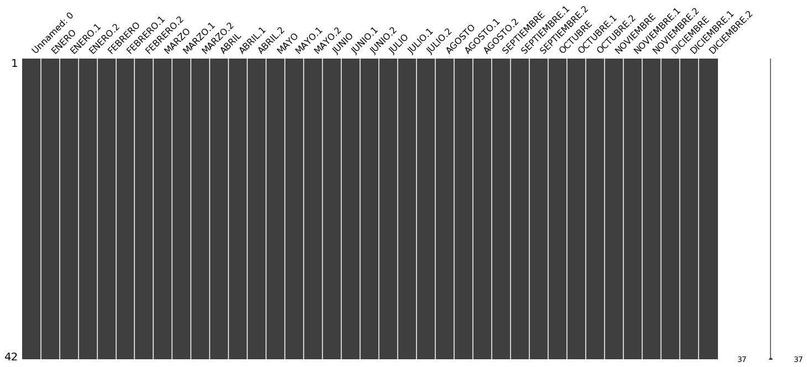

```python
import pandas as pd
import numpy as np
import missingno as msno
%matplotlib inline
```


```python
path = 'usuarios_win_mac_lin.csv'
df = pd.read_csv(path)
df.head()
```


<div>
<style scoped>
    .dataframe tbody tr th:only-of-type {
        vertical-align: middle;
    }

    .dataframe tbody tr th {
        vertical-align: top;
    }

    .dataframe thead th {
        text-align: right;
    }
</style>
<table border="1" class="dataframe">
  <thead>
    <tr style="text-align: right;">
      <th></th>
      <th>duracion</th>
      <th>paginas</th>
      <th>acciones</th>
      <th>valor</th>
      <th>clase</th>
    </tr>
  </thead>
  <tbody>
    <tr>
      <th>0</th>
      <td>7.0</td>
      <td>2</td>
      <td>4</td>
      <td>8</td>
      <td>2</td>
    </tr>
    <tr>
      <th>1</th>
      <td>21.0</td>
      <td>2</td>
      <td>6</td>
      <td>6</td>
      <td>2</td>
    </tr>
    <tr>
      <th>2</th>
      <td>57.0</td>
      <td>2</td>
      <td>4</td>
      <td>4</td>
      <td>2</td>
    </tr>
    <tr>
      <th>3</th>
      <td>101.0</td>
      <td>3</td>
      <td>6</td>
      <td>12</td>
      <td>2</td>
    </tr>
    <tr>
      <th>4</th>
      <td>109.0</td>
      <td>2</td>
      <td>6</td>
      <td>12</td>
      <td>2</td>
    </tr>
  </tbody>
</table>
</div>


```python
df.info()

```

    <class 'pandas.core.frame.DataFrame'>
    RangeIndex: 170 entries, 0 to 169
    Data columns (total 5 columns):
    duracion    170 non-null float64
    paginas     170 non-null int64
    acciones    170 non-null int64
    valor       170 non-null int64
    clase       170 non-null int64
    dtypes: float64(1), int64(4)
    memory usage: 6.7 KB


```python
df.shape

```


    (170, 5)


```python
df.shape[0]

```


    170


```python
df.shape[1]

```


    5


```python
df.columns.values.tolist()

```


    ['duracion', 'paginas', 'acciones', 'valor', 'clase']


```python
df.dtypes

```


    duracion    float64
    paginas       int64
    acciones      int64
    valor         int64
    clase         int64
    dtype: object


```python
df.isnull().any().any()

```


    False


```python
msno.matrix(df)

```


    <matplotlib.axes._subplots.AxesSubplot at 0x7f1604024908>


```python
df.isnull().any().any()

```


    False


```python
msno.matrix(df)
```


    <matplotlib.axes._subplots.AxesSubplot at 0x7f1603f9fb38>





```python
msno.bar(df)

```


    <matplotlib.axes._subplots.AxesSubplot at 0x7f1603f700b8>


df.columns[df.isnull().any()].tolist()
No existen valores nulos

```python
df.describe()
```


<div>
<style scoped>
    .dataframe tbody tr th:only-of-type {
        vertical-align: middle;
    }

    .dataframe tbody tr th {
        vertical-align: top;
    }

    .dataframe thead th {
        text-align: right;
    }
</style>
<table border="1" class="dataframe">
  <thead>
    <tr style="text-align: right;">
      <th></th>
      <th>duracion</th>
      <th>paginas</th>
      <th>acciones</th>
      <th>valor</th>
      <th>clase</th>
    </tr>
  </thead>
  <tbody>
    <tr>
      <th>count</th>
      <td>170.000000</td>
      <td>170.000000</td>
      <td>170.000000</td>
      <td>170.000000</td>
      <td>170.000000</td>
    </tr>
    <tr>
      <th>mean</th>
      <td>111.075729</td>
      <td>2.041176</td>
      <td>8.723529</td>
      <td>32.676471</td>
      <td>0.752941</td>
    </tr>
    <tr>
      <th>std</th>
      <td>202.453200</td>
      <td>1.500911</td>
      <td>9.136054</td>
      <td>44.751993</td>
      <td>0.841327</td>
    </tr>
    <tr>
      <th>min</th>
      <td>1.000000</td>
      <td>1.000000</td>
      <td>1.000000</td>
      <td>1.000000</td>
      <td>0.000000</td>
    </tr>
    <tr>
      <th>25%</th>
      <td>11.000000</td>
      <td>1.000000</td>
      <td>3.000000</td>
      <td>8.000000</td>
      <td>0.000000</td>
    </tr>
    <tr>
      <th>50%</th>
      <td>13.000000</td>
      <td>2.000000</td>
      <td>6.000000</td>
      <td>20.000000</td>
      <td>0.000000</td>
    </tr>
    <tr>
      <th>75%</th>
      <td>108.000000</td>
      <td>2.000000</td>
      <td>10.000000</td>
      <td>36.000000</td>
      <td>2.000000</td>
    </tr>
    <tr>
      <th>max</th>
      <td>898.000000</td>
      <td>9.000000</td>
      <td>63.000000</td>
      <td>378.000000</td>
      <td>2.000000</td>
    </tr>
  </tbody>
</table>
</div>


```python
df.loc[[0]]
```


<div>
<style scoped>
    .dataframe tbody tr th:only-of-type {
        vertical-align: middle;
    }

    .dataframe tbody tr th {
        vertical-align: top;
    }

    .dataframe thead th {
        text-align: right;
    }
</style>
<table border="1" class="dataframe">
  <thead>
    <tr style="text-align: right;">
      <th></th>
      <th>duracion</th>
      <th>paginas</th>
      <th>acciones</th>
      <th>valor</th>
      <th>clase</th>
    </tr>
  </thead>
  <tbody>
    <tr>
      <th>0</th>
      <td>7.0</td>
      <td>2</td>
      <td>4</td>
      <td>8</td>
      <td>2</td>
    </tr>
  </tbody>
</table>
</div>


```python
df.acciones.loc[[6]]
```


    6    2
    Name: acciones, dtype: int64


```python
df["acciones"].loc[[0]]
```


    0    4
    Name: acciones, dtype: int64


```python
df[["acciones", "paginas"]].loc[[0]]
```


<div>
<style scoped>
    .dataframe tbody tr th:only-of-type {
        vertical-align: middle;
    }

    .dataframe tbody tr th {
        vertical-align: top;
    }

    .dataframe thead th {
        text-align: right;
    }
</style>
<table border="1" class="dataframe">
  <thead>
    <tr style="text-align: right;">
      <th></th>
      <th>acciones</th>
      <th>paginas</th>
    </tr>
  </thead>
  <tbody>
    <tr>
      <th>0</th>
      <td>4</td>
      <td>2</td>
    </tr>
  </tbody>
</table>
</div>


```python
df.loc[30:33]

```


<div>
<style scoped>
    .dataframe tbody tr th:only-of-type {
        vertical-align: middle;
    }

    .dataframe tbody tr th {
        vertical-align: top;
    }

    .dataframe thead th {
        text-align: right;
    }
</style>
<table border="1" class="dataframe">
  <thead>
    <tr style="text-align: right;">
      <th></th>
      <th>duracion</th>
      <th>paginas</th>
      <th>acciones</th>
      <th>valor</th>
      <th>clase</th>
    </tr>
  </thead>
  <tbody>
    <tr>
      <th>30</th>
      <td>355.0</td>
      <td>2</td>
      <td>4</td>
      <td>16</td>
      <td>1</td>
    </tr>
    <tr>
      <th>31</th>
      <td>473.0</td>
      <td>3</td>
      <td>6</td>
      <td>30</td>
      <td>1</td>
    </tr>
    <tr>
      <th>32</th>
      <td>485.0</td>
      <td>2</td>
      <td>6</td>
      <td>30</td>
      <td>1</td>
    </tr>
    <tr>
      <th>33</th>
      <td>652.0</td>
      <td>2</td>
      <td>6</td>
      <td>24</td>
      <td>1</td>
    </tr>
  </tbody>
</table>
</div>


```python
df.drop([0,4,32], axis=0).head()

```


<div>
<style scoped>
    .dataframe tbody tr th:only-of-type {
        vertical-align: middle;
    }

    .dataframe tbody tr th {
        vertical-align: top;
    }

    .dataframe thead th {
        text-align: right;
    }
</style>
<table border="1" class="dataframe">
  <thead>
    <tr style="text-align: right;">
      <th></th>
      <th>duracion</th>
      <th>paginas</th>
      <th>acciones</th>
      <th>valor</th>
      <th>clase</th>
    </tr>
  </thead>
  <tbody>
    <tr>
      <th>1</th>
      <td>21.0</td>
      <td>2</td>
      <td>6</td>
      <td>6</td>
      <td>2</td>
    </tr>
    <tr>
      <th>2</th>
      <td>57.0</td>
      <td>2</td>
      <td>4</td>
      <td>4</td>
      <td>2</td>
    </tr>
    <tr>
      <th>3</th>
      <td>101.0</td>
      <td>3</td>
      <td>6</td>
      <td>12</td>
      <td>2</td>
    </tr>
    <tr>
      <th>5</th>
      <td>125.0</td>
      <td>5</td>
      <td>10</td>
      <td>20</td>
      <td>2</td>
    </tr>
    <tr>
      <th>6</th>
      <td>133.0</td>
      <td>2</td>
      <td>2</td>
      <td>4</td>
      <td>2</td>
    </tr>
  </tbody>
</table>
</div>


```python
df.drop(df.index[1:5], axis=0).head(10)

```


<div>
<style scoped>
    .dataframe tbody tr th:only-of-type {
        vertical-align: middle;
    }

    .dataframe tbody tr th {
        vertical-align: top;
    }

    .dataframe thead th {
        text-align: right;
    }
</style>
<table border="1" class="dataframe">
  <thead>
    <tr style="text-align: right;">
      <th></th>
      <th>duracion</th>
      <th>paginas</th>
      <th>acciones</th>
      <th>valor</th>
      <th>clase</th>
    </tr>
  </thead>
  <tbody>
    <tr>
      <th>0</th>
      <td>7.0</td>
      <td>2</td>
      <td>4</td>
      <td>8</td>
      <td>2</td>
    </tr>
    <tr>
      <th>5</th>
      <td>125.0</td>
      <td>5</td>
      <td>10</td>
      <td>20</td>
      <td>2</td>
    </tr>
    <tr>
      <th>6</th>
      <td>133.0</td>
      <td>2</td>
      <td>2</td>
      <td>4</td>
      <td>2</td>
    </tr>
    <tr>
      <th>7</th>
      <td>162.0</td>
      <td>2</td>
      <td>6</td>
      <td>12</td>
      <td>2</td>
    </tr>
    <tr>
      <th>8</th>
      <td>170.0</td>
      <td>2</td>
      <td>4</td>
      <td>8</td>
      <td>2</td>
    </tr>
    <tr>
      <th>9</th>
      <td>217.0</td>
      <td>2</td>
      <td>6</td>
      <td>6</td>
      <td>2</td>
    </tr>
    <tr>
      <th>10</th>
      <td>266.0</td>
      <td>2</td>
      <td>6</td>
      <td>12</td>
      <td>2</td>
    </tr>
    <tr>
      <th>11</th>
      <td>335.0</td>
      <td>4</td>
      <td>12</td>
      <td>24</td>
      <td>2</td>
    </tr>
    <tr>
      <th>12</th>
      <td>553.0</td>
      <td>4</td>
      <td>12</td>
      <td>24</td>
      <td>2</td>
    </tr>
    <tr>
      <th>13</th>
      <td>798.0</td>
      <td>5</td>
      <td>15</td>
      <td>15</td>
      <td>2</td>
    </tr>
  </tbody>
</table>
</div>


```python
df[100:].head() 

```


<div>
<style scoped>
    .dataframe tbody tr th:only-of-type {
        vertical-align: middle;
    }

    .dataframe tbody tr th {
        vertical-align: top;
    }

    .dataframe thead th {
        text-align: right;
    }
</style>
<table border="1" class="dataframe">
  <thead>
    <tr style="text-align: right;">
      <th></th>
      <th>duracion</th>
      <th>paginas</th>
      <th>acciones</th>
      <th>valor</th>
      <th>clase</th>
    </tr>
  </thead>
  <tbody>
    <tr>
      <th>100</th>
      <td>12.0</td>
      <td>1</td>
      <td>6</td>
      <td>24</td>
      <td>1</td>
    </tr>
    <tr>
      <th>101</th>
      <td>12.0</td>
      <td>1</td>
      <td>5</td>
      <td>35</td>
      <td>1</td>
    </tr>
    <tr>
      <th>102</th>
      <td>13.0</td>
      <td>1</td>
      <td>6</td>
      <td>36</td>
      <td>1</td>
    </tr>
    <tr>
      <th>103</th>
      <td>13.0</td>
      <td>1</td>
      <td>5</td>
      <td>20</td>
      <td>1</td>
    </tr>
    <tr>
      <th>104</th>
      <td>12.0</td>
      <td>1</td>
      <td>3</td>
      <td>12</td>
      <td>1</td>
    </tr>
  </tbody>
</table>
</div>


```python
df.duracion.values

```


    array([  7.   ,  21.   ,  57.   , 101.   , 109.   , 125.   , 133.   ,
           162.   , 170.   , 217.   , 266.   , 335.   , 553.   , 798.   ,
           872.   ,   1.105,   2.091,  21.   ,  33.   ,  49.   ,  74.   ,
            93.   , 145.   , 152.   , 208.   , 219.   , 235.   , 257.   ,
           266.   , 275.   , 355.   , 473.   , 485.   , 652.   , 848.   ,
             2.   ,   9.   , 739.   , 898.   ,   1.401,  11.   ,  31.   ,
            51.   ,  89.   , 112.   , 278.   , 674.   ,   1.088,   1.294,
             1.   ,   2.   ,   7.   ,  10.   ,  12.   ,  14.   ,  20.   ,
            23.   ,  50.   ,  54.   ,  68.   ,  85.   ,  86.   ,  87.   ,
           105.   , 116.   , 117.   , 146.   , 195.   , 230.   , 293.   ,
           304.   , 319.   , 530.   , 584.   , 608.   , 643.   , 649.   ,
           783.   ,   1.169,   1.284,   1.425,   1.478,   1.59 ,   2.041,
             2.695,   3.085,  15.   ,  29.   ,  30.   ,   1.064,  15.   ,
            29.   ,  30.   ,   1.064,  11.   ,  12.   ,  13.   ,  11.   ,
            12.   ,  13.   ,  12.   ,  12.   ,  13.   ,  13.   ,  12.   ,
            13.   ,  12.   ,  13.   ,  12.   ,  11.   ,  12.   ,  12.   ,
            12.   ,  12.   ,  11.   ,  12.   ,  13.   ,  12.   ,  12.   ,
            11.   ,  11.   ,  12.   ,  12.   ,  12.   ,  11.   ,  11.   ,
            13.   ,  11.   ,  12.   ,  11.   ,  11.   ,  13.   ,  12.   ,
            13.   ,  11.   ,  12.   ,  13.   ,  12.   ,  11.   ,  11.   ,
            11.   ,  13.   ,  11.   ,  11.   ,  12.   ,  13.   ,  13.   ,
            11.   ,  13.   ,  11.   ,  11.   ,  11.   ,  13.   ,  12.   ,
            12.   ,  12.   ,  12.   ,  11.   ,  12.   ,  13.   ,  11.   ,
            13.   ,  12.   ,  11.   ,  13.   ,  13.   ,  12.   ,  13.   ,
            13.   ,  12.   ])


```python
df[['duracion', "valor"]].values

```


    array([[  7.   ,   8.   ],
           [ 21.   ,   6.   ],
           [ 57.   ,   4.   ],
           [101.   ,  12.   ],
           [109.   ,  12.   ],
           [125.   ,  20.   ],
           [133.   ,   4.   ],
           [162.   ,  12.   ],
           [170.   ,   8.   ],
           [217.   ,   6.   ],
           [266.   ,  12.   ],
           [335.   ,  24.   ],
           [553.   ,  24.   ],
           [798.   ,  15.   ],
           [872.   ,   6.   ],
           [  1.105,   8.   ],
           [  2.091,   5.   ],
           [ 21.   ,  12.   ],
           [ 33.   ,  48.   ],
           [ 49.   ,  32.   ],
           [ 74.   ,  18.   ],
           [ 93.   ,  96.   ],
           [145.   ,  30.   ],
           [152.   ,  20.   ],
           [208.   ,  30.   ],
           [219.   ,  54.   ],
           [235.   ,  96.   ],
           [257.   ,  48.   ],
           [266.   ,  12.   ],
           [275.   , 144.   ],
           [355.   ,  16.   ],
           [473.   ,  30.   ],
           [485.   ,  30.   ],
           [652.   ,  24.   ],
           [848.   ,  54.   ],
           [  2.   ,   2.   ],
           [  9.   ,   1.   ],
           [739.   ,  15.   ],
           [898.   ,   2.   ],
           [  1.401,   6.   ],
           [ 11.   ,  40.   ],
           [ 31.   ,  30.   ],
           [ 51.   ,  20.   ],
           [ 89.   , 144.   ],
           [112.   ,  18.   ],
           [278.   ,  28.   ],
           [674.   ,  72.   ],
           [  1.088,  64.   ],
           [  1.294,  18.   ],
           [  1.   ,  36.   ],
           [  2.   , 120.   ],
           [  7.   ,  28.   ],
           [ 10.   ,  54.   ],
           [ 12.   ,  40.   ],
           [ 14.   ,  36.   ],
           [ 20.   ,  63.   ],
           [ 23.   ,  24.   ],
           [ 50.   ,  54.   ],
           [ 54.   ,  15.   ],
           [ 68.   , 378.   ],
           [ 85.   ,   6.   ],
           [ 86.   , 162.   ],
           [ 87.   ,  36.   ],
           [105.   ,   6.   ],
           [116.   ,  64.   ],
           [117.   , 240.   ],
           [146.   ,  28.   ],
           [195.   ,  12.   ],
           [230.   ,  60.   ],
           [293.   ,  24.   ],
           [304.   ,  54.   ],
           [319.   ,  28.   ],
           [530.   ,  24.   ],
           [584.   ,  30.   ],
           [608.   ,  60.   ],
           [643.   , 168.   ],
           [649.   ,  12.   ],
           [783.   ,  80.   ],
           [  1.169,  24.   ],
           [  1.284,  48.   ],
           [  1.425,  56.   ],
           [  1.478,  90.   ],
           [  1.59 , 160.   ],
           [  2.041,  72.   ],
           [  2.695,  36.   ],
           [  3.085, 112.   ],
           [ 15.   ,   4.   ],
           [ 29.   ,  12.   ],
           [ 30.   ,  18.   ],
           [  1.064, 100.   ],
           [ 15.   ,  60.   ],
           [ 29.   ,  64.   ],
           [ 30.   ,  12.   ],
           [  1.064,  80.   ],
           [ 11.   ,  24.   ],
           [ 12.   ,   6.   ],
           [ 13.   ,  16.   ],
           [ 11.   ,   4.   ],
           [ 12.   ,  48.   ],
           [ 13.   ,  12.   ],
           [ 12.   ,  24.   ],
           [ 12.   ,  35.   ],
           [ 13.   ,  36.   ],
           [ 13.   ,  20.   ],
           [ 12.   ,  12.   ],
           [ 13.   ,  18.   ],
           [ 12.   ,  24.   ],
           [ 13.   ,  18.   ],
           [ 12.   ,  24.   ],
           [ 11.   ,  40.   ],
           [ 12.   ,   2.   ],
           [ 12.   ,   3.   ],
           [ 12.   ,   1.   ],
           [ 12.   ,   2.   ],
           [ 11.   ,   6.   ],
           [ 12.   ,   6.   ],
           [ 13.   ,   4.   ],
           [ 12.   ,   4.   ],
           [ 12.   ,   3.   ],
           [ 11.   ,   3.   ],
           [ 11.   ,   6.   ],
           [ 12.   ,   6.   ],
           [ 12.   ,   2.   ],
           [ 12.   ,   3.   ],
           [ 11.   ,   3.   ],
           [ 11.   ,   4.   ],
           [ 13.   ,   1.   ],
           [ 11.   ,   3.   ],
           [ 12.   ,   1.   ],
           [ 11.   ,   2.   ],
           [ 11.   ,  48.   ],
           [ 13.   ,  35.   ],
           [ 12.   ,  16.   ],
           [ 13.   ,  12.   ],
           [ 11.   ,  30.   ],
           [ 12.   ,  20.   ],
           [ 13.   ,  16.   ],
           [ 12.   ,  42.   ],
           [ 11.   ,   8.   ],
           [ 11.   ,  28.   ],
           [ 11.   ,  10.   ],
           [ 13.   ,  12.   ],
           [ 11.   ,  32.   ],
           [ 11.   ,   6.   ],
           [ 12.   ,  24.   ],
           [ 13.   ,   3.   ],
           [ 13.   ,  24.   ],
           [ 11.   ,  15.   ],
           [ 13.   ,  25.   ],
           [ 11.   ,   6.   ],
           [ 11.   ,  12.   ],
           [ 11.   ,   6.   ],
           [ 13.   ,  27.   ],
           [ 12.   ,  40.   ],
           [ 12.   ,  18.   ],
           [ 12.   ,   2.   ],
           [ 12.   ,   4.   ],
           [ 11.   ,  15.   ],
           [ 12.   ,  24.   ],
           [ 13.   ,  24.   ],
           [ 11.   ,  15.   ],
           [ 13.   ,  30.   ],
           [ 12.   ,  24.   ],
           [ 11.   ,  35.   ],
           [ 13.   ,   8.   ],
           [ 13.   ,  42.   ],
           [ 12.   ,   6.   ],
           [ 13.   ,   9.   ],
           [ 13.   ,  28.   ],
           [ 12.   ,  18.   ]])


```python
df.acciones.unique()
```


    array([ 4,  6, 10,  2, 12, 15,  5,  8,  9, 24, 18,  1, 20,  7, 21, 63, 27,
           16, 40, 14, 30, 28, 32, 56, 25,  3])


```python
df.acciones.nunique()
```


    26


```python
df.acciones.value_counts()
```


    6     26
    2     24
    3     18
    4     16
    8     11
    12     9
    1      8
    5      8
    7      8
    18     8
    10     7
    20     5
    9      3
    16     3
    15     2
    24     2
    28     2
    30     2
    14     1
    56     1
    21     1
    25     1
    27     1
    32     1
    40     1
    63     1
    Name: acciones, dtype: int64


```python
df.agg(['count', 'size', 'nunique'])
```


<div>
<style scoped>
    .dataframe tbody tr th:only-of-type {
        vertical-align: middle;
    }

    .dataframe tbody tr th {
        vertical-align: top;
    }

    .dataframe thead th {
        text-align: right;
    }
</style>
<table border="1" class="dataframe">
  <thead>
    <tr style="text-align: right;">
      <th></th>
      <th>duracion</th>
      <th>paginas</th>
      <th>acciones</th>
      <th>valor</th>
      <th>clase</th>
    </tr>
  </thead>
  <tbody>
    <tr>
      <th>count</th>
      <td>170</td>
      <td>170</td>
      <td>170</td>
      <td>170</td>
      <td>170</td>
    </tr>
    <tr>
      <th>size</th>
      <td>170</td>
      <td>170</td>
      <td>170</td>
      <td>170</td>
      <td>170</td>
    </tr>
    <tr>
      <th>nunique</th>
      <td>87</td>
      <td>8</td>
      <td>26</td>
      <td>43</td>
      <td>3</td>
    </tr>
  </tbody>
</table>
</div>


```python
df.groupby('valor').agg(['count', 'size', 'nunique']).stack()

```


<div>
<style scoped>
    .dataframe tbody tr th:only-of-type {
        vertical-align: middle;
    }

    .dataframe tbody tr th {
        vertical-align: top;
    }

    .dataframe thead th {
        text-align: right;
    }
</style>
<table border="1" class="dataframe">
  <thead>
    <tr style="text-align: right;">
      <th></th>
      <th></th>
      <th>duracion</th>
      <th>paginas</th>
      <th>acciones</th>
      <th>clase</th>
    </tr>
    <tr>
      <th>valor</th>
      <th></th>
      <th></th>
      <th></th>
      <th></th>
      <th></th>
    </tr>
  </thead>
  <tbody>
    <tr>
      <th rowspan="3" valign="top">1</th>
      <th>count</th>
      <td>4</td>
      <td>4</td>
      <td>4</td>
      <td>4</td>
    </tr>
    <tr>
      <th>size</th>
      <td>4</td>
      <td>4</td>
      <td>4</td>
      <td>4</td>
    </tr>
    <tr>
      <th>nunique</th>
      <td>3</td>
      <td>1</td>
      <td>1</td>
      <td>1</td>
    </tr>
    <tr>
      <th rowspan="3" valign="top">2</th>
      <th>count</th>
      <td>7</td>
      <td>7</td>
      <td>7</td>
      <td>7</td>
    </tr>
    <tr>
      <th>size</th>
      <td>7</td>
      <td>7</td>
      <td>7</td>
      <td>7</td>
    </tr>
    <tr>
      <th>nunique</th>
      <td>4</td>
      <td>2</td>
      <td>2</td>
      <td>2</td>
    </tr>
    <tr>
      <th rowspan="3" valign="top">3</th>
      <th>count</th>
      <td>7</td>
      <td>7</td>
      <td>7</td>
      <td>7</td>
    </tr>
    <tr>
      <th>size</th>
      <td>7</td>
      <td>7</td>
      <td>7</td>
      <td>7</td>
    </tr>
    <tr>
      <th>nunique</th>
      <td>3</td>
      <td>1</td>
      <td>2</td>
      <td>2</td>
    </tr>
    <tr>
      <th rowspan="3" valign="top">4</th>
      <th>count</th>
      <td>8</td>
      <td>8</td>
      <td>8</td>
      <td>8</td>
    </tr>
    <tr>
      <th>size</th>
      <td>8</td>
      <td>8</td>
      <td>8</td>
      <td>8</td>
    </tr>
    <tr>
      <th>nunique</th>
      <td>6</td>
      <td>2</td>
      <td>3</td>
      <td>2</td>
    </tr>
    <tr>
      <th rowspan="3" valign="top">5</th>
      <th>count</th>
      <td>1</td>
      <td>1</td>
      <td>1</td>
      <td>1</td>
    </tr>
    <tr>
      <th>size</th>
      <td>1</td>
      <td>1</td>
      <td>1</td>
      <td>1</td>
    </tr>
    <tr>
      <th>nunique</th>
      <td>1</td>
      <td>1</td>
      <td>1</td>
      <td>1</td>
    </tr>
    <tr>
      <th rowspan="3" valign="top">6</th>
      <th>count</th>
      <td>15</td>
      <td>15</td>
      <td>15</td>
      <td>15</td>
    </tr>
    <tr>
      <th>size</th>
      <td>15</td>
      <td>15</td>
      <td>15</td>
      <td>15</td>
    </tr>
    <tr>
      <th>nunique</th>
      <td>8</td>
      <td>3</td>
      <td>3</td>
      <td>2</td>
    </tr>
    <tr>
      <th rowspan="3" valign="top">8</th>
      <th>count</th>
      <td>5</td>
      <td>5</td>
      <td>5</td>
      <td>5</td>
    </tr>
    <tr>
      <th>size</th>
      <td>5</td>
      <td>5</td>
      <td>5</td>
      <td>5</td>
    </tr>
    <tr>
      <th>nunique</th>
      <td>5</td>
      <td>2</td>
      <td>2</td>
      <td>2</td>
    </tr>
    <tr>
      <th rowspan="3" valign="top">9</th>
      <th>count</th>
      <td>1</td>
      <td>1</td>
      <td>1</td>
      <td>1</td>
    </tr>
    <tr>
      <th>size</th>
      <td>1</td>
      <td>1</td>
      <td>1</td>
      <td>1</td>
    </tr>
    <tr>
      <th>nunique</th>
      <td>1</td>
      <td>1</td>
      <td>1</td>
      <td>1</td>
    </tr>
    <tr>
      <th rowspan="3" valign="top">10</th>
      <th>count</th>
      <td>1</td>
      <td>1</td>
      <td>1</td>
      <td>1</td>
    </tr>
    <tr>
      <th>size</th>
      <td>1</td>
      <td>1</td>
      <td>1</td>
      <td>1</td>
    </tr>
    <tr>
      <th>nunique</th>
      <td>1</td>
      <td>1</td>
      <td>1</td>
      <td>1</td>
    </tr>
    <tr>
      <th rowspan="3" valign="top">12</th>
      <th>count</th>
      <td>15</td>
      <td>15</td>
      <td>15</td>
      <td>15</td>
    </tr>
    <tr>
      <th>size</th>
      <td>15</td>
      <td>15</td>
      <td>15</td>
      <td>15</td>
    </tr>
    <tr>
      <th>nunique</th>
      <td>12</td>
      <td>3</td>
      <td>4</td>
      <td>3</td>
    </tr>
    <tr>
      <th>...</th>
      <th>...</th>
      <td>...</td>
      <td>...</td>
      <td>...</td>
      <td>...</td>
    </tr>
    <tr>
      <th rowspan="3" valign="top">96</th>
      <th>count</th>
      <td>2</td>
      <td>2</td>
      <td>2</td>
      <td>2</td>
    </tr>
    <tr>
      <th>size</th>
      <td>2</td>
      <td>2</td>
      <td>2</td>
      <td>2</td>
    </tr>
    <tr>
      <th>nunique</th>
      <td>2</td>
      <td>2</td>
      <td>1</td>
      <td>1</td>
    </tr>
    <tr>
      <th rowspan="3" valign="top">100</th>
      <th>count</th>
      <td>1</td>
      <td>1</td>
      <td>1</td>
      <td>1</td>
    </tr>
    <tr>
      <th>size</th>
      <td>1</td>
      <td>1</td>
      <td>1</td>
      <td>1</td>
    </tr>
    <tr>
      <th>nunique</th>
      <td>1</td>
      <td>1</td>
      <td>1</td>
      <td>1</td>
    </tr>
    <tr>
      <th rowspan="3" valign="top">112</th>
      <th>count</th>
      <td>1</td>
      <td>1</td>
      <td>1</td>
      <td>1</td>
    </tr>
    <tr>
      <th>size</th>
      <td>1</td>
      <td>1</td>
      <td>1</td>
      <td>1</td>
    </tr>
    <tr>
      <th>nunique</th>
      <td>1</td>
      <td>1</td>
      <td>1</td>
      <td>1</td>
    </tr>
    <tr>
      <th rowspan="3" valign="top">120</th>
      <th>count</th>
      <td>1</td>
      <td>1</td>
      <td>1</td>
      <td>1</td>
    </tr>
    <tr>
      <th>size</th>
      <td>1</td>
      <td>1</td>
      <td>1</td>
      <td>1</td>
    </tr>
    <tr>
      <th>nunique</th>
      <td>1</td>
      <td>1</td>
      <td>1</td>
      <td>1</td>
    </tr>
    <tr>
      <th rowspan="3" valign="top">144</th>
      <th>count</th>
      <td>2</td>
      <td>2</td>
      <td>2</td>
      <td>2</td>
    </tr>
    <tr>
      <th>size</th>
      <td>2</td>
      <td>2</td>
      <td>2</td>
      <td>2</td>
    </tr>
    <tr>
      <th>nunique</th>
      <td>2</td>
      <td>2</td>
      <td>2</td>
      <td>1</td>
    </tr>
    <tr>
      <th rowspan="3" valign="top">160</th>
      <th>count</th>
      <td>1</td>
      <td>1</td>
      <td>1</td>
      <td>1</td>
    </tr>
    <tr>
      <th>size</th>
      <td>1</td>
      <td>1</td>
      <td>1</td>
      <td>1</td>
    </tr>
    <tr>
      <th>nunique</th>
      <td>1</td>
      <td>1</td>
      <td>1</td>
      <td>1</td>
    </tr>
    <tr>
      <th rowspan="3" valign="top">162</th>
      <th>count</th>
      <td>1</td>
      <td>1</td>
      <td>1</td>
      <td>1</td>
    </tr>
    <tr>
      <th>size</th>
      <td>1</td>
      <td>1</td>
      <td>1</td>
      <td>1</td>
    </tr>
    <tr>
      <th>nunique</th>
      <td>1</td>
      <td>1</td>
      <td>1</td>
      <td>1</td>
    </tr>
    <tr>
      <th rowspan="3" valign="top">168</th>
      <th>count</th>
      <td>1</td>
      <td>1</td>
      <td>1</td>
      <td>1</td>
    </tr>
    <tr>
      <th>size</th>
      <td>1</td>
      <td>1</td>
      <td>1</td>
      <td>1</td>
    </tr>
    <tr>
      <th>nunique</th>
      <td>1</td>
      <td>1</td>
      <td>1</td>
      <td>1</td>
    </tr>
    <tr>
      <th rowspan="3" valign="top">240</th>
      <th>count</th>
      <td>1</td>
      <td>1</td>
      <td>1</td>
      <td>1</td>
    </tr>
    <tr>
      <th>size</th>
      <td>1</td>
      <td>1</td>
      <td>1</td>
      <td>1</td>
    </tr>
    <tr>
      <th>nunique</th>
      <td>1</td>
      <td>1</td>
      <td>1</td>
      <td>1</td>
    </tr>
    <tr>
      <th rowspan="3" valign="top">378</th>
      <th>count</th>
      <td>1</td>
      <td>1</td>
      <td>1</td>
      <td>1</td>
    </tr>
    <tr>
      <th>size</th>
      <td>1</td>
      <td>1</td>
      <td>1</td>
      <td>1</td>
    </tr>
    <tr>
      <th>nunique</th>
      <td>1</td>
      <td>1</td>
      <td>1</td>
      <td>1</td>
    </tr>
  </tbody>
</table>
<p>129 rows × 4 columns</p>
</div>


```python
df.groupby('valor').agg(['count', 'size', 'nunique'])

```


<div>
<style scoped>
    .dataframe tbody tr th:only-of-type {
        vertical-align: middle;
    }

    .dataframe tbody tr th {
        vertical-align: top;
    }

    .dataframe thead tr th {
        text-align: left;
    }

    .dataframe thead tr:last-of-type th {
        text-align: right;
    }
</style>
<table border="1" class="dataframe">
  <thead>
    <tr>
      <th></th>
      <th colspan="3" halign="left">duracion</th>
      <th colspan="3" halign="left">paginas</th>
      <th colspan="3" halign="left">acciones</th>
      <th colspan="3" halign="left">clase</th>
    </tr>
    <tr>
      <th></th>
      <th>count</th>
      <th>size</th>
      <th>nunique</th>
      <th>count</th>
      <th>size</th>
      <th>nunique</th>
      <th>count</th>
      <th>size</th>
      <th>nunique</th>
      <th>count</th>
      <th>size</th>
      <th>nunique</th>
    </tr>
    <tr>
      <th>valor</th>
      <th></th>
      <th></th>
      <th></th>
      <th></th>
      <th></th>
      <th></th>
      <th></th>
      <th></th>
      <th></th>
      <th></th>
      <th></th>
      <th></th>
    </tr>
  </thead>
  <tbody>
    <tr>
      <th>1</th>
      <td>4</td>
      <td>4</td>
      <td>3</td>
      <td>4</td>
      <td>4</td>
      <td>1</td>
      <td>4</td>
      <td>4</td>
      <td>1</td>
      <td>4</td>
      <td>4</td>
      <td>1</td>
    </tr>
    <tr>
      <th>2</th>
      <td>7</td>
      <td>7</td>
      <td>4</td>
      <td>7</td>
      <td>7</td>
      <td>2</td>
      <td>7</td>
      <td>7</td>
      <td>2</td>
      <td>7</td>
      <td>7</td>
      <td>2</td>
    </tr>
    <tr>
      <th>3</th>
      <td>7</td>
      <td>7</td>
      <td>3</td>
      <td>7</td>
      <td>7</td>
      <td>1</td>
      <td>7</td>
      <td>7</td>
      <td>2</td>
      <td>7</td>
      <td>7</td>
      <td>2</td>
    </tr>
    <tr>
      <th>4</th>
      <td>8</td>
      <td>8</td>
      <td>6</td>
      <td>8</td>
      <td>8</td>
      <td>2</td>
      <td>8</td>
      <td>8</td>
      <td>3</td>
      <td>8</td>
      <td>8</td>
      <td>2</td>
    </tr>
    <tr>
      <th>5</th>
      <td>1</td>
      <td>1</td>
      <td>1</td>
      <td>1</td>
      <td>1</td>
      <td>1</td>
      <td>1</td>
      <td>1</td>
      <td>1</td>
      <td>1</td>
      <td>1</td>
      <td>1</td>
    </tr>
    <tr>
      <th>6</th>
      <td>15</td>
      <td>15</td>
      <td>8</td>
      <td>15</td>
      <td>15</td>
      <td>3</td>
      <td>15</td>
      <td>15</td>
      <td>3</td>
      <td>15</td>
      <td>15</td>
      <td>2</td>
    </tr>
    <tr>
      <th>8</th>
      <td>5</td>
      <td>5</td>
      <td>5</td>
      <td>5</td>
      <td>5</td>
      <td>2</td>
      <td>5</td>
      <td>5</td>
      <td>2</td>
      <td>5</td>
      <td>5</td>
      <td>2</td>
    </tr>
    <tr>
      <th>9</th>
      <td>1</td>
      <td>1</td>
      <td>1</td>
      <td>1</td>
      <td>1</td>
      <td>1</td>
      <td>1</td>
      <td>1</td>
      <td>1</td>
      <td>1</td>
      <td>1</td>
      <td>1</td>
    </tr>
    <tr>
      <th>10</th>
      <td>1</td>
      <td>1</td>
      <td>1</td>
      <td>1</td>
      <td>1</td>
      <td>1</td>
      <td>1</td>
      <td>1</td>
      <td>1</td>
      <td>1</td>
      <td>1</td>
      <td>1</td>
    </tr>
    <tr>
      <th>12</th>
      <td>15</td>
      <td>15</td>
      <td>12</td>
      <td>15</td>
      <td>15</td>
      <td>3</td>
      <td>15</td>
      <td>15</td>
      <td>4</td>
      <td>15</td>
      <td>15</td>
      <td>3</td>
    </tr>
    <tr>
      <th>15</th>
      <td>6</td>
      <td>6</td>
      <td>4</td>
      <td>6</td>
      <td>6</td>
      <td>2</td>
      <td>6</td>
      <td>6</td>
      <td>3</td>
      <td>6</td>
      <td>6</td>
      <td>2</td>
    </tr>
    <tr>
      <th>16</th>
      <td>4</td>
      <td>4</td>
      <td>3</td>
      <td>4</td>
      <td>4</td>
      <td>2</td>
      <td>4</td>
      <td>4</td>
      <td>3</td>
      <td>4</td>
      <td>4</td>
      <td>2</td>
    </tr>
    <tr>
      <th>18</th>
      <td>8</td>
      <td>8</td>
      <td>6</td>
      <td>8</td>
      <td>8</td>
      <td>2</td>
      <td>8</td>
      <td>8</td>
      <td>2</td>
      <td>8</td>
      <td>8</td>
      <td>2</td>
    </tr>
    <tr>
      <th>20</th>
      <td>5</td>
      <td>5</td>
      <td>5</td>
      <td>5</td>
      <td>5</td>
      <td>3</td>
      <td>5</td>
      <td>5</td>
      <td>3</td>
      <td>5</td>
      <td>5</td>
      <td>3</td>
    </tr>
    <tr>
      <th>24</th>
      <td>16</td>
      <td>16</td>
      <td>10</td>
      <td>16</td>
      <td>16</td>
      <td>4</td>
      <td>16</td>
      <td>16</td>
      <td>4</td>
      <td>16</td>
      <td>16</td>
      <td>3</td>
    </tr>
    <tr>
      <th>25</th>
      <td>1</td>
      <td>1</td>
      <td>1</td>
      <td>1</td>
      <td>1</td>
      <td>1</td>
      <td>1</td>
      <td>1</td>
      <td>1</td>
      <td>1</td>
      <td>1</td>
      <td>1</td>
    </tr>
    <tr>
      <th>27</th>
      <td>1</td>
      <td>1</td>
      <td>1</td>
      <td>1</td>
      <td>1</td>
      <td>1</td>
      <td>1</td>
      <td>1</td>
      <td>1</td>
      <td>1</td>
      <td>1</td>
      <td>1</td>
    </tr>
    <tr>
      <th>28</th>
      <td>6</td>
      <td>6</td>
      <td>6</td>
      <td>6</td>
      <td>6</td>
      <td>2</td>
      <td>6</td>
      <td>6</td>
      <td>3</td>
      <td>6</td>
      <td>6</td>
      <td>2</td>
    </tr>
    <tr>
      <th>30</th>
      <td>8</td>
      <td>8</td>
      <td>8</td>
      <td>8</td>
      <td>8</td>
      <td>3</td>
      <td>8</td>
      <td>8</td>
      <td>2</td>
      <td>8</td>
      <td>8</td>
      <td>2</td>
    </tr>
    <tr>
      <th>32</th>
      <td>2</td>
      <td>2</td>
      <td>2</td>
      <td>2</td>
      <td>2</td>
      <td>2</td>
      <td>2</td>
      <td>2</td>
      <td>1</td>
      <td>2</td>
      <td>2</td>
      <td>2</td>
    </tr>
    <tr>
      <th>35</th>
      <td>3</td>
      <td>3</td>
      <td>3</td>
      <td>3</td>
      <td>3</td>
      <td>1</td>
      <td>3</td>
      <td>3</td>
      <td>2</td>
      <td>3</td>
      <td>3</td>
      <td>2</td>
    </tr>
    <tr>
      <th>36</th>
      <td>5</td>
      <td>5</td>
      <td>5</td>
      <td>5</td>
      <td>5</td>
      <td>4</td>
      <td>5</td>
      <td>5</td>
      <td>4</td>
      <td>5</td>
      <td>5</td>
      <td>2</td>
    </tr>
    <tr>
      <th>40</th>
      <td>4</td>
      <td>4</td>
      <td>2</td>
      <td>4</td>
      <td>4</td>
      <td>2</td>
      <td>4</td>
      <td>4</td>
      <td>4</td>
      <td>4</td>
      <td>4</td>
      <td>2</td>
    </tr>
    <tr>
      <th>42</th>
      <td>2</td>
      <td>2</td>
      <td>2</td>
      <td>2</td>
      <td>2</td>
      <td>1</td>
      <td>2</td>
      <td>2</td>
      <td>1</td>
      <td>2</td>
      <td>2</td>
      <td>1</td>
    </tr>
    <tr>
      <th>48</th>
      <td>5</td>
      <td>5</td>
      <td>5</td>
      <td>5</td>
      <td>5</td>
      <td>3</td>
      <td>5</td>
      <td>5</td>
      <td>4</td>
      <td>5</td>
      <td>5</td>
      <td>2</td>
    </tr>
    <tr>
      <th>54</th>
      <td>5</td>
      <td>5</td>
      <td>5</td>
      <td>5</td>
      <td>5</td>
      <td>2</td>
      <td>5</td>
      <td>5</td>
      <td>2</td>
      <td>5</td>
      <td>5</td>
      <td>2</td>
    </tr>
    <tr>
      <th>56</th>
      <td>1</td>
      <td>1</td>
      <td>1</td>
      <td>1</td>
      <td>1</td>
      <td>1</td>
      <td>1</td>
      <td>1</td>
      <td>1</td>
      <td>1</td>
      <td>1</td>
      <td>1</td>
    </tr>
    <tr>
      <th>60</th>
      <td>3</td>
      <td>3</td>
      <td>3</td>
      <td>3</td>
      <td>3</td>
      <td>2</td>
      <td>3</td>
      <td>3</td>
      <td>3</td>
      <td>3</td>
      <td>3</td>
      <td>1</td>
    </tr>
    <tr>
      <th>63</th>
      <td>1</td>
      <td>1</td>
      <td>1</td>
      <td>1</td>
      <td>1</td>
      <td>1</td>
      <td>1</td>
      <td>1</td>
      <td>1</td>
      <td>1</td>
      <td>1</td>
      <td>1</td>
    </tr>
    <tr>
      <th>64</th>
      <td>3</td>
      <td>3</td>
      <td>3</td>
      <td>3</td>
      <td>3</td>
      <td>1</td>
      <td>3</td>
      <td>3</td>
      <td>2</td>
      <td>3</td>
      <td>3</td>
      <td>2</td>
    </tr>
    <tr>
      <th>72</th>
      <td>2</td>
      <td>2</td>
      <td>2</td>
      <td>2</td>
      <td>2</td>
      <td>2</td>
      <td>2</td>
      <td>2</td>
      <td>2</td>
      <td>2</td>
      <td>2</td>
      <td>2</td>
    </tr>
    <tr>
      <th>80</th>
      <td>2</td>
      <td>2</td>
      <td>2</td>
      <td>2</td>
      <td>2</td>
      <td>2</td>
      <td>2</td>
      <td>2</td>
      <td>1</td>
      <td>2</td>
      <td>2</td>
      <td>1</td>
    </tr>
    <tr>
      <th>90</th>
      <td>1</td>
      <td>1</td>
      <td>1</td>
      <td>1</td>
      <td>1</td>
      <td>1</td>
      <td>1</td>
      <td>1</td>
      <td>1</td>
      <td>1</td>
      <td>1</td>
      <td>1</td>
    </tr>
    <tr>
      <th>96</th>
      <td>2</td>
      <td>2</td>
      <td>2</td>
      <td>2</td>
      <td>2</td>
      <td>2</td>
      <td>2</td>
      <td>2</td>
      <td>1</td>
      <td>2</td>
      <td>2</td>
      <td>1</td>
    </tr>
    <tr>
      <th>100</th>
      <td>1</td>
      <td>1</td>
      <td>1</td>
      <td>1</td>
      <td>1</td>
      <td>1</td>
      <td>1</td>
      <td>1</td>
      <td>1</td>
      <td>1</td>
      <td>1</td>
      <td>1</td>
    </tr>
    <tr>
      <th>112</th>
      <td>1</td>
      <td>1</td>
      <td>1</td>
      <td>1</td>
      <td>1</td>
      <td>1</td>
      <td>1</td>
      <td>1</td>
      <td>1</td>
      <td>1</td>
      <td>1</td>
      <td>1</td>
    </tr>
    <tr>
      <th>120</th>
      <td>1</td>
      <td>1</td>
      <td>1</td>
      <td>1</td>
      <td>1</td>
      <td>1</td>
      <td>1</td>
      <td>1</td>
      <td>1</td>
      <td>1</td>
      <td>1</td>
      <td>1</td>
    </tr>
    <tr>
      <th>144</th>
      <td>2</td>
      <td>2</td>
      <td>2</td>
      <td>2</td>
      <td>2</td>
      <td>2</td>
      <td>2</td>
      <td>2</td>
      <td>2</td>
      <td>2</td>
      <td>2</td>
      <td>1</td>
    </tr>
    <tr>
      <th>160</th>
      <td>1</td>
      <td>1</td>
      <td>1</td>
      <td>1</td>
      <td>1</td>
      <td>1</td>
      <td>1</td>
      <td>1</td>
      <td>1</td>
      <td>1</td>
      <td>1</td>
      <td>1</td>
    </tr>
    <tr>
      <th>162</th>
      <td>1</td>
      <td>1</td>
      <td>1</td>
      <td>1</td>
      <td>1</td>
      <td>1</td>
      <td>1</td>
      <td>1</td>
      <td>1</td>
      <td>1</td>
      <td>1</td>
      <td>1</td>
    </tr>
    <tr>
      <th>168</th>
      <td>1</td>
      <td>1</td>
      <td>1</td>
      <td>1</td>
      <td>1</td>
      <td>1</td>
      <td>1</td>
      <td>1</td>
      <td>1</td>
      <td>1</td>
      <td>1</td>
      <td>1</td>
    </tr>
    <tr>
      <th>240</th>
      <td>1</td>
      <td>1</td>
      <td>1</td>
      <td>1</td>
      <td>1</td>
      <td>1</td>
      <td>1</td>
      <td>1</td>
      <td>1</td>
      <td>1</td>
      <td>1</td>
      <td>1</td>
    </tr>
    <tr>
      <th>378</th>
      <td>1</td>
      <td>1</td>
      <td>1</td>
      <td>1</td>
      <td>1</td>
      <td>1</td>
      <td>1</td>
      <td>1</td>
      <td>1</td>
      <td>1</td>
      <td>1</td>
      <td>1</td>
    </tr>
  </tbody>
</table>
</div>


```python
df_sample = df.sample(frac=0.05, random_state=1)
df_sample.head()
```


<div>
<style scoped>
    .dataframe tbody tr th:only-of-type {
        vertical-align: middle;
    }

    .dataframe tbody tr th {
        vertical-align: top;
    }

    .dataframe thead th {
        text-align: right;
    }
</style>
<table border="1" class="dataframe">
  <thead>
    <tr style="text-align: right;">
      <th></th>
      <th>duracion</th>
      <th>paginas</th>
      <th>acciones</th>
      <th>valor</th>
      <th>clase</th>
    </tr>
  </thead>
  <tbody>
    <tr>
      <th>48</th>
      <td>1.294</td>
      <td>2</td>
      <td>6</td>
      <td>18</td>
      <td>1</td>
    </tr>
    <tr>
      <th>91</th>
      <td>29.000</td>
      <td>2</td>
      <td>16</td>
      <td>64</td>
      <td>0</td>
    </tr>
    <tr>
      <th>19</th>
      <td>49.000</td>
      <td>2</td>
      <td>8</td>
      <td>32</td>
      <td>1</td>
    </tr>
    <tr>
      <th>35</th>
      <td>2.000</td>
      <td>2</td>
      <td>2</td>
      <td>2</td>
      <td>2</td>
    </tr>
    <tr>
      <th>164</th>
      <td>13.000</td>
      <td>1</td>
      <td>4</td>
      <td>8</td>
      <td>0</td>
    </tr>
  </tbody>
</table>
</div>


```python
df.shape

```


    (170, 5)


```python
df_sample.shape

```


    (8, 5)


Transformación de Datos


```python
df_dropped = df.dropna(subset=['duracion'])
df_dropped.head()
```


<div>
<style scoped>
    .dataframe tbody tr th:only-of-type {
        vertical-align: middle;
    }

    .dataframe tbody tr th {
        vertical-align: top;
    }

    .dataframe thead th {
        text-align: right;
    }
</style>
<table border="1" class="dataframe">
  <thead>
    <tr style="text-align: right;">
      <th></th>
      <th>duracion</th>
      <th>paginas</th>
      <th>acciones</th>
      <th>valor</th>
      <th>clase</th>
    </tr>
  </thead>
  <tbody>
    <tr>
      <th>0</th>
      <td>7.0</td>
      <td>2</td>
      <td>4</td>
      <td>8</td>
      <td>2</td>
    </tr>
    <tr>
      <th>1</th>
      <td>21.0</td>
      <td>2</td>
      <td>6</td>
      <td>6</td>
      <td>2</td>
    </tr>
    <tr>
      <th>2</th>
      <td>57.0</td>
      <td>2</td>
      <td>4</td>
      <td>4</td>
      <td>2</td>
    </tr>
    <tr>
      <th>3</th>
      <td>101.0</td>
      <td>3</td>
      <td>6</td>
      <td>12</td>
      <td>2</td>
    </tr>
    <tr>
      <th>4</th>
      <td>109.0</td>
      <td>2</td>
      <td>6</td>
      <td>12</td>
      <td>2</td>
    </tr>
  </tbody>
</table>
</div>


```python
df_dropped.shape

```


    (170, 5)


```python
df_copy = df.copy()
df_copy.head()
```


<div>
<style scoped>
    .dataframe tbody tr th:only-of-type {
        vertical-align: middle;
    }

    .dataframe tbody tr th {
        vertical-align: top;
    }

    .dataframe thead th {
        text-align: right;
    }
</style>
<table border="1" class="dataframe">
  <thead>
    <tr style="text-align: right;">
      <th></th>
      <th>duracion</th>
      <th>paginas</th>
      <th>acciones</th>
      <th>valor</th>
      <th>clase</th>
    </tr>
  </thead>
  <tbody>
    <tr>
      <th>0</th>
      <td>7.0</td>
      <td>2</td>
      <td>4</td>
      <td>8</td>
      <td>2</td>
    </tr>
    <tr>
      <th>1</th>
      <td>21.0</td>
      <td>2</td>
      <td>6</td>
      <td>6</td>
      <td>2</td>
    </tr>
    <tr>
      <th>2</th>
      <td>57.0</td>
      <td>2</td>
      <td>4</td>
      <td>4</td>
      <td>2</td>
    </tr>
    <tr>
      <th>3</th>
      <td>101.0</td>
      <td>3</td>
      <td>6</td>
      <td>12</td>
      <td>2</td>
    </tr>
    <tr>
      <th>4</th>
      <td>109.0</td>
      <td>2</td>
      <td>6</td>
      <td>12</td>
      <td>2</td>
    </tr>
  </tbody>
</table>
</div>


```python
df_copy.shape

```


    (170, 5)


```python
df_copy.agg(['count', 'size', 'nunique'])

```


<div>
<style scoped>
    .dataframe tbody tr th:only-of-type {
        vertical-align: middle;
    }

    .dataframe tbody tr th {
        vertical-align: top;
    }

    .dataframe thead th {
        text-align: right;
    }
</style>
<table border="1" class="dataframe">
  <thead>
    <tr style="text-align: right;">
      <th></th>
      <th>duracion</th>
      <th>paginas</th>
      <th>acciones</th>
      <th>valor</th>
      <th>clase</th>
    </tr>
  </thead>
  <tbody>
    <tr>
      <th>count</th>
      <td>170</td>
      <td>170</td>
      <td>170</td>
      <td>170</td>
      <td>170</td>
    </tr>
    <tr>
      <th>size</th>
      <td>170</td>
      <td>170</td>
      <td>170</td>
      <td>170</td>
      <td>170</td>
    </tr>
    <tr>
      <th>nunique</th>
      <td>87</td>
      <td>8</td>
      <td>26</td>
      <td>43</td>
      <td>3</td>
    </tr>
  </tbody>
</table>
</div>


```python
list(df['paginas'].unique())
```


    [2, 3, 5, 4, 6, 1, 9, 7]


```python
"""
2 Navegador
3 Portal de empleo
5 Redes sociales
4 Educacion
6 Email
1 Citas
9 Enciclopedia
7 Videos
"""
df['paginas'].replace({2:"Navegador", 
                       3:"empleo",
                       5:"sociales", 
                       4:"Educacion", 
                       6:"Email", 
                       1:"Citas",
                       9:"Enciclopedia",
                       7:"Videos"}, inplace=True)
```


```python
list(df['paginas'].unique())
```


    ['Navegador',
     'empleo',
     'sociales',
     'Educacion',
     'Email',
     'Citas',
     'Enciclopedia',
     'Videos']


```python
keys = list(df['paginas'].unique())
vals = range(1,8)
act = dict(zip(keys, vals))
act
```


    {'Navegador': 1,
     'empleo': 2,
     'sociales': 3,
     'Educacion': 4,
     'Email': 5,
     'Citas': 6,
     'Enciclopedia': 7}


```python
df_copy['clase'] = df['paginas'].map(act)
df_copy.head()
```


<div>
<style scoped>
    .dataframe tbody tr th:only-of-type {
        vertical-align: middle;
    }

    .dataframe tbody tr th {
        vertical-align: top;
    }

    .dataframe thead th {
        text-align: right;
    }
</style>
<table border="1" class="dataframe">
  <thead>
    <tr style="text-align: right;">
      <th></th>
      <th>duracion</th>
      <th>paginas</th>
      <th>acciones</th>
      <th>valor</th>
      <th>clase</th>
    </tr>
  </thead>
  <tbody>
    <tr>
      <th>0</th>
      <td>7.0</td>
      <td>2</td>
      <td>4</td>
      <td>1.0</td>
      <td>1.0</td>
    </tr>
    <tr>
      <th>1</th>
      <td>21.0</td>
      <td>2</td>
      <td>6</td>
      <td>1.0</td>
      <td>1.0</td>
    </tr>
    <tr>
      <th>2</th>
      <td>57.0</td>
      <td>2</td>
      <td>4</td>
      <td>1.0</td>
      <td>1.0</td>
    </tr>
    <tr>
      <th>3</th>
      <td>101.0</td>
      <td>3</td>
      <td>6</td>
      <td>2.0</td>
      <td>2.0</td>
    </tr>
    <tr>
      <th>4</th>
      <td>109.0</td>
      <td>2</td>
      <td>6</td>
      <td>1.0</td>
      <td>1.0</td>
    </tr>
  </tbody>
</table>
</div>


```python
list(df_copy['clase'].unique())

```


    [1.0, 2.0, 3.0, 4.0, 5.0, 6.0, 7.0, nan]


### Data Summarization


```python
df_copy['valor'].mean()
```


    3.8579881656804735


```python
df_copy['valor'][df_copy['paginas'] == 6]
```


    26    5.0
    39    5.0
    81    5.0
    83    5.0
    Name: valor, dtype: float64


```python
df_copy['valor'][df_copy['clase'] == 6].mean()
```


    6.0


```python
df_copy.groupby(["duracion", "valor", "clase", "paginas"]).count()
```


<div>
<style scoped>
    .dataframe tbody tr th:only-of-type {
        vertical-align: middle;
    }

    .dataframe tbody tr th {
        vertical-align: top;
    }

    .dataframe thead th {
        text-align: right;
    }
</style>
<table border="1" class="dataframe">
  <thead>
    <tr style="text-align: right;">
      <th></th>
      <th></th>
      <th></th>
      <th></th>
      <th>acciones</th>
    </tr>
    <tr>
      <th>duracion</th>
      <th>valor</th>
      <th>clase</th>
      <th>paginas</th>
      <th></th>
    </tr>
  </thead>
  <tbody>
    <tr>
      <th>1.000</th>
      <th>1.0</th>
      <th>1.0</th>
      <th>2</th>
      <td>1</td>
    </tr>
    <tr>
      <th>1.064</th>
      <th>3.0</th>
      <th>3.0</th>
      <th>5</th>
      <td>2</td>
    </tr>
    <tr>
      <th>1.088</th>
      <th>1.0</th>
      <th>1.0</th>
      <th>2</th>
      <td>1</td>
    </tr>
    <tr>
      <th>1.105</th>
      <th>1.0</th>
      <th>1.0</th>
      <th>2</th>
      <td>1</td>
    </tr>
    <tr>
      <th>1.169</th>
      <th>4.0</th>
      <th>4.0</th>
      <th>4</th>
      <td>1</td>
    </tr>
    <tr>
      <th>1.284</th>
      <th>4.0</th>
      <th>4.0</th>
      <th>4</th>
      <td>1</td>
    </tr>
    <tr>
      <th>1.294</th>
      <th>1.0</th>
      <th>1.0</th>
      <th>2</th>
      <td>1</td>
    </tr>
    <tr>
      <th>1.401</th>
      <th>5.0</th>
      <th>5.0</th>
      <th>6</th>
      <td>1</td>
    </tr>
    <tr>
      <th>1.425</th>
      <th>4.0</th>
      <th>4.0</th>
      <th>4</th>
      <td>1</td>
    </tr>
    <tr>
      <th>1.478</th>
      <th>5.0</th>
      <th>5.0</th>
      <th>6</th>
      <td>1</td>
    </tr>
    <tr>
      <th>1.590</th>
      <th>4.0</th>
      <th>4.0</th>
      <th>4</th>
      <td>1</td>
    </tr>
    <tr>
      <th>2.000</th>
      <th>1.0</th>
      <th>1.0</th>
      <th>2</th>
      <td>2</td>
    </tr>
    <tr>
      <th>2.041</th>
      <th>5.0</th>
      <th>5.0</th>
      <th>6</th>
      <td>1</td>
    </tr>
    <tr>
      <th>2.091</th>
      <th>3.0</th>
      <th>3.0</th>
      <th>5</th>
      <td>1</td>
    </tr>
    <tr>
      <th>2.695</th>
      <th>7.0</th>
      <th>7.0</th>
      <th>9</th>
      <td>1</td>
    </tr>
    <tr>
      <th rowspan="2" valign="top">7.000</th>
      <th>1.0</th>
      <th>1.0</th>
      <th>2</th>
      <td>1</td>
    </tr>
    <tr>
      <th>6.0</th>
      <th>6.0</th>
      <th>1</th>
      <td>1</td>
    </tr>
    <tr>
      <th>9.000</th>
      <th>6.0</th>
      <th>6.0</th>
      <th>1</th>
      <td>1</td>
    </tr>
    <tr>
      <th>10.000</th>
      <th>1.0</th>
      <th>1.0</th>
      <th>2</th>
      <td>1</td>
    </tr>
    <tr>
      <th rowspan="2" valign="top">11.000</th>
      <th>1.0</th>
      <th>1.0</th>
      <th>2</th>
      <td>1</td>
    </tr>
    <tr>
      <th>6.0</th>
      <th>6.0</th>
      <th>1</th>
      <td>24</td>
    </tr>
    <tr>
      <th rowspan="2" valign="top">12.000</th>
      <th>1.0</th>
      <th>1.0</th>
      <th>2</th>
      <td>1</td>
    </tr>
    <tr>
      <th>6.0</th>
      <th>6.0</th>
      <th>1</th>
      <td>30</td>
    </tr>
    <tr>
      <th>13.000</th>
      <th>6.0</th>
      <th>6.0</th>
      <th>1</th>
      <td>22</td>
    </tr>
    <tr>
      <th>14.000</th>
      <th>1.0</th>
      <th>1.0</th>
      <th>2</th>
      <td>1</td>
    </tr>
    <tr>
      <th>15.000</th>
      <th>1.0</th>
      <th>1.0</th>
      <th>2</th>
      <td>2</td>
    </tr>
    <tr>
      <th>20.000</th>
      <th>2.0</th>
      <th>2.0</th>
      <th>3</th>
      <td>1</td>
    </tr>
    <tr>
      <th>21.000</th>
      <th>1.0</th>
      <th>1.0</th>
      <th>2</th>
      <td>2</td>
    </tr>
    <tr>
      <th>23.000</th>
      <th>1.0</th>
      <th>1.0</th>
      <th>2</th>
      <td>1</td>
    </tr>
    <tr>
      <th>29.000</th>
      <th>1.0</th>
      <th>1.0</th>
      <th>2</th>
      <td>2</td>
    </tr>
    <tr>
      <th>...</th>
      <th>...</th>
      <th>...</th>
      <th>...</th>
      <td>...</td>
    </tr>
    <tr>
      <th>208.000</th>
      <th>1.0</th>
      <th>1.0</th>
      <th>2</th>
      <td>1</td>
    </tr>
    <tr>
      <th>217.000</th>
      <th>1.0</th>
      <th>1.0</th>
      <th>2</th>
      <td>1</td>
    </tr>
    <tr>
      <th>219.000</th>
      <th>2.0</th>
      <th>2.0</th>
      <th>3</th>
      <td>1</td>
    </tr>
    <tr>
      <th>230.000</th>
      <th>1.0</th>
      <th>1.0</th>
      <th>2</th>
      <td>1</td>
    </tr>
    <tr>
      <th>235.000</th>
      <th>5.0</th>
      <th>5.0</th>
      <th>6</th>
      <td>1</td>
    </tr>
    <tr>
      <th>257.000</th>
      <th>1.0</th>
      <th>1.0</th>
      <th>2</th>
      <td>1</td>
    </tr>
    <tr>
      <th>266.000</th>
      <th>1.0</th>
      <th>1.0</th>
      <th>2</th>
      <td>2</td>
    </tr>
    <tr>
      <th>275.000</th>
      <th>4.0</th>
      <th>4.0</th>
      <th>4</th>
      <td>1</td>
    </tr>
    <tr>
      <th>278.000</th>
      <th>1.0</th>
      <th>1.0</th>
      <th>2</th>
      <td>1</td>
    </tr>
    <tr>
      <th>293.000</th>
      <th>4.0</th>
      <th>4.0</th>
      <th>4</th>
      <td>1</td>
    </tr>
    <tr>
      <th>304.000</th>
      <th>1.0</th>
      <th>1.0</th>
      <th>2</th>
      <td>1</td>
    </tr>
    <tr>
      <th>319.000</th>
      <th>6.0</th>
      <th>6.0</th>
      <th>1</th>
      <td>1</td>
    </tr>
    <tr>
      <th>335.000</th>
      <th>4.0</th>
      <th>4.0</th>
      <th>4</th>
      <td>1</td>
    </tr>
    <tr>
      <th>355.000</th>
      <th>1.0</th>
      <th>1.0</th>
      <th>2</th>
      <td>1</td>
    </tr>
    <tr>
      <th>473.000</th>
      <th>2.0</th>
      <th>2.0</th>
      <th>3</th>
      <td>1</td>
    </tr>
    <tr>
      <th>485.000</th>
      <th>1.0</th>
      <th>1.0</th>
      <th>2</th>
      <td>1</td>
    </tr>
    <tr>
      <th>530.000</th>
      <th>2.0</th>
      <th>2.0</th>
      <th>3</th>
      <td>1</td>
    </tr>
    <tr>
      <th>553.000</th>
      <th>4.0</th>
      <th>4.0</th>
      <th>4</th>
      <td>1</td>
    </tr>
    <tr>
      <th>584.000</th>
      <th>1.0</th>
      <th>1.0</th>
      <th>2</th>
      <td>1</td>
    </tr>
    <tr>
      <th>608.000</th>
      <th>2.0</th>
      <th>2.0</th>
      <th>3</th>
      <td>1</td>
    </tr>
    <tr>
      <th>643.000</th>
      <th>4.0</th>
      <th>4.0</th>
      <th>4</th>
      <td>1</td>
    </tr>
    <tr>
      <th>649.000</th>
      <th>1.0</th>
      <th>1.0</th>
      <th>2</th>
      <td>1</td>
    </tr>
    <tr>
      <th>652.000</th>
      <th>1.0</th>
      <th>1.0</th>
      <th>2</th>
      <td>1</td>
    </tr>
    <tr>
      <th>674.000</th>
      <th>2.0</th>
      <th>2.0</th>
      <th>3</th>
      <td>1</td>
    </tr>
    <tr>
      <th>739.000</th>
      <th>3.0</th>
      <th>3.0</th>
      <th>5</th>
      <td>1</td>
    </tr>
    <tr>
      <th>783.000</th>
      <th>4.0</th>
      <th>4.0</th>
      <th>4</th>
      <td>1</td>
    </tr>
    <tr>
      <th>798.000</th>
      <th>3.0</th>
      <th>3.0</th>
      <th>5</th>
      <td>1</td>
    </tr>
    <tr>
      <th>848.000</th>
      <th>2.0</th>
      <th>2.0</th>
      <th>3</th>
      <td>1</td>
    </tr>
    <tr>
      <th>872.000</th>
      <th>1.0</th>
      <th>1.0</th>
      <th>2</th>
      <td>1</td>
    </tr>
    <tr>
      <th>898.000</th>
      <th>1.0</th>
      <th>1.0</th>
      <th>2</th>
      <td>1</td>
    </tr>
  </tbody>
</table>
<p>89 rows × 1 columns</p>
</div>


```python
df_copy.groupby(["duracion", "valor"])[["clase", "paginas"]].count()
```


<div>
<style scoped>
    .dataframe tbody tr th:only-of-type {
        vertical-align: middle;
    }

    .dataframe tbody tr th {
        vertical-align: top;
    }

    .dataframe thead th {
        text-align: right;
    }
</style>
<table border="1" class="dataframe">
  <thead>
    <tr style="text-align: right;">
      <th></th>
      <th></th>
      <th>clase</th>
      <th>paginas</th>
    </tr>
    <tr>
      <th>duracion</th>
      <th>valor</th>
      <th></th>
      <th></th>
    </tr>
  </thead>
  <tbody>
    <tr>
      <th>1.000</th>
      <th>1.0</th>
      <td>1</td>
      <td>1</td>
    </tr>
    <tr>
      <th>1.064</th>
      <th>3.0</th>
      <td>2</td>
      <td>2</td>
    </tr>
    <tr>
      <th>1.088</th>
      <th>1.0</th>
      <td>1</td>
      <td>1</td>
    </tr>
    <tr>
      <th>1.105</th>
      <th>1.0</th>
      <td>1</td>
      <td>1</td>
    </tr>
    <tr>
      <th>1.169</th>
      <th>4.0</th>
      <td>1</td>
      <td>1</td>
    </tr>
    <tr>
      <th>1.284</th>
      <th>4.0</th>
      <td>1</td>
      <td>1</td>
    </tr>
    <tr>
      <th>1.294</th>
      <th>1.0</th>
      <td>1</td>
      <td>1</td>
    </tr>
    <tr>
      <th>1.401</th>
      <th>5.0</th>
      <td>1</td>
      <td>1</td>
    </tr>
    <tr>
      <th>1.425</th>
      <th>4.0</th>
      <td>1</td>
      <td>1</td>
    </tr>
    <tr>
      <th>1.478</th>
      <th>5.0</th>
      <td>1</td>
      <td>1</td>
    </tr>
    <tr>
      <th>1.590</th>
      <th>4.0</th>
      <td>1</td>
      <td>1</td>
    </tr>
    <tr>
      <th>2.000</th>
      <th>1.0</th>
      <td>2</td>
      <td>2</td>
    </tr>
    <tr>
      <th>2.041</th>
      <th>5.0</th>
      <td>1</td>
      <td>1</td>
    </tr>
    <tr>
      <th>2.091</th>
      <th>3.0</th>
      <td>1</td>
      <td>1</td>
    </tr>
    <tr>
      <th>2.695</th>
      <th>7.0</th>
      <td>1</td>
      <td>1</td>
    </tr>
    <tr>
      <th rowspan="2" valign="top">7.000</th>
      <th>1.0</th>
      <td>1</td>
      <td>1</td>
    </tr>
    <tr>
      <th>6.0</th>
      <td>1</td>
      <td>1</td>
    </tr>
    <tr>
      <th>9.000</th>
      <th>6.0</th>
      <td>1</td>
      <td>1</td>
    </tr>
    <tr>
      <th>10.000</th>
      <th>1.0</th>
      <td>1</td>
      <td>1</td>
    </tr>
    <tr>
      <th rowspan="2" valign="top">11.000</th>
      <th>1.0</th>
      <td>1</td>
      <td>1</td>
    </tr>
    <tr>
      <th>6.0</th>
      <td>24</td>
      <td>24</td>
    </tr>
    <tr>
      <th rowspan="2" valign="top">12.000</th>
      <th>1.0</th>
      <td>1</td>
      <td>1</td>
    </tr>
    <tr>
      <th>6.0</th>
      <td>30</td>
      <td>30</td>
    </tr>
    <tr>
      <th>13.000</th>
      <th>6.0</th>
      <td>22</td>
      <td>22</td>
    </tr>
    <tr>
      <th>14.000</th>
      <th>1.0</th>
      <td>1</td>
      <td>1</td>
    </tr>
    <tr>
      <th>15.000</th>
      <th>1.0</th>
      <td>2</td>
      <td>2</td>
    </tr>
    <tr>
      <th>20.000</th>
      <th>2.0</th>
      <td>1</td>
      <td>1</td>
    </tr>
    <tr>
      <th>21.000</th>
      <th>1.0</th>
      <td>2</td>
      <td>2</td>
    </tr>
    <tr>
      <th>23.000</th>
      <th>1.0</th>
      <td>1</td>
      <td>1</td>
    </tr>
    <tr>
      <th>29.000</th>
      <th>1.0</th>
      <td>2</td>
      <td>2</td>
    </tr>
    <tr>
      <th>...</th>
      <th>...</th>
      <td>...</td>
      <td>...</td>
    </tr>
    <tr>
      <th>208.000</th>
      <th>1.0</th>
      <td>1</td>
      <td>1</td>
    </tr>
    <tr>
      <th>217.000</th>
      <th>1.0</th>
      <td>1</td>
      <td>1</td>
    </tr>
    <tr>
      <th>219.000</th>
      <th>2.0</th>
      <td>1</td>
      <td>1</td>
    </tr>
    <tr>
      <th>230.000</th>
      <th>1.0</th>
      <td>1</td>
      <td>1</td>
    </tr>
    <tr>
      <th>235.000</th>
      <th>5.0</th>
      <td>1</td>
      <td>1</td>
    </tr>
    <tr>
      <th>257.000</th>
      <th>1.0</th>
      <td>1</td>
      <td>1</td>
    </tr>
    <tr>
      <th>266.000</th>
      <th>1.0</th>
      <td>2</td>
      <td>2</td>
    </tr>
    <tr>
      <th>275.000</th>
      <th>4.0</th>
      <td>1</td>
      <td>1</td>
    </tr>
    <tr>
      <th>278.000</th>
      <th>1.0</th>
      <td>1</td>
      <td>1</td>
    </tr>
    <tr>
      <th>293.000</th>
      <th>4.0</th>
      <td>1</td>
      <td>1</td>
    </tr>
    <tr>
      <th>304.000</th>
      <th>1.0</th>
      <td>1</td>
      <td>1</td>
    </tr>
    <tr>
      <th>319.000</th>
      <th>6.0</th>
      <td>1</td>
      <td>1</td>
    </tr>
    <tr>
      <th>335.000</th>
      <th>4.0</th>
      <td>1</td>
      <td>1</td>
    </tr>
    <tr>
      <th>355.000</th>
      <th>1.0</th>
      <td>1</td>
      <td>1</td>
    </tr>
    <tr>
      <th>473.000</th>
      <th>2.0</th>
      <td>1</td>
      <td>1</td>
    </tr>
    <tr>
      <th>485.000</th>
      <th>1.0</th>
      <td>1</td>
      <td>1</td>
    </tr>
    <tr>
      <th>530.000</th>
      <th>2.0</th>
      <td>1</td>
      <td>1</td>
    </tr>
    <tr>
      <th>553.000</th>
      <th>4.0</th>
      <td>1</td>
      <td>1</td>
    </tr>
    <tr>
      <th>584.000</th>
      <th>1.0</th>
      <td>1</td>
      <td>1</td>
    </tr>
    <tr>
      <th>608.000</th>
      <th>2.0</th>
      <td>1</td>
      <td>1</td>
    </tr>
    <tr>
      <th>643.000</th>
      <th>4.0</th>
      <td>1</td>
      <td>1</td>
    </tr>
    <tr>
      <th>649.000</th>
      <th>1.0</th>
      <td>1</td>
      <td>1</td>
    </tr>
    <tr>
      <th>652.000</th>
      <th>1.0</th>
      <td>1</td>
      <td>1</td>
    </tr>
    <tr>
      <th>674.000</th>
      <th>2.0</th>
      <td>1</td>
      <td>1</td>
    </tr>
    <tr>
      <th>739.000</th>
      <th>3.0</th>
      <td>1</td>
      <td>1</td>
    </tr>
    <tr>
      <th>783.000</th>
      <th>4.0</th>
      <td>1</td>
      <td>1</td>
    </tr>
    <tr>
      <th>798.000</th>
      <th>3.0</th>
      <td>1</td>
      <td>1</td>
    </tr>
    <tr>
      <th>848.000</th>
      <th>2.0</th>
      <td>1</td>
      <td>1</td>
    </tr>
    <tr>
      <th>872.000</th>
      <th>1.0</th>
      <td>1</td>
      <td>1</td>
    </tr>
    <tr>
      <th>898.000</th>
      <th>1.0</th>
      <td>1</td>
      <td>1</td>
    </tr>
  </tbody>
</table>
<p>89 rows × 2 columns</p>
</div>


```python
df_copy.paginas
```


    0      2
    1      2
    2      2
    3      3
    4      2
    5      5
    6      2
    7      2
    8      2
    9      2
    10     2
    11     4
    12     4
    13     5
    14     2
    15     2
    16     5
    17     2
    18     2
    19     2
    20     2
    21     2
    22     2
    23     2
    24     2
    25     3
    26     6
    27     2
    28     2
    29     4
          ..
    140    1
    141    1
    142    1
    143    1
    144    1
    145    1
    146    1
    147    1
    148    1
    149    1
    150    1
    151    1
    152    1
    153    1
    154    1
    155    1
    156    1
    157    1
    158    1
    159    1
    160    1
    161    1
    162    1
    163    1
    164    1
    165    1
    166    1
    167    1
    168    1
    169    1
    Name: paginas, Length: 170, dtype: int64


```python
df_sample = df.sample(frac=0.05, random_state=1)
df_sample.head()
```


<div>
<style scoped>
    .dataframe tbody tr th:only-of-type {
        vertical-align: middle;
    }

    .dataframe tbody tr th {
        vertical-align: top;
    }

    .dataframe thead th {
        text-align: right;
    }
</style>
<table border="1" class="dataframe">
  <thead>
    <tr style="text-align: right;">
      <th></th>
      <th>duracion</th>
      <th>paginas</th>
      <th>acciones</th>
      <th>valor</th>
      <th>clase</th>
    </tr>
  </thead>
  <tbody>
    <tr>
      <th>48</th>
      <td>1.294</td>
      <td>Navegador</td>
      <td>6</td>
      <td>18</td>
      <td>1</td>
    </tr>
    <tr>
      <th>91</th>
      <td>29.000</td>
      <td>Navegador</td>
      <td>16</td>
      <td>64</td>
      <td>0</td>
    </tr>
    <tr>
      <th>19</th>
      <td>49.000</td>
      <td>Navegador</td>
      <td>8</td>
      <td>32</td>
      <td>1</td>
    </tr>
    <tr>
      <th>35</th>
      <td>2.000</td>
      <td>Navegador</td>
      <td>2</td>
      <td>2</td>
      <td>2</td>
    </tr>
    <tr>
      <th>164</th>
      <td>13.000</td>
      <td>Citas</td>
      <td>4</td>
      <td>8</td>
      <td>0</td>
    </tr>
  </tbody>
</table>
</div>


```python
df_sample.groupby(["duracion", "valor"])[["clase", "paginas"]].agg([np.sum, np.mean,
                                                              np.count_nonzero])
```


<div>
<style scoped>
    .dataframe tbody tr th:only-of-type {
        vertical-align: middle;
    }

    .dataframe tbody tr th {
        vertical-align: top;
    }

    .dataframe thead tr th {
        text-align: left;
    }

    .dataframe thead tr:last-of-type th {
        text-align: right;
    }
</style>
<table border="1" class="dataframe">
  <thead>
    <tr>
      <th></th>
      <th></th>
      <th colspan="3" halign="left">clase</th>
    </tr>
    <tr>
      <th></th>
      <th></th>
      <th>sum</th>
      <th>mean</th>
      <th>count_nonzero</th>
    </tr>
    <tr>
      <th>duracion</th>
      <th>valor</th>
      <th></th>
      <th></th>
      <th></th>
    </tr>
  </thead>
  <tbody>
    <tr>
      <th>1.294</th>
      <th>18</th>
      <td>1</td>
      <td>1</td>
      <td>1</td>
    </tr>
    <tr>
      <th>2.000</th>
      <th>2</th>
      <td>2</td>
      <td>2</td>
      <td>1</td>
    </tr>
    <tr>
      <th>12.000</th>
      <th>24</th>
      <td>1</td>
      <td>1</td>
      <td>1</td>
    </tr>
    <tr>
      <th>13.000</th>
      <th>8</th>
      <td>0</td>
      <td>0</td>
      <td>0</td>
    </tr>
    <tr>
      <th>29.000</th>
      <th>64</th>
      <td>0</td>
      <td>0</td>
      <td>0</td>
    </tr>
    <tr>
      <th>30.000</th>
      <th>18</th>
      <td>0</td>
      <td>0</td>
      <td>0</td>
    </tr>
    <tr>
      <th>49.000</th>
      <th>32</th>
      <td>1</td>
      <td>1</td>
      <td>1</td>
    </tr>
    <tr>
      <th>872.000</th>
      <th>6</th>
      <td>2</td>
      <td>2</td>
      <td>1</td>
    </tr>
  </tbody>
</table>
</div>


```python
df_sample.groupby(["duracion", "valor"]).agg({'clase':np.mean,'paginas':np.max})
```


<div>
<style scoped>
    .dataframe tbody tr th:only-of-type {
        vertical-align: middle;
    }

    .dataframe tbody tr th {
        vertical-align: top;
    }

    .dataframe thead th {
        text-align: right;
    }
</style>
<table border="1" class="dataframe">
  <thead>
    <tr style="text-align: right;">
      <th></th>
      <th></th>
      <th>clase</th>
      <th>paginas</th>
    </tr>
    <tr>
      <th>duracion</th>
      <th>valor</th>
      <th></th>
      <th></th>
    </tr>
  </thead>
  <tbody>
    <tr>
      <th>1.294</th>
      <th>18</th>
      <td>1</td>
      <td>Navegador</td>
    </tr>
    <tr>
      <th>2.000</th>
      <th>2</th>
      <td>2</td>
      <td>Navegador</td>
    </tr>
    <tr>
      <th>12.000</th>
      <th>24</th>
      <td>1</td>
      <td>Citas</td>
    </tr>
    <tr>
      <th>13.000</th>
      <th>8</th>
      <td>0</td>
      <td>Citas</td>
    </tr>
    <tr>
      <th>29.000</th>
      <th>64</th>
      <td>0</td>
      <td>Navegador</td>
    </tr>
    <tr>
      <th>30.000</th>
      <th>18</th>
      <td>0</td>
      <td>Navegador</td>
    </tr>
    <tr>
      <th>49.000</th>
      <th>32</th>
      <td>1</td>
      <td>Navegador</td>
    </tr>
    <tr>
      <th>872.000</th>
      <th>6</th>
      <td>2</td>
      <td>Navegador</td>
    </tr>
  </tbody>
</table>
</div>


### VISUALIZACIÓN DE DATOS


```python
%matplotlib inline
import matplotlib.pyplot as plt

df_sample['valor'] = df_sample['valor'].astype('int64')

df_sample.plot(kind='scatter',x='valor',y='paginas')
```


    ---------------------------------------------------------------------------

    ValueError                                Traceback (most recent call last)

    <ipython-input-72-309c75b0f2ed> in <module>
          4 df_sample['valor'] = df_sample['valor'].astype('int64')
          5 
    ----> 6 df_sample.plot(kind='scatter',x='valor',y='paginas')
    

    ~/anaconda3/lib/python3.7/site-packages/pandas/plotting/_core.py in __call__(self, x, y, kind, ax, subplots, sharex, sharey, layout, figsize, use_index, title, grid, legend, style, logx, logy, loglog, xticks, yticks, xlim, ylim, rot, fontsize, colormap, table, yerr, xerr, secondary_y, sort_columns, **kwds)
       2940                           fontsize=fontsize, colormap=colormap, table=table,
       2941                           yerr=yerr, xerr=xerr, secondary_y=secondary_y,
    -> 2942                           sort_columns=sort_columns, **kwds)
       2943     __call__.__doc__ = plot_frame.__doc__
       2944 


    ~/anaconda3/lib/python3.7/site-packages/pandas/plotting/_core.py in plot_frame(data, x, y, kind, ax, subplots, sharex, sharey, layout, figsize, use_index, title, grid, legend, style, logx, logy, loglog, xticks, yticks, xlim, ylim, rot, fontsize, colormap, table, yerr, xerr, secondary_y, sort_columns, **kwds)
       1971                  yerr=yerr, xerr=xerr,
       1972                  secondary_y=secondary_y, sort_columns=sort_columns,
    -> 1973                  **kwds)
       1974 
       1975 


    ~/anaconda3/lib/python3.7/site-packages/pandas/plotting/_core.py in _plot(data, x, y, subplots, ax, kind, **kwds)
       1738         if isinstance(data, ABCDataFrame):
       1739             plot_obj = klass(data, x=x, y=y, subplots=subplots, ax=ax,
    -> 1740                              kind=kind, **kwds)
       1741         else:
       1742             raise ValueError("plot kind %r can only be used for data frames"


    ~/anaconda3/lib/python3.7/site-packages/pandas/plotting/_core.py in __init__(self, data, x, y, s, c, **kwargs)
        858             # the handling of this argument later
        859             s = 20
    --> 860         super(ScatterPlot, self).__init__(data, x, y, s=s, **kwargs)
        861         if is_integer(c) and not self.data.columns.holds_integer():
        862             c = self.data.columns[c]


    ~/anaconda3/lib/python3.7/site-packages/pandas/plotting/_core.py in __init__(self, data, x, y, **kwargs)
        804             raise ValueError(self._kind + ' requires x column to be numeric')
        805         if len(self.data[y]._get_numeric_data()) == 0:
    --> 806             raise ValueError(self._kind + ' requires y column to be numeric')
        807 
        808         self.x = x


    ValueError: scatter requires y column to be numeric


```python
%matplotlib inline
import matplotlib.pyplot as plt
```


```python
plt.hist(df_sample['paginas'])
plt.xlabel('paginas')
plt.ylabel('Frequency')
plt.title('Frecuencia de paginas')
```


    Text(0.5, 1.0, 'Frecuencia de paginas')


```python
plt.boxplot(df_sample['valor'], showmeans=True, meanline=True)
plt.ylabel('valor count')
plt.title('Box Plot de valor')
```


    Text(0.5, 1.0, 'Box Plot de valor')


