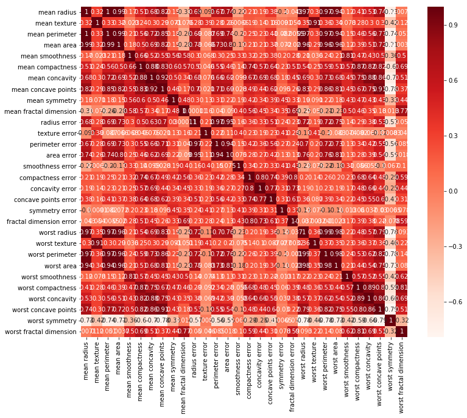
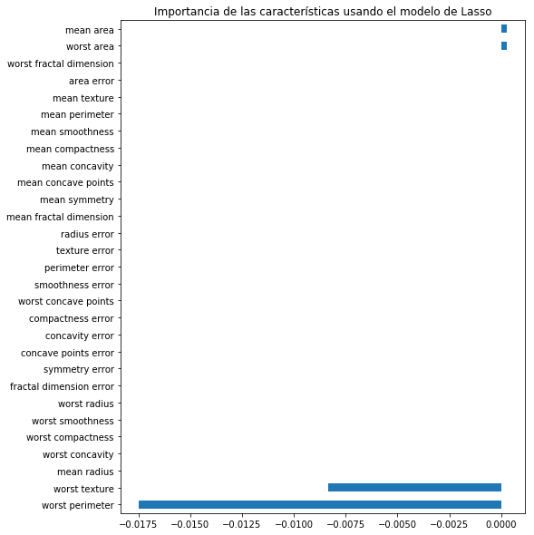

```python
from sklearn.datasets import load_breast_cancer
import pandas as pd
import numpy as np
import matplotlib
import matplotlib.pyplot as plt
import seaborn as sns
import statsmodels.api as sm
%matplotlib inline

from sklearn.model_selection import train_test_split
from sklearn.linear_model import LinearRegression
from sklearn.feature_selection import RFE
from sklearn.linear_model import RidgeCV, LassoCV, Ridge, Lasso
```


```python
# Cargamos el dataset
x = load_breast_cancer()
df = pd.DataFrame(x.data, columns = x.feature_names)
df["worst symmetry"] = x.target
X = df.drop("worst symmetry",1)   #Características
y = df["worst symmetry"]          #Target
df.head()
```


<div>
<style scoped>
    .dataframe tbody tr th:only-of-type {
        vertical-align: middle;
    }

    .dataframe tbody tr th {
        vertical-align: top;
    }

    .dataframe thead th {
        text-align: right;
    }
</style>
<table border="1" class="dataframe">
  <thead>
    <tr style="text-align: right;">
      <th></th>
      <th>mean radius</th>
      <th>mean texture</th>
      <th>mean perimeter</th>
      <th>mean area</th>
      <th>mean smoothness</th>
      <th>mean compactness</th>
      <th>mean concavity</th>
      <th>mean concave points</th>
      <th>mean symmetry</th>
      <th>mean fractal dimension</th>
      <th>...</th>
      <th>worst radius</th>
      <th>worst texture</th>
      <th>worst perimeter</th>
      <th>worst area</th>
      <th>worst smoothness</th>
      <th>worst compactness</th>
      <th>worst concavity</th>
      <th>worst concave points</th>
      <th>worst symmetry</th>
      <th>worst fractal dimension</th>
    </tr>
  </thead>
  <tbody>
    <tr>
      <th>0</th>
      <td>17.99</td>
      <td>10.38</td>
      <td>122.80</td>
      <td>1001.0</td>
      <td>0.11840</td>
      <td>0.27760</td>
      <td>0.3001</td>
      <td>0.14710</td>
      <td>0.2419</td>
      <td>0.07871</td>
      <td>...</td>
      <td>25.38</td>
      <td>17.33</td>
      <td>184.60</td>
      <td>2019.0</td>
      <td>0.1622</td>
      <td>0.6656</td>
      <td>0.7119</td>
      <td>0.2654</td>
      <td>0</td>
      <td>0.11890</td>
    </tr>
    <tr>
      <th>1</th>
      <td>20.57</td>
      <td>17.77</td>
      <td>132.90</td>
      <td>1326.0</td>
      <td>0.08474</td>
      <td>0.07864</td>
      <td>0.0869</td>
      <td>0.07017</td>
      <td>0.1812</td>
      <td>0.05667</td>
      <td>...</td>
      <td>24.99</td>
      <td>23.41</td>
      <td>158.80</td>
      <td>1956.0</td>
      <td>0.1238</td>
      <td>0.1866</td>
      <td>0.2416</td>
      <td>0.1860</td>
      <td>0</td>
      <td>0.08902</td>
    </tr>
    <tr>
      <th>2</th>
      <td>19.69</td>
      <td>21.25</td>
      <td>130.00</td>
      <td>1203.0</td>
      <td>0.10960</td>
      <td>0.15990</td>
      <td>0.1974</td>
      <td>0.12790</td>
      <td>0.2069</td>
      <td>0.05999</td>
      <td>...</td>
      <td>23.57</td>
      <td>25.53</td>
      <td>152.50</td>
      <td>1709.0</td>
      <td>0.1444</td>
      <td>0.4245</td>
      <td>0.4504</td>
      <td>0.2430</td>
      <td>0</td>
      <td>0.08758</td>
    </tr>
    <tr>
      <th>3</th>
      <td>11.42</td>
      <td>20.38</td>
      <td>77.58</td>
      <td>386.1</td>
      <td>0.14250</td>
      <td>0.28390</td>
      <td>0.2414</td>
      <td>0.10520</td>
      <td>0.2597</td>
      <td>0.09744</td>
      <td>...</td>
      <td>14.91</td>
      <td>26.50</td>
      <td>98.87</td>
      <td>567.7</td>
      <td>0.2098</td>
      <td>0.8663</td>
      <td>0.6869</td>
      <td>0.2575</td>
      <td>0</td>
      <td>0.17300</td>
    </tr>
    <tr>
      <th>4</th>
      <td>20.29</td>
      <td>14.34</td>
      <td>135.10</td>
      <td>1297.0</td>
      <td>0.10030</td>
      <td>0.13280</td>
      <td>0.1980</td>
      <td>0.10430</td>
      <td>0.1809</td>
      <td>0.05883</td>
      <td>...</td>
      <td>22.54</td>
      <td>16.67</td>
      <td>152.20</td>
      <td>1575.0</td>
      <td>0.1374</td>
      <td>0.2050</td>
      <td>0.4000</td>
      <td>0.1625</td>
      <td>0</td>
      <td>0.07678</td>
    </tr>
  </tbody>
</table>
<p>5 rows × 30 columns</p>
</div>


```python

plt.figure(figsize=(12,10))
cor = df.corr()
sns.heatmap(cor, annot=True, cmap=plt.cm.Reds)
plt.show()
```





```python
#Correlación respecto a la variable de salida o target
cor_target = abs(cor["worst symmetry"])

#Selección de características altamente correlacionadas
relevant_features = cor_target[cor_target>0.5]
relevant_features
```


    mean radius             0.730029
    mean perimeter          0.742636
    mean area               0.708984
    mean compactness        0.596534
    mean concavity          0.696360
    mean concave points     0.776614
    radius error            0.567134
    perimeter error         0.556141
    area error              0.548236
    worst radius            0.776454
    worst perimeter         0.782914
    worst area              0.733825
    worst compactness       0.590998
    worst concavity         0.659610
    worst concave points    0.793566
    worst symmetry          1.000000
    Name: worst symmetry, dtype: float64


```python
print(df[["worst radius","worst texture"]].corr())
print(df[["worst concavity","worst radius"]].corr())
```

                   worst radius  worst texture
    worst radius       1.000000       0.359921
    worst texture      0.359921       1.000000
                     worst concavity  worst radius
    worst concavity         1.000000      0.573975
    worst radius            0.573975      1.000000


```python

#Agregar una columna constante de unos, obligatorio para el modelo sm.OLS
X_1 = sm.add_constant(X)

#Ajuste del modelo sm.OLS
model = sm.OLS(y,X_1).fit()
model.pvalues.sort_values(ascending=False)
```

    /home/karisauria/anaconda3/lib/python3.7/site-packages/numpy/core/fromnumeric.py:2389: FutureWarning: Method .ptp is deprecated and will be removed in a future version. Use numpy.ptp instead.
      return ptp(axis=axis, out=out, **kwargs)


    mean fractal dimension     9.886190e-01
    compactness error          9.488633e-01
    mean smoothness            9.215133e-01
    mean texture               7.581436e-01
    worst perimeter            7.287947e-01
    worst compactness          7.084803e-01
    area error                 5.900996e-01
    texture error              5.747749e-01
    worst smoothness           5.671506e-01
    worst concave points       5.588637e-01
    perimeter error            5.271836e-01
    fractal dimension error    4.812630e-01
    mean area                  4.702435e-01
    mean perimeter             3.593973e-01
    mean concave points        2.700660e-01
    mean symmetry              2.045936e-01
    mean radius                1.973705e-01
    mean concavity             1.904908e-01
    radius error               1.877935e-01
    worst concavity            1.803624e-01
    worst texture              1.651663e-01
    concave points error       6.299280e-02
    worst fractal dimension    5.782900e-02
    smoothness error           2.723388e-02
    symmetry error             2.176570e-02
    concavity error            8.719673e-03
    mean compactness           1.140888e-03
    worst area                 7.207647e-04
    worst radius               4.006398e-04
    const                      3.907774e-12
    dtype: float64


```python
#Backward Elimination
cols = list(X.columns)
pmax = 1

while (len(cols)>0):
    p = []
    X_1 = X[cols]
    X_1 = sm.add_constant(X_1)
    model = sm.OLS(y,X_1).fit()
    p = pd.Series(model.pvalues.values[1:],index = cols)      
    pmax = max(p)
    feature_with_p_max = p.idxmax()
    if(pmax > 0.05):
        cols.remove(feature_with_p_max)
    else:
        break
        
selected_features_BE = cols
print(selected_features_BE)
```

    ['mean radius', 'mean area', 'mean compactness', 'mean concave points', 'smoothness error', 'concavity error', 'concave points error', 'symmetry error', 'worst radius', 'worst texture', 'worst area', 'worst concavity', 'worst fractal dimension']


```python
model = LinearRegression()

#Método RFE
rfe = RFE(model, 7, verbose=1)

#Transformando los datos usando el método RFE
X_rfe = rfe.fit_transform(X,y)  

#Encontrando el modelo de los datos
model.fit(X_rfe,y)
print(rfe.support_)
print(rfe.ranking_)
```

    Fitting estimator with 29 features.
    Fitting estimator with 28 features.
    Fitting estimator with 27 features.
    Fitting estimator with 26 features.
    Fitting estimator with 25 features.
    Fitting estimator with 24 features.
    Fitting estimator with 23 features.
    Fitting estimator with 22 features.
    Fitting estimator with 21 features.
    Fitting estimator with 20 features.
    Fitting estimator with 19 features.
    Fitting estimator with 18 features.
    Fitting estimator with 17 features.
    Fitting estimator with 16 features.
    Fitting estimator with 15 features.
    Fitting estimator with 14 features.
    Fitting estimator with 13 features.
    Fitting estimator with 12 features.
    Fitting estimator with 11 features.
    Fitting estimator with 10 features.
    Fitting estimator with 9 features.
    Fitting estimator with 8 features.
    [False False False False  True False False  True False  True False False
     False False False False False  True  True False False False False False
      True False False False  True]
    [15 21 16 23  1  7 11  1  8  1 10 12 13 20  4  2  6  1  1  3 14 17 19 22
      1 18  9  5  1]


```python
#Número de características
nof_list = np.arange(1,20)            
high_score = 0

#Proceso para almacenar las características óptimas
nof = 0           
score_list = []

for n in range(len(nof_list)):
    X_train, X_test, y_train, y_test = train_test_split(X,y, test_size = 0.3, random_state = 0)
    model = LinearRegression()
    rfe = RFE(model,nof_list[n])
    X_train_rfe = rfe.fit_transform(X_train,y_train)
    X_test_rfe = rfe.transform(X_test)
    model.fit(X_train_rfe,y_train)
    score = model.score(X_test_rfe,y_test)
    score_list.append(score)
    if(score>high_score):
        high_score = score
        nof = nof_list[n]
        
print("Número óptimo de características: %d" %nof)
print("Desempeño con %d características: %f" % (nof, high_score))
```

    Número óptimo de características: 16
    Desempeño con 16 características: 0.687813


```python
cols = list(X.columns)
model = LinearRegression()
#Initializing RFE model
rfe = RFE(model, 10)             
#Transforming data using RFE
X_rfe = rfe.fit_transform(X,y)  
#Fitting the data to model
model.fit(X_rfe,y)              
temp = pd.Series(rfe.support_,index=cols)
selected_features_rfe = temp[temp==True].index
print(selected_features_rfe)
```

    Index(['mean smoothness', 'mean concave points', 'mean fractal dimension',
           'smoothness error', 'compactness error', 'concave points error',
           'symmetry error', 'fractal dimension error', 'worst smoothness',
           'worst fractal dimension'],
          dtype='object')


```python
reg = LassoCV()
reg.fit(X, y)
coef = pd.Series(reg.coef_, index = X.columns)
print("Número óptimo de características:" + str(sum(coef != 0)))
print("Desempeño mediante la regularización Lasso: %f" %reg.score(X,y))
```

    Número óptimo de características:4
    Desempeño mediante la regularización Lasso: 0.661795


    /home/karisauria/anaconda3/lib/python3.7/site-packages/sklearn/model_selection/_split.py:2053: FutureWarning: You should specify a value for 'cv' instead of relying on the default value. The default value will change from 3 to 5 in version 0.22.
      warnings.warn(CV_WARNING, FutureWarning)


```python
imp_coef = coef.sort_values()
import matplotlib
matplotlib.rcParams['figure.figsize'] = (8.0, 10.0)
imp_coef.plot(kind = "barh")
plt.title("Importancia de las características usando el modelo de Lasso")
```


    Text(0.5, 1.0, 'Importancia de las características usando el modelo de Lasso')





```python

```
