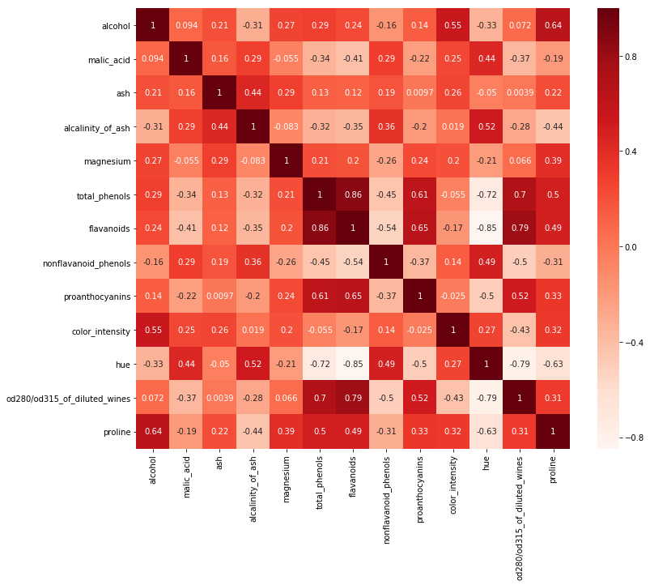
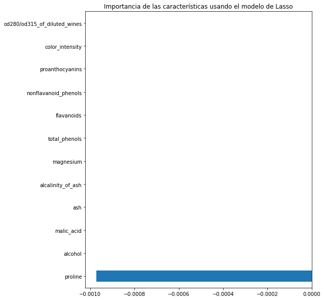

```python
from sklearn.datasets import load_wine
import pandas as pd
import numpy as np
import matplotlib
import matplotlib.pyplot as plt
import seaborn as sns
import statsmodels.api as sm
%matplotlib inline

from sklearn.model_selection import train_test_split
from sklearn.linear_model import LinearRegression
from sklearn.feature_selection import RFE
from sklearn.linear_model import RidgeCV, LassoCV, Ridge, Lasso
```


```python
# Cargamos el dataset
x = load_wine()
df = pd.DataFrame(x.data, columns = x.feature_names)
df["hue"] = x.target
X = df.drop("hue",1)   #Características
y = df["hue"]          #Target
df.head()
```


<div>
<style scoped>
    .dataframe tbody tr th:only-of-type {
        vertical-align: middle;
    }

    .dataframe tbody tr th {
        vertical-align: top;
    }

    .dataframe thead th {
        text-align: right;
    }
</style>
<table border="1" class="dataframe">
  <thead>
    <tr style="text-align: right;">
      <th></th>
      <th>alcohol</th>
      <th>malic_acid</th>
      <th>ash</th>
      <th>alcalinity_of_ash</th>
      <th>magnesium</th>
      <th>total_phenols</th>
      <th>flavanoids</th>
      <th>nonflavanoid_phenols</th>
      <th>proanthocyanins</th>
      <th>color_intensity</th>
      <th>hue</th>
      <th>od280/od315_of_diluted_wines</th>
      <th>proline</th>
    </tr>
  </thead>
  <tbody>
    <tr>
      <th>0</th>
      <td>14.23</td>
      <td>1.71</td>
      <td>2.43</td>
      <td>15.6</td>
      <td>127.0</td>
      <td>2.80</td>
      <td>3.06</td>
      <td>0.28</td>
      <td>2.29</td>
      <td>5.64</td>
      <td>0</td>
      <td>3.92</td>
      <td>1065.0</td>
    </tr>
    <tr>
      <th>1</th>
      <td>13.20</td>
      <td>1.78</td>
      <td>2.14</td>
      <td>11.2</td>
      <td>100.0</td>
      <td>2.65</td>
      <td>2.76</td>
      <td>0.26</td>
      <td>1.28</td>
      <td>4.38</td>
      <td>0</td>
      <td>3.40</td>
      <td>1050.0</td>
    </tr>
    <tr>
      <th>2</th>
      <td>13.16</td>
      <td>2.36</td>
      <td>2.67</td>
      <td>18.6</td>
      <td>101.0</td>
      <td>2.80</td>
      <td>3.24</td>
      <td>0.30</td>
      <td>2.81</td>
      <td>5.68</td>
      <td>0</td>
      <td>3.17</td>
      <td>1185.0</td>
    </tr>
    <tr>
      <th>3</th>
      <td>14.37</td>
      <td>1.95</td>
      <td>2.50</td>
      <td>16.8</td>
      <td>113.0</td>
      <td>3.85</td>
      <td>3.49</td>
      <td>0.24</td>
      <td>2.18</td>
      <td>7.80</td>
      <td>0</td>
      <td>3.45</td>
      <td>1480.0</td>
    </tr>
    <tr>
      <th>4</th>
      <td>13.24</td>
      <td>2.59</td>
      <td>2.87</td>
      <td>21.0</td>
      <td>118.0</td>
      <td>2.80</td>
      <td>2.69</td>
      <td>0.39</td>
      <td>1.82</td>
      <td>4.32</td>
      <td>0</td>
      <td>2.93</td>
      <td>735.0</td>
    </tr>
  </tbody>
</table>
</div>


```python

plt.figure(figsize=(12,10))
cor = df.corr()
sns.heatmap(cor, annot=True, cmap=plt.cm.Reds)
plt.show()
```





```python
#Correlación respecto a la variable de salida o target
cor_target = abs(cor["hue"])

#Selección de características altamente correlacionadas
relevant_features = cor_target[cor_target>0.5]
relevant_features
```


    alcalinity_of_ash               0.517859
    total_phenols                   0.719163
    flavanoids                      0.847498
    hue                             1.000000
    od280/od315_of_diluted_wines    0.788230
    proline                         0.633717
    Name: hue, dtype: float64


```python
print(df[["alcalinity_of_ash","ash"]].corr())
print(df[["flavanoids","alcalinity_of_ash"]].corr())
```

                       alcalinity_of_ash       ash
    alcalinity_of_ash           1.000000  0.443367
    ash                         0.443367  1.000000
                       flavanoids  alcalinity_of_ash
    flavanoids            1.00000           -0.35137
    alcalinity_of_ash    -0.35137            1.00000


```python

#Agregar una columna constante de unos, obligatorio para el modelo sm.OLS
X_1 = sm.add_constant(X)

#Ajuste del modelo sm.OLS
model = sm.OLS(y,X_1).fit()
model.pvalues.sort_values(ascending=False)
```

    /home/karisauria/anaconda3/lib/python3.7/site-packages/numpy/core/fromnumeric.py:2389: FutureWarning: Method .ptp is deprecated and will be removed in a future version. Use numpy.ptp instead.
      return ptp(axis=axis, out=out, **kwargs)


    magnesium                       7.217832e-01
    proanthocyanins                 4.024617e-01
    ash                             1.514475e-01
    nonflavanoid_phenols            9.552633e-02
    malic_acid                      4.912771e-02
    total_phenols                   2.362317e-02
    alcohol                         1.465080e-03
    alcalinity_of_ash               6.038148e-06
    od280/od315_of_diluted_wines    6.381934e-07
    color_intensity                 1.063286e-09
    const                           1.086593e-10
    proline                         2.705593e-11
    flavanoids                      1.871687e-12
    dtype: float64


```python
#Backward Elimination
cols = list(X.columns)
pmax = 1

while (len(cols)>0):
    p = []
    X_1 = X[cols]
    X_1 = sm.add_constant(X_1)
    model = sm.OLS(y,X_1).fit()
    p = pd.Series(model.pvalues.values[1:],index = cols)      
    pmax = max(p)
    feature_with_p_max = p.idxmax()
    if(pmax > 0.05):
        cols.remove(feature_with_p_max)
    else:
        break
        
selected_features_BE = cols
print(selected_features_BE)
```

    ['alcohol', 'malic_acid', 'ash', 'alcalinity_of_ash', 'total_phenols', 'flavanoids', 'color_intensity', 'od280/od315_of_diluted_wines', 'proline']


```python
model = LinearRegression()

#Método RFE
rfe = RFE(model, 7, verbose=1)

#Transformando los datos usando el método RFE
X_rfe = rfe.fit_transform(X,y)  

#Encontrando el modelo de los datos
model.fit(X_rfe,y)
print(rfe.support_)
print(rfe.ranking_)
```

    Fitting estimator with 12 features.
    Fitting estimator with 11 features.
    Fitting estimator with 10 features.
    Fitting estimator with 9 features.
    Fitting estimator with 8 features.
    [ True  True False False False  True  True  True False  True  True False]
    [1 1 2 3 6 1 1 1 4 1 1 5]


```python
#Número de características
nof_list = np.arange(1,13)            
high_score = 0

#Proceso para almacenar las características óptimas
nof = 0           
score_list = []

for n in range(len(nof_list)):
    X_train, X_test, y_train, y_test = train_test_split(X,y, test_size = 0.3, random_state = 0)
    model = LinearRegression()
    rfe = RFE(model,nof_list[n])
    X_train_rfe = rfe.fit_transform(X_train,y_train)
    X_test_rfe = rfe.transform(X_test)
    model.fit(X_train_rfe,y_train)
    score = model.score(X_test_rfe,y_test)
    score_list.append(score)
    if(score>high_score):
        high_score = score
        nof = nof_list[n]
        
print("Número óptimo de características: %d" %nof)
print("Desempeño con %d características: %f" % (nof, high_score))
```

    Número óptimo de características: 11
    Desempeño con 11 características: 0.841688


```python
cols = list(X.columns)
model = LinearRegression()
#Initializing RFE model
rfe = RFE(model, 10)             
#Transforming data using RFE
X_rfe = rfe.fit_transform(X,y)  
#Fitting the data to model
model.fit(X_rfe,y)              
temp = pd.Series(rfe.support_,index=cols)
selected_features_rfe = temp[temp==True].index
print(selected_features_rfe)
```

    Index(['alcohol', 'malic_acid', 'ash', 'alcalinity_of_ash', 'total_phenols',
           'flavanoids', 'nonflavanoid_phenols', 'proanthocyanins',
           'color_intensity', 'od280/od315_of_diluted_wines'],
          dtype='object')


```python
reg = LassoCV()
reg.fit(X, y)
coef = pd.Series(reg.coef_, index = X.columns)
print("Número óptimo de características:" + str(sum(coef != 0)))
print("Desempeño mediante la regularización Lasso: %f" %reg.score(X,y))
```

    Número óptimo de características:1
    Desempeño mediante la regularización Lasso: 0.344672


    /home/karisauria/anaconda3/lib/python3.7/site-packages/sklearn/model_selection/_split.py:2053: FutureWarning: You should specify a value for 'cv' instead of relying on the default value. The default value will change from 3 to 5 in version 0.22.
      warnings.warn(CV_WARNING, FutureWarning)


```python
imp_coef = coef.sort_values()
import matplotlib
matplotlib.rcParams['figure.figsize'] = (8.0, 10.0)
imp_coef.plot(kind = "barh")
plt.title("Importancia de las características usando el modelo de Lasso")
```


    Text(0.5, 1.0, 'Importancia de las características usando el modelo de Lasso')





```python

```
